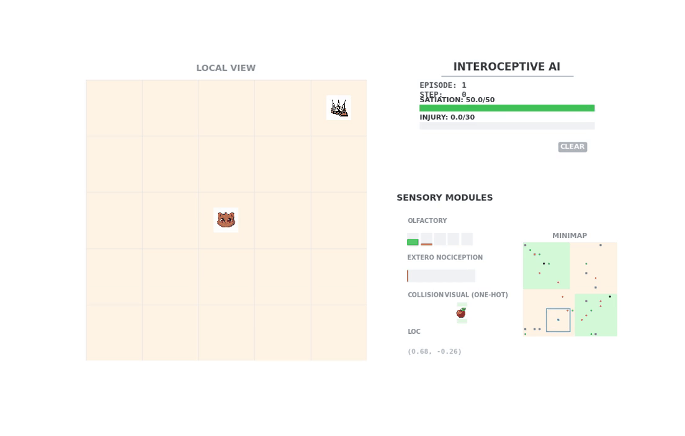

# 🎮 GridWorld Pain

> **A high-performance, JAX-native Research Environment for Interoceptive AI and Homeostatic RL.**


<div align="center">
  
</div>

---

## 📖 Overview

**GridWorld Pain** is a cutting-edge Reinforcement Learning platform designed to study **Interoception** - the sensing of internal physiological states. Built entirely in **JAX** with **Flax NNX**, it enables massive parallelization (1000+ envs) and zero-copy host-device execution, specifically tailored for agents that must balance external goals with internal survival needs (Hunger, Pain, Injury).

---

## ✨ Key Features

- **🚀 JAX-Native Core**: Every step, sensor, and reward calculation is JIT-compiled for GPU/TPU acceleration.
- **⚡ Supercharged Parallelization**: Vectorized environments using `jax.vmap` for extreme training throughput.
- **🤖 Modern RL Suite**: Fully implemented in JAX/Flax NNX:
  - **DQN / DRQN**: Discrete action value networks with recurrent state support.
  - **PPO / RecurrentPPO**: High-stability policy gradients with vectorized GAE.
  - **DreamerV3**: State-of-the-art Model-Based RL using latent imagination rollouts.
- **🧠 Advanced Interoception**: Simulation of internal states (Satiation, Injury) driving Homeostatic Reward signals.
- **🛡️ Strict Configuration**: "No Safe Defaults" protocol ensuring 100% research reproducibility.
- **🎥 High-Fidelity Rendering**: Optimized JAX renderer with real-time sensory overlays.

---

## 📂 Project Structure

```text
├── configs/                    # ⚙️ Configuration YAMLs
│   ├── experiment/             # 🧪 Homeostatic & Survival Branches
│   │   ├── ablation/           # 🧪 Ablation Study Configs
│   ├── environment/            # 🌍 Environment settings
│   ├── models/                 # 🤖 Agent hyperparameters
├── src/                        # 🐍 Source Code
│   ├── environment/            # 🌍 JAX-native Core (State, Sensors, Core)
│   ├── models/                 # 🤖 JAX/Flax NNX implementations
│   └── utils/                  # 🛠️ Utilities (Config, WandB, Viz)
├── train.py                    # 🧠 Unified JAX Training Script
└── evaluation.py               # 🎬 High-Performance Evaluation Script
```

---

## 🌍 Environment Architecture (POMDP)

The environment follows a **Partially Observable Markov Decision Process (POMDP)** framework. Below is a mapping of the **Ground Truth State** ($S$) to the **Agent Observations** ($O$).

| State Category | State Component | Observation Modality | Mapping Description |
| :--- | :--- | :--- | :--- |
| **Agent** | `agent_pos`, `last_action` | **Location**, **Collision**, **Proprioception*** | Normalized $(r, c)$, occupancy, and motor feedback. |
| **Body** | `satiation`, `nutrition`, `injury_level` | **Interoception**, **Nociception** | Subjective energy/fullness and phasic pain contacts. |
| **Resources** | `res_pos`, `res_active` | **Chemical**, **Visual*** | Olfactory signatures and visual object IDs. |
| **Predators** | `pred_pos`, `pred_state` | **Chemical**, **Visual***, **Nociception** | Movement tracking and physical contact damage. |
| **Neutral** | `neutral_pos` | **Chemical**, **Visual*** | Olfactory decoys and visual identification. |
| **Obstacles** | `obs_pos` | **Chemical**, **Collision**, **Visual*** | Proximity, blocking tiles, and contact/bumps. |

*\* Optional: Enabled via configuration.*

---

---

## 🚀 Getting Started

### Prerequisites

- **Python**: 3.11 or higher
- **Conda**: Mandatory for dependency management

### 💿 Installation

1.  **Create and activate the official environment:**
    ```bash
    conda create -n grid_world_pain python=3.11
    conda activate grid_world_pain
    ```

2.  **Install project in editable mode:**
    ```bash
    pip install -e .
    ```

---

## 🛠️ Usage

### 🛑 CRITICAL: Execution Protocol
Always use the explicit conda path or `conda run` to ensure dependency integrity:
`/home/vncuser/miniconda3/envs/grid_world_pain/bin/python ...`

### 1. Training Agents
Train high-performance JAX agents with massive parallelization.

**Example: Train RecurrentPPO with 128 parallel environments:**
```bash
/home/vncuser/miniconda3/envs/grid_world_pain/bin/python train.py \
    --agent_config configs/models/recurrent_ppo/recurrent_ppo.yaml \
    --config configs/experiment/ablation/homeostatic/08_location.yaml \
    --num-envs 128
```

### 2. Evaluating & Visualizing
Generate high-quality videos demonstrating agent behavior and sensory activations.

```bash
/home/vncuser/miniconda3/envs/grid_world_pain/bin/python evaluation.py \
    --results_dir results/JAX_PPO/my_run \
    --episodes 3 \
    --render-video
```

---

## 🧪 Research Framework (Ablations)

| Level | Goal | Featured Sensor |
|-------|------|-----------------|
| 01-03 | Pathfinding | None (Baseline) |
| 04 | Survival | **Nociception** (Pain) |
| 05 | Nutrition | **Olfactory** (Chemical) |
| 06 | Interaction | **Proprioception** (Motor) |
| 07 | Mobility | **Collision** (Ray-cast) |
| 08 | Homeostasis | **Interoception** (Full) |
| 09 | Navigation | **Location** (Spatial) |
| 10+ | - | [Full Review Matrix](file:///media/nas01/projects/Interoceptive-AI/grid_world_pain/docs/ABLATION_REVIEW.md) |

---

<div align="center">
    <sub>Targeting AGI through Interoceptive Feedback Loops</sub>
</div>
