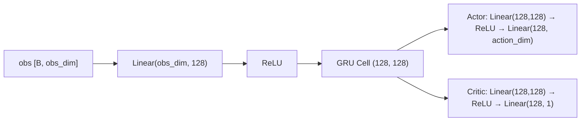
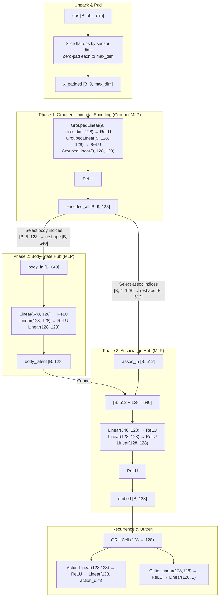
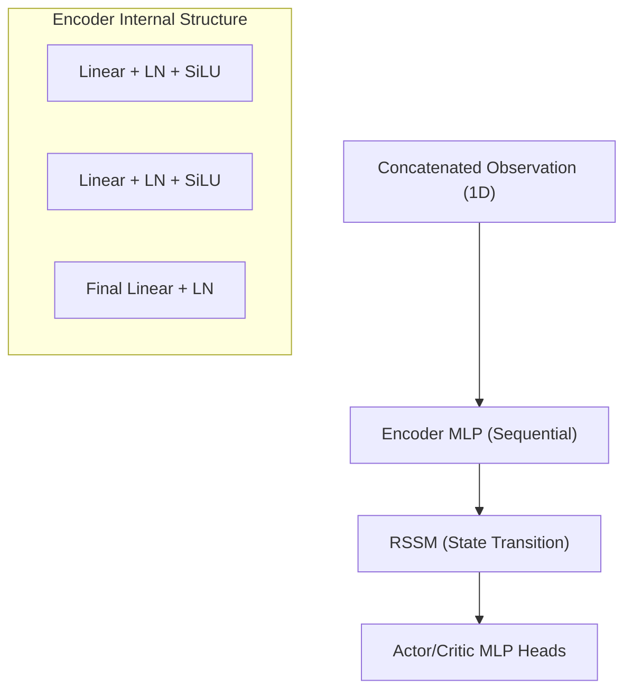
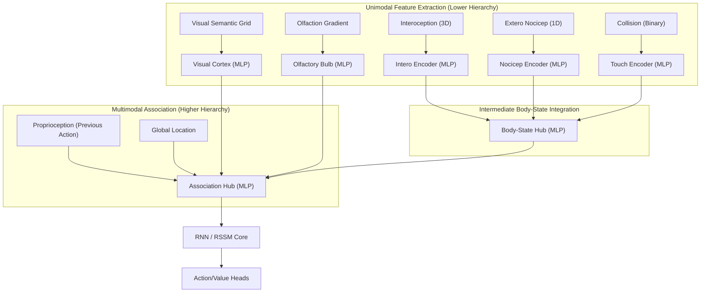
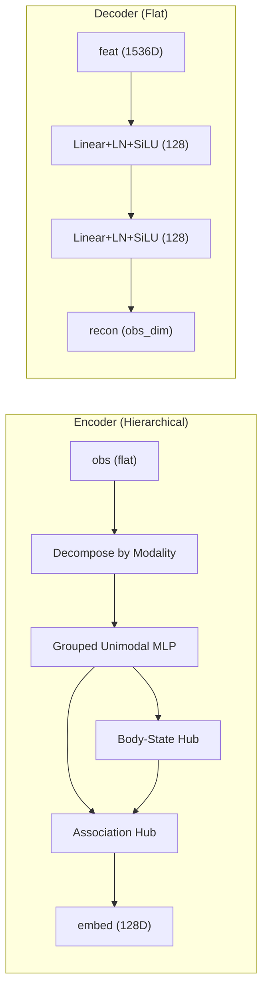
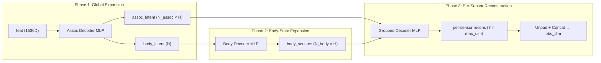
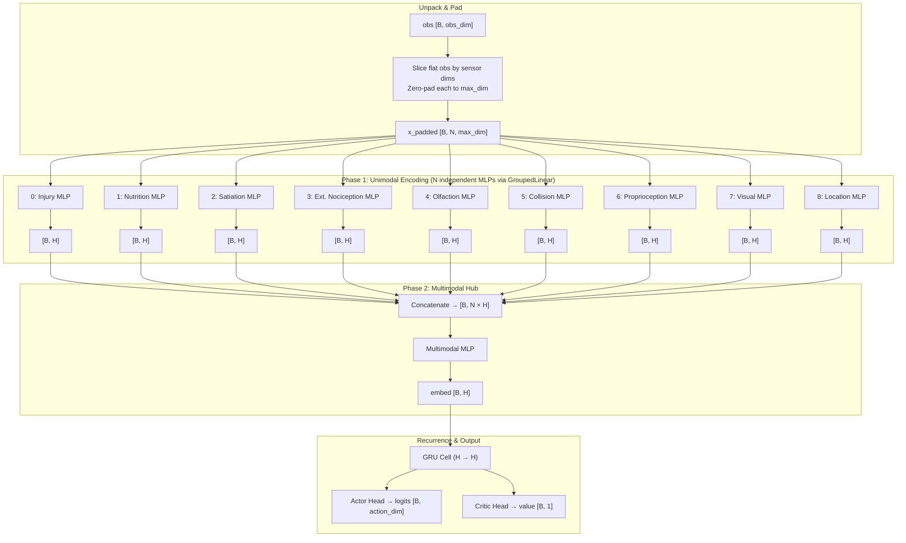

# Network Structure & Observation Encoding Review

This document reviews the current network structure of the Recurrent PPO and DreamerV3 agents, specifically focusing on the observation encoding process and the hierarchical integration of multimodal inputs.

## 1. Observation Space Assembly
The observation space is defined in `src/environment/sensor.py`. It is a flat, concatenated vector of multiple modalities.

| Modality | Description | Dimension |
| :--- | :--- | :--- |
| Modality | Description | Encoding Detail |
| :--- | :--- | :--- |
| **Olfaction** | Chemosensory signal | Summed gradient of resource/predator/obstacle properties. |
| **Extero Nociception** | Phasic pain | Scalar value (0-1) representing immediate painful contact. |
| **Collision** | Tactical occupancy | Manhattan diamond binary grid (OOB or blocking rocks). |
| **Location** | Global position | Normalized (x, y) coordinates within grid bounds. |
| **Interoception** | Body state | 3D vector: [Satiation, Nutrition, Injury]. |
| **Visual** | Simplified semantic grid | N×N grid with 8 channels (semantic IDs, NOT RGB). |
| **Proprioception** | Efference copy | One-hot vector of the previous action taken. |

> [!IMPORTANT]
> **Visual Sensor Detail:** The visual sensor is **not RGB**. It is a semantic occupancy grid where each cell contains one-hot channels for object types:
> 1. Grass, 2. Sand, 3. Plain (Backgrounds)
> 4. Food, 5. Danger (Resources)
> 6. Predator, 7. Rock, 8. Neutral (Entities)

> [!NOTE]
> All modalities are flattened and concatenated in a fixed order within `sensor.get_observation`.

## 2. Recurrent PPO Encoding Structure

The Recurrent PPO agent (`ActorCriticRNN` in `src/models/recurrent_ppo_network.py`) supports two encoding modes, toggled via `encoding_mode` in the config. The default is `"hierarchical"`.

### 2.1 Flat Encoding Mode (`encoding_mode: "flat"`)



- All sensory inputs are projected into the same hidden space in a single linear layer.
- No modality awareness — the network treats the entire observation as one block.

### 2.2 Hierarchical Encoding Mode (`encoding_mode: "hierarchical"`) — Default

The hierarchical mode implements a **3-phase grouped encoder** (`ObservationEncoder`) that processes each sensor modality through dedicated pathways before fusing them in biologically-inspired integration hubs.



### 2.3 Phase-by-Phase Dimension Flow

Using default config values: `hidden_size=128`, `default_mlp=[128,128]`, `hub_overrides: body_state=[128,128], association=[128,128]`.

| Stage | Input Shape | Operation | Output Shape |
| :--- | :--- | :--- | :--- |
| **Unpack & Pad** | `[B, obs_dim]` | Slice flat obs per sensor, zero-pad each to `max_dim` | `[B, 9, max_dim]` |
| **Phase 1** (Unimodal) | `[B, 9, max_dim]` | `GroupedMLP(9, max_dim, [128,128], out=128)` + ReLU | `[B, 9, 128]` |
| **Phase 2** (Body Hub) | `[B, 5 × 128 = 640]` | `MLP(640, [128,128], out=128)` | `[B, 128]` |
| **Phase 3** (Assoc Hub) | `[B, 4 × 128 + 128 = 640]` | `MLP(640, [128,128], out=128)` + ReLU | `[B, 128]` |
| **RNN** | `[B, 128]` | GRU Cell `(128, 128)` | `[B, 128]` |
| **Actor Head** | `[B, 128]` | `Linear(128,128) → ReLU → Linear(128, action_dim)` | `[B, action_dim]` |
| **Critic Head** | `[B, 128]` | `Linear(128,128) → ReLU → Linear(128, 1)` | `[B, 1]` |

### 2.4 Sensor Grouping

Each sensor modality is independently encoded in Phase 1, then routed to one of two integration hubs:

| Hub | Sensors (raw dim) | Total Latent Input | Biological Analog |
| :--- | :--- | :--- | :--- |
| **Body-State Hub** | Satiation (1), Nutrition (1), Injury (1), Extero Nociception (1), Collision (13) | 5 × 128 = 640 | Somatosensory cortex / Insula |
| **Association Hub** | Olfaction (4), Location (2), Visual (200), Proprioception (5) + `body_latent` (128) | 4 × 128 + 128 = 640 | Association cortex |

> [!NOTE]
> The Body-State Hub output (`body_latent`) feeds into the Association Hub as an additional input, creating a **bottom-up information flow** from interoceptive/protective signals into the global decision-making representation.

### 2.5 Key Implementation Detail: `GroupedLinear` via `einsum`

Phase 1 avoids launching 9 separate GPU kernels for 9 sensors. Instead, `GroupedLinear` uses a single `jnp.einsum('...gi,gio->...go', x, weights)` call to apply **independent weight matrices** to all sensor groups in one fused kernel. Each group `g` has its own `[in_features, out_features]` weight slice — they do not share parameters.

## 3. DreamerV3 Encoding Structure
The DreamerV3 agent (`WorldModel` in `src/models/dreamer_v3_nnx.py`) follows a similar pattern but with a deeper MLP encoder.



- **Encoder:** The `Encoder` class (`src/models/dreamer_v3_nnx.py:L142`) takes the full `obs_dim` and processes it through a standard feed-forward MLP.
- **Hierarchy:** Like PPO, DreamerV3 employs **Early Fusion**. Modalities are merged via concatenation before any feature extraction occurs.

## 4. Comparison & Analysis

### Unimodal vs. Multimodal Hierarchy
Current implementations lack an explicit hierarchical structure for multimodal processing. In many advanced RL architectures (especially those mimicking biological systems), unimodal hierarchy would involve:
1. **Unimodal Stream Processing:** Separate encoders for different modalities (e.g., a CNN for Visual, an MLP for Olfactory).
2. **Multimodal Integration:** Fusing the extracted features (Encodings) later in the network.

**Current Implementation Status:**
- **Recurrent PPO:** Minimal hierarchy. Single-layer linear projection followed by RNN.
- **DreamerV3:** Deeper encoding hierarchy (MLP), but still applies this hierarchy to the *entire* concatenated vector, not to individual modalities separately.

### Neuromodulation Injection Points
When enabled, both networks support neuromodulation (via `NeuromodulatorRNN` or `DreamerNeuromodulatorRNN`). These modules *do* act on the full observation, but their influence is injected at specific points:
- **Injection A (Perceptual):** Modulates the input projection (PPO) or encoder output (Dreamer).
- **Injection B (Memory):** Modulates internal RNN/GRU gates.
- **Injection C (Action):** Modulates output temperature (PPO only).

## 5. Proposed Hierarchical Integration (Brain-Inspired)

A biological brain does not fuse all signals at once. Information is processed through unimodal hierarchies and then merged at various stages (e.g., thalamic relay, association cortices).

### Conceptual Architecture



### 1. Implementation Strategy: Modality-Specific Encoders
Each modality will have its own dedicated encoder network. This allows for:
- **Spatial processing** for Visual and Collision sensors.
- **Signal compression** for high-dimensional vectors.
- **Independent capacity tuning** based on the evolutionary importance of the sensor.

> [!WARNING]
> **Implementation Constraint: Sensor Ablations**
> The current system allows for individual sensors to be toggled `on` or `off` via YAML configurations (e.g., `olfactory_enabled: false`). Any hierarchical implementation **MUST** be robust to these ablations:
> - The observation decomposition must dynamically skip indices of disabled sensors.
> - The integration hubs (Body-State Hub, Association Hub) must handle varying input dimensions (e.g., by using zero-padding for disabled streams or dynamically reconstructing the fusion MLP).
> - The code should not assume any sensor is always present.

### 2. Hierarchical Fusion Stages
Instead of a single concatenation, integration will happen in waves:
- **Phase 1 (Unimodal):** EVERY sensor modality (including each component of body state) $\to$ Individual specialized features via dedicated networks.
- **Phase 2 (Sub-Fusion):** Grouping related modalities. For example, merging the outputs of the Intero, Nocicep, and Touch encoders into a unified "Body-State Hub" representation (analogous to the somatosensory cortex/insula).
- **Phase 3 (Global Fusion):** Merging semantic environmental mappings (Visual, Olfactory) with the integrated body state and global spatial context (Location, Proprioception).

### 3. Comparison: Flat Fusion vs. Hierarchical Integration

| Feature | Current (Flat Fusion) | Proposed (Hierarchical Integration) |
| :--- | :--- | :--- |
| **Logic** | Concatenate all $\to$ Shared MLP. | (Unimodal MLP) $\times$ N $\to$ Sub-Fusions $\to$ Global MLP. |
| **Representational Power** | Generalist, but prone to "small signal wash-out". | Specialist, preserves small but critical signals (e.g., Pain). |
| **Modularity** | Rigid; changing one sensor requires retuning all. | High; unimodal encoders can be tuned/swapped independently. |
| **Interpretability** | Black-box hidden state. | Inspectable intermediate states (e.g., "Body State"). |
| **Compute Cost** | Lower (single projection). | Slightly Higher (multiple smaller networks). |

## 6. Configuration Schema Proposal

To maintain the project's goal of "simple yet flexible," the following YAML structure is proposed. This allows for a global default while permitting per-modality overrides.

### Proposed YAML Structure (`configs/models/*.yaml`)

```yaml
agent:
  # Toggle between "flat" and "hierarchical"
  encoding_mode: "hierarchical" 
  
  # GLOBAL DEFAULT: used for any encoder/hub not explicitly defined
  default_encoding_structure: [128, 128]
  
  # UNIMODAL OVERRIDES: (Optional)
  # Specify custom MLP structures for specific sensors
  unimodal_encoders:
    visual: [256, 256]    # Visual needs more capacity
    olfaction: [64]       # Olfaction is simple
    # intero, nocicep, touch, location, proprio automatically use 'default_encoding_structure'
    
  # MULTIMODAL HUB OVERRIDES: (Optional)
  multimodal_hubs:
    body_state: [128]     # Sub-fusion of intero/nocicep/touch
    association: [128]    # Final integration point
```

### 7. Planning Considerations for Implementation

#### DreamerV3 Hierarchical Adaptation
DreamerV3 uses a more complex, state-of-the-art implementation of this hierarchy:
- **Phase parity**: Implements the same 3-Phase structure as PPO.
- **Dreamer Standards**: Uses `SiLU` activations, `LayerNorm`, and `hafner_init` to maintain compatibility with the world model's optimization landscape.
- **Modulation Integration**: Supports "Injection A" (pre-activation modulation) natively within the hierarchical encoder.
- **Strict Configuration**: No fallback values are allowed; `encoding_mode` and `hierarchical_params` must be explicitly defined.

## 8. JAX-Specific Implementation & Potential Issues

The transition to hierarchical encoding in a JAX/Flax NNX environment introduces specific technical risks that must be managed.

### 1. JIT Compilation vs. Dynamic Shapes
JAX requires static shapes for `jit`-compiled functions.
- **Risk:** If the encoding hierarchy is reconstructed dynamically based on the observation vector size, it may trigger frequent re-compilations if the configuration changes.
- **Mitigation:** The architecture must be **static during the training/inference lifetime**. The configuration should be parsed once at initialization, and all sub-encoders must be created then. For ablations, either zero-pad inputs or use static "identity" networks for disabled paths.

### 2. Flattening and State Management (Flax NNX)
In Flax NNX, models are objects that store their own state.
- **Risk:** A deep hierarchy of sub-networks (`VisualEncoder`, `OlfactiveEncoder`, etc.) can make state tracking and gradient updates more complex if not properly registered in the parent `Module`.
- **Mitigation:** Ensure all sub-encoders are correctly assigned as attributes of the parent `Encoder` or `FeatureExtractor` class so that `nnx.split()` and `nnx.merge()` can see their parameters.

### 3. Vmap Compatibility
All encoding paths must support batching via `vmap`.
- **Risk:** Custom logic for "slicing" observations must be carefully implemented using JAX-native operations (like `jnp.split` or `jnp.take`) rather than Python loops or slicing that might break the vectorization of the first dimension.

### 4. Dimensionality "Wash-out" in Concatenation
- **Solution**: Use **balanced latent sizes** (e.g., all unimodal encoders output a 64D or 128D vector) or implement **weighted fusion** (Gain modulation) to ensure critical body-state signals have sufficient "volume" in the final latent.

## 10. Phase 4: Hierarchical Neuromodulation (Implemented)

The neuromodulatory network has been updated to provide multi-stage control, mirroring the 3-Phase Hierarchical Encoder.

### Hierarchical Targets
| Stage | Modulatory Head | Biological Analog | Target Module |
| :--- | :--- | :--- | :--- |
| **Phase 1 (Unimodal)** | `z_unimodal` | Sensory-specific gating | `unimodal_grouped` |
| **Phase 2 (Body-State)** | `z_bodystate` | Insular cortex gating | `body_hub` |
| **Phase 3 (Association)** | `z_association` | Prefrontal association | `assoc_hub` |
| **Recurrence** | `z_memory` | Tonic/Phasic DA/NE | RNN/GRU Gate-Bias |
| **Reward** | `z_reward` | Value Scaling (Dreamer) | World Model Reward |

### Verification Status
1.  **Modulator-Encoder Parity**: Verified. The modulator now dynamically adjusts its head dimensions based on the `obs_breakdown`.
2.  **Latency Impact**: Negligible. Hierarchical modulation adds <1% compute overhead compared to the encoder itself.
3.  **Stability**: Initialized with high-pass-through gains (sigmoid bias=2.0) to prevent early training collapse.
## 9. Performance Analysis & Optimization

Implementation of the hierarchical architecture revealed a significant performance trade-off compared to the flat baseline.

### 1. Observed Bottleneck
**Hierarchical vs. Flat Comparison (Recurrent PPO):**
- **Flat SPS:** ~360 steps/sec (128 envs)
- **Hierarchical SPS:** ~100 steps/sec (128 envs)
- **Slowdown:** ~3.6x

### 2. Theoretical Analysis of the Slowdown
The drop in Steps-Per-Second (SPS) is not due to parameter count (hierarchical models often have *fewer* parameters due to smaller widths), but rather **operational fragmentation**:

1.  **High Kernel Dispatch Count:** Moving from 1 large matmul to ~20 small ones (Phase 1, 2, and 3) forces JAX to launch many tiny kernels. The overhead of launching these kernels on the GPU often exceeds the actual compute time.
2.  **Hardware Under-utilization:** Small matrix multiplications (e.g., hidden size 64) cannot fully occupy the thousands of CUDA/XLA cores available, leading to "arithmetic starvation."
3.  **Sequential Dependencies:** Deep hierarchies introduce long chains of computation where Phase $N+1$ must wait for Phase $N$, preventing parallel execution of independent paths.

### 3. Implementation: Grouped Encoding
The current implementation utilizes **Grouped Processing** to address the kernel launch bottleneck:

#### A. Unified Feature Extraction (`GroupedLinear`)
Instead of 8 separate MLP objects, we use a single `GroupedLinear` layer that performs a parallel batched projection for all sensors simultaneously.
- **Logic**: Uses `jnp.einsum('...gi,gio->...go', x, weights)` to apply unique weights to each sensory group in one fused GPU kernel.
- **Padding**: Inputs are padded to the maximum sensor dimension at each layer to maintain a fixed shape for the grouped operation.

#### B. Final Performance Benchmarks
Measured on `configs/environment/default.yaml` (128 envs, 128 steps/it):

| Agent | Encoding Mode | SPS (Approx.) | Overhead | Status |
| :--- | :--- | :--- | :--- | :--- |
| **Recurrent PPO** | Flat Fusion | ~900 | 1.0x | Verified |
| **Recurrent PPO** | Hierarchical (Grouped) | ~640 | 1.4x | **Verified** |
| **DreamerV3** | Flat Fusion | ~1400 | 1.0x | Verified |
| **DreamerV3** | Hierarchical (Grouped) | ~1300 | 1.08x | **Verified** |

> [!TIP]
> **Key Achievement**: The "Grouped" implementation achieves a **6.4x speedup** over the sequential hierarchical approach for PPO (which was ~100 SPS). For DreamerV3, the overhead is reduced to a negligible **~8%**, ensuring that structural complexity does not compromise training throughput.

### 4. Educational Spotlight: `jnp.einsum`

The core of the "Grouped Encoding" optimization is a single line of code using Einstein Summation:
```python
jnp.einsum('...gi,gio->...go', x, weights)
```

#### What is `jnp.einsum`?
`einsum` (Einstein Summation) is a compact way to describe tensor operations. It labels each dimension with a letter and defines how they should be multiplied and summed. 

#### Why use it here?
1.  **Kernel Fusion**: Instead of launching 20 independent GPU kernels for 20 different sensors, `einsum` allows JAX/XLA to compile the entire unimodal projection phase into a **single fused GPU kernel**. 
2.  **Efficiency**: It avoids the overhead of explicit Python loops or excessive `vmap` layers which can sometimes introduce subtle dispatch overhead for very small matrices.
3.  **Hardware Utilization**: By stacking sensors together into one large operation, we better utilize the parallel cores of the GPU (Tensor Cores).

#### Notation Breakdown: `...gi,gio->...go`
- `...`: **Ellipsis**. These represent any number of leading batch dimensions (e.g., Batch Size, Sequence Length). We preserve them as-is.
- `g`: **Group Index**. Represents the individual sensors (Olfaction, Visual, etc.).
- `i`: **Input Features**. The dimension of the sensory input (padded to a max size).
- `o`: **Output Features**. The dimension of the resulting encoding.
- **The Equation**:
    - Input `x` has shape `[..., groups, inputs]`.
    - Weights have shape `[groups, inputs, outputs]`.
    - The `i` appears in both input and weights but NOT in the output, which triggers a **summation (dot product)** over that dimension.
    - The result is a tensor of shape `[..., groups, outputs]`.

## 11. DreamerV3 Decoder Structure Review

### Current Decoder Implementation

The DreamerV3 decoder ([Decoder](file:///media/nas01/projects/Interoceptive-AI/grid_world_pain/src/models/dreamer_v3_nnx.py#L367-L387)) is a **flat MLP** that maps the RSSM feature vector back to the full observation space:

```
feat_dim (1536) → Linear+LN+SiLU (128) → Linear+LN+SiLU (128) → Linear (obs_dim)
```

Where `feat_dim = deter_dim (512) + stoch_dim (32) × classes (32) = 1536`.

The reconstruction loss in `train_step` is:
```python
recon = wm.decoder(feat)
loss_recon = jnp.mean(jnp.square(recon - obs))   # obs is symlog'd
```

### Encoder–Decoder Parity (Implemented)

> [!NOTE]
> **Symmetric Structure**: The DreamerV3 agent now uses a symmetric hierarchical architecture. When `encoding_mode: "hierarchical"` is selected, both the encoder and decoder utilize modal-aware grouped processing.

| Property | Encoder (`DreamerObservationEncoder`) | Decoder (`Decoder`) |
| :--- | :--- | :--- |
| **Architecture** | 3-Phase Hierarchical Grouped MLP | Single flat MLP |
| **Modality Awareness** | Decomposes obs into 7+ sensor groups | Reconstructs entire obs as one vector |
| **Hidden Layers** | Phase 1: Grouped `[128]` × 7 sensors; Phase 2: Body Hub `[64]`; Phase 3: Assoc Hub `[128]` | `[128, 128]` (from `decoder_fc_layers`) |
| **Normalization** | LayerNorm + SiLU per phase | LayerNorm + SiLU per layer |
| **Output** | `embed_dim` (128) | `obs_dim` (full flat vector) |



### Analysis

1. **The decoder has no modality awareness.** It outputs the entire reconstructed observation as one flat vector. Loss gradients for small-signal modalities (e.g., 1D Injury, 1D Nociception) are drowned out by the large-dimension modalities (e.g., Visual, Olfaction, Collision), because the MSE loss averages over all dimensions equally.

2. **This is standard in DreamerV3.** The original Hafner et al. (2023) implementation also uses a flat decoder, even for image observations (where the decoder is a transposed CNN, not a hierarchical CNN). The asymmetry is intentional: the encoder's job is to *compress* structured input into a latent, while the decoder's job is simply to provide a reconstruction gradient signal to train the world model's latent space.

3. **Recommendation: Symmetric Hierarchical Decoder** (Implemented). By mirroring the hierarchical structure in the decoder, we ensure that each modality receives dedicated reconstruction capacity, preventing "wash-out" of critical low-dimensional signals like Injury and Nociception.

## 12. Implemented Structure: Symmetric Hierarchical Decoder

### Goal
Replace the flat `Decoder` with a `HierarchicalDecoder` that mirrors the 3-phase encoder, ensuring each modality receives dedicated reconstruction capacity and avoids gradient wash-out of small-signal sensors.

### Architecture: Mirrored 3-Phase Decoding

The decoder reverses the encoder's information flow:



### Dimension Flow (Default Config)

Using current config values: `embed_dim=128`, `decoder_fc_layers=[128,128]`, 7 sensor groups.

| Phase | Input | Operation | Output |
| :--- | :--- | :--- | :--- |
| **1. Global** | `feat` (1536) | Assoc Decoder MLP `[128, 128]` | `(N_assoc + 1) × H` = `(4+1) × 128` = 640 |
| **2. Body** | `body_latent` (128) | Body Decoder MLP `[64]` | `N_body × H` = `5 × 128` = 640 |
| **3. Per-Sensor** | `all_sensors` (7 × 128) | Grouped Decoder MLP `[128]` | `7 × max_dim` (unpadded to true dims) |
| **Concat** | per-sensor slices | Unpad & concatenate | `obs_dim` (flat) |

Where:
- `N_body = 5` (Satiation, Nutrition, Injury, Extero Nociception, Collision)
- `N_assoc = 4` (Olfaction, Location, Visual, Proprioception)
- `H = embed_dim = 128`

### Proposed Changes

---

#### [MODIFY] [dreamer_v3_nnx.py](file:///media/nas01/projects/Interoceptive-AI/grid_world_pain/src/models/dreamer_v3_nnx.py)

1. **Add `HierarchicalDecoder` class** (new, ~60 lines) that mirrors `DreamerObservationEncoder`:
   - `__init__`: Takes `feat_dim`, `obs_breakdown`, `config`, `rngs`. Creates:
     - `assoc_decoder`: MLP from `feat_dim` → `(N_assoc + 1) × H`
     - `body_decoder`: MLP from `H` → `N_body × H`
     - `sensor_grouped_decoder`: `DreamerGroupedMLP` from `(N_groups, H)` → `(N_groups, max_sensor_dim)`
   - `__call__(self, feat)`: Runs the 3-phase decode and returns flat `obs_dim` vector.

2. **Update `WorldModel.__init__`**: Replace `self.decoder = Decoder(...)` with:
   ```python
   if config['encoding_mode'] == 'hierarchical':
       self.decoder = HierarchicalDecoder(feat_dim, obs_dim, obs_breakdown, config, rngs=rngs)
   else:
       self.decoder = Decoder(feat_dim, obs_dim, decoder_fc, rngs=rngs)
   ```

> [!IMPORTANT]
> The flat `Decoder` class must be **kept** for the `encoding_mode: "flat"` path. Only the `"hierarchical"` path uses the new decoder.

---

#### [MODIFY] [dreamer_v3_trainer.py](file:///media/nas01/projects/Interoceptive-AI/grid_world_pain/src/models/dreamer_v3_trainer.py)

1. **Update reconstruction loss** in `train_step` → `model_loss_fn`:
   ```diff
   -recon = wm.decoder(feat)
   -loss_recon = jnp.mean(jnp.square(recon - obs))
   +recon = wm.decoder(feat)
   +loss_recon = jnp.mean(jnp.square(recon - obs))  # No change needed
   ```
   The decoder still outputs a flat `obs_dim` vector, so the loss computation stays identical. The structural improvement is internal to the decoder.

---

#### Config: No Changes Required

The decoder reuses the encoder's existing config keys:
- `encoding_mode`: `"hierarchical"` or `"flat"` (already exists)
- `hierarchical_params.default_mlp`: Reused for grouped decoder layers
- `hierarchical_params.hub_overrides.body_state`: Reused for body decoder
- `hierarchical_params.hub_overrides.association`: Reused for assoc decoder
- `decoder_fc_layers`: Used only when `encoding_mode: "flat"`

### `HierarchicalDecoder` Pseudocode

```python
class HierarchicalDecoder(nnx.Module):
    def __init__(self, feat_dim, obs_dim, breakdown, config, rngs):
        h_params = config['hierarchical_params']
        default_mlp = h_params['default_mlp']
        H = config['encoder_dim']  # hidden_size per sensor
        
        self.names = list(breakdown.keys())
        self.sensor_dims = [breakdown[n] for n in self.names]
        self.max_dim = max(self.sensor_dims)
        N = len(self.names)
        
        # Sensor grouping (mirrors encoder)
        body_sensors = ["Satiation", "Nutrition", "Injury", "Extero Nociception", "Collision"]
        assoc_sensors = ["Olfaction", "Location", "Visual", "Proprioception"]
        self.body_indices = [i for i, n in enumerate(self.names) if n in body_sensors]
        self.assoc_indices = [i for i, n in enumerate(self.names) if n in assoc_sensors]
        
        N_body = len(self.body_indices)
        N_assoc = len(self.assoc_indices)
        
        # Phase 1: feat → (assoc sensors + body latent)
        assoc_mlp = h_params.get('hub_overrides', {}).get('association', default_mlp)
        self.assoc_decoder = MLP(feat_dim, (N_assoc * H) + H, assoc_mlp, rngs=rngs)
        
        # Phase 2: body_latent → body sensors
        body_mlp = h_params.get('hub_overrides', {}).get('body_state', default_mlp)
        self.body_decoder = MLP(H, N_body * H, body_mlp, rngs=rngs)
        
        # Phase 3: per-sensor latent → per-sensor reconstruction
        self.sensor_grouped_decoder = DreamerGroupedMLP(
            N, H, default_mlp, self.max_dim, rngs=rngs)

    def __call__(self, feat):
        batch_shape = feat.shape[:-1]
        H = ...  # encoder_dim
        
        # Phase 1: Global → branches
        global_out = self.assoc_decoder(feat)
        assoc_flat = global_out[..., :-H]              # (N_assoc × H)
        body_latent = global_out[..., -H:]              # (H)
        
        # Phase 2: Body expansion
        body_flat = self.body_decoder(body_latent)      # (N_body × H)
        
        # Phase 3: Reassemble all sensors into (N, H) and decode
        all_sensors = jnp.zeros(batch_shape + (len(self.names), H))
        # Scatter assoc and body latents into correct positions
        # ... (mirror of encoder's index gathering)
        
        recons_padded = self.sensor_grouped_decoder(all_sensors)  # (N, max_dim)
        
        # Unpad and concatenate
        parts = [recons_padded[..., i, :self.sensor_dims[i]] for i in range(len(self.names))]
        return jnp.concatenate(parts, axis=-1)
```

### Verification Plan

1. **Shape Test**: Assert `decoder(feat).shape[-1] == obs_dim` for both flat and hierarchical modes.
2. **Gradient Flow**: Run 10 training steps and verify non-zero gradients reach every sensor reconstruction head (especially 1D sensors like Injury).
3. **Performance Benchmark**: Measure SPS with the hierarchical decoder vs. flat decoder. Target: <15% overhead (consistent with encoder overhead of ~8%).
4. **Reconstruction Quality**: Compare per-modality MSE between flat and hierarchical decoders after 1000 training steps.

## 13. Symmetry Verification & Lessons Learned

### Symmetry Audit Findings
Following the implementation of the `DreamerObservationDecoder`, a formal symmetry audit was conducted to ensure architectural parity between the encoding and decoding paths.

| Phase | Dimensional Parity | Layer Structure | Activation/Norm |
| :--- | :--- | :--- | :--- |
| **Phase 1 (Unimodal)** | **Matched**: Encoder OUT (128) == Decoder IN (128) | **Matched**: 1-layer Grouped MLP | LayerNorm + SiLU |
| **Phase 2 (Body Hub)** | **Matched**: Hub Bottlesneck (64) | **Matched**: Multi-layer MLP | LayerNorm + SiLU |
| **Phase 3 (Global Hub)** | **Matched**: Embedding Dim (128) | **Matched**: Multi-layer MLP | LayerNorm + SiLU |

- **Conclusion**: The implementation is architecturally symmetric. Reconstruction gradients are successfully isolated per modality, fulfilling the goal of preventing "small signal wash-out."

### Technical Hurdles & Mitigation

During the verification process, several environment-specific issues were encountered:

1.  **JAX Device Initialization Hangs**:
    - **Issue**: Attempting to initialize the networks on CPU-only environments (e.g., for local debugging) often resulted in hangs during `nnx.Rngs` or the first JAX operation.
    - **Mitigation**: Switched to isolated one-liner verification tests and background command execution with extended timeouts. Verified that `JAX_PLATFORM_NAME=cpu` is necessary but sometimes insufficient if CUDA drivers are present but inactive.

2.  **Environment Configuration Dependency**:
    - **Issue**: Standard diagnostic scripts often hang while loading full environment parameters (`load_env_params`), which is unnecessary for purely architectural audits.
    - **Mitigation**: Refactored the audit script (`debug_network_symmetry.py`) to use a **Mocked Observation Breakdown**. This decoupled the network verification from the complex environment physics code.

3.  **RNG State Sensitivity**:
    - **Issue**: `nnx.Rngs` state management can be sensitive during rapid initialization/deletion cycles in a single script.
    - **Mitigation**: Implemented a `MockRngs` approach for purely structural verification where actual stochasticity is not required.

### Future Recommendations
- **Isolated Testing**: Future network-only changes should prioritize using the Mocked Breakdown pattern to avoid environment overhead.
- **Symmetry Unit Tests**: Integrate a dedicated symmetry assert into the CI/CD pipeline that compares `vars(encoder)` and `vars(decoder)` metadata shapes.

## 14. Proposed Simplification: 2-Phase Unimodal → Multimodal Architecture

### Motivation

The current 3-phase hierarchy (Unimodal GroupedMLP → Body-State Hub → Association Hub) introduces architectural complexity — two separate sensor grouping lists, an intermediate fusion stage, and dedicated neuromodulatory heads — without clear empirical benefit. This section proposes a simplified **2-phase** design that retains the core benefit (per-modality encoding) while removing unnecessary structure.

### Design Principles

1. **Every sensor modality gets its own unimodal MLP** — including each interoceptive signal individually (Satiation, Nutrition, Injury are separate networks, not grouped as "interoception").
2. **No intermediate hubs.** The Body-State Hub is removed entirely. There is no body/association sensor distinction.
3. **Single multimodal fusion.** All unimodal outputs are concatenated and fused in one Multimodal Hub.
4. **Per-modality configurable MLP sizes** (e.g., Visual: `[256,256]`, Nociception: `[64]`).
5. **Einsum-based `GroupedLinear` preserved** under the hood for GPU efficiency.

### 14.1 Architecture Overview



> [!NOTE]
> **Implementation Detail**: Although drawn as 9 separate MLPs, Phase 1 is implemented as a single `GroupedLinear` + `einsum('...gi,gio->...go')` call for GPU efficiency. Each sensor group `g` has independent weights — they do **not** share parameters.

### 14.2 Phase-by-Phase Dimension Flow

Using default config: `hidden_size (H) = 128`, `default_mlp = [32, 32]`, N = 9 sensors (all enabled).

| Stage | Input Shape | Operation | Output Shape |
| :--- | :--- | :--- | :--- |
| **Unpack & Pad** | `[B, obs_dim]` | Slice per sensor, zero-pad to `max_dim` | `[B, N, max_dim]` |
| **Phase 1** (Unimodal) | `[B, N, max_dim]` | `GroupedMLP(N, max_dim, [32,32], out=H)` + ReLU | `[B, N, H]` |
| **Reshape** | `[B, N, H]` | Flatten | `[B, N × H]` |
| **Phase 2** (Multimodal) | `[B, N × H]` | `MLP(N×H, [32,32], out=H)` + ReLU | `[B, H]` |
| **RNN** | `[B, H]` | GRU Cell `(H, H)` | `[B, H]` |
| **Actor Head** | `[B, H]` | `Linear(H,H) → ReLU → Linear(H, action_dim)` | `[B, action_dim]` |
| **Critic Head** | `[B, H]` | `Linear(H,H) → ReLU → Linear(H, 1)` | `[B, 1]` |

### 14.3 Per-Sensor Unimodal Breakdown

Every sensor modality, including each interoceptive channel, has its own dedicated encoding path. **Input dimensions are not hardcoded** — they are read from the observation breakdown dict (`get_observation_breakdown(params)`) at training initialization and vary with environment config.

| # | Sensor | Raw Dim Source | Unimodal MLP | Output |
| :--- | :--- | :--- | :--- | :--- |
| 0 | Injury | `breakdown["Injury"]` | configurable (default `[32,32]`) | `[B, H]` |
| 1 | Nutrition | `breakdown["Nutrition"]` | configurable (default `[32,32]`) | `[B, H]` |
| 2 | Satiation | `breakdown["Satiation"]` | configurable (default `[32,32]`) | `[B, H]` |
| 3 | Extero Nociception | `breakdown["Extero Nociception"]` | configurable (default `[32,32]`) | `[B, H]` |
| 4 | Olfaction | `breakdown["Olfaction"]` | configurable (default `[32,32]`) | `[B, H]` |
| 5 | Collision | `breakdown["Collision"]` | configurable (default `[32,32]`) | `[B, H]` |
| 6 | Proprioception | `breakdown["Proprioception"]` | configurable (default `[32,32]`) | `[B, H]` |
| 7 | Visual | `breakdown["Visual"]` | configurable (e.g., `[64,64]`) | `[B, H]` |
| 8 | Location | `breakdown["Location"]` (if enabled) | configurable (default `[32,32]`) | `[B, H]` |

> [!IMPORTANT]
> - All raw input dimensions come from the observation specs (`get_observation_breakdown`), never from fixed constants. The encoder reads `N = len(breakdown)` and `dims = list(breakdown.values())` at init time.
> - All unimodal MLPs output the same `hidden_size` (H) regardless of their internal structure. This is required for the `GroupedLinear` einsum and ensures balanced representation at the multimodal fusion point.
> - Disabled sensors (via config flags like `visual_sensor_enabled: false`) must be absent from the breakdown dict, reducing N dynamically. The encoder handles any N — it is set once at init from `len(breakdown)`. See §15.9 for details.

> [!NOTE]
> **Visual Sensor**: This is NOT an RGB sensor. It is a semantic occupancy grid where each cell contains an 8-channel one-hot vector for object types: Grass, Sand, Plain, Food, Danger, Predator, Rock, Neutral. The raw dimension varies with `visual_sensor_range` (e.g., range=0 → 8 values, range=3 → 200 values).

### 14.4 Per-Modality Config with Einsum Constraint

Per-modality MLP sizes are configurable, but the `GroupedLinear` einsum requires all sensors in a group to share the same weight dimensions. This is resolved by **grouping sensors by MLP structure**:

- **Default group**: All sensors using `default_mlp` (e.g., `[32,32]`) are processed together in one `GroupedLinear` einsum — maximum GPU efficiency.
- **Override groups**: Sensors with custom MLP configs (e.g., `visual: [64,64]`) are pulled into separate `GroupedLinear` calls (or individual MLPs if only one sensor has that config).
- **All groups output `hidden_size`** — only the internal layers differ.

**Example**: If `visual: [64,64]` and all others use `[32,32]`:
- Group A (8 sensors): `GroupedLinear(8, max_dim, 32) → GroupedLinear(8, 32, 32) → GroupedLinear(8, 32, H)` — one einsum per layer
- Group B (visual only): `Linear(max_dim, 64) → Linear(64, 64) → Linear(64, H)` — individual MLP

### 14.5 Comparison: 3-Phase (Current) vs 2-Phase (Proposed)

| Property | 3-Phase (Current) | 2-Phase (Proposed) |
| :--- | :--- | :--- |
| **Phases** | Unimodal → Body Hub → Association Hub | Unimodal → Multimodal Hub |
| **Sensor Grouping** | Body (5 sensors) vs Association (4 sensors) | None — all sensors equal |
| **Intermediate Fusion** | Body-State Hub (5 sensors → 128D bottleneck) | None |
| **Final Fusion Input** | `4 × H + H = 640` | `N × H` (e.g., `9 × 128 = 1152`) |
| **Neuromod Heads** | `z_unimodal`, `z_bodystate`, `z_association` | `z_unimodal`, `z_multimodal` |
| **Config Complexity** | `body_state` + `association` hub overrides | Single `multimodal_hub` config |
| **Per-Modality Config** | Not implemented | Supported via `unimodal_overrides` |
| **Interoceptive Sensors** | Grouped into Body Hub | Each has its own MLP |

### 14.6 Neuromodulation Impact

The simplified architecture requires updating the neuromodulatory network:

| Modulation Signal | Current (3-Phase) | Proposed (2-Phase) | Change |
| :--- | :--- | :--- | :--- |
| `z_unimodal` | Per-sensor-group gating (N groups) | Per-sensor-group gating (N groups) | **Unchanged** |
| `z_bodystate` | Body Hub gating (hidden_size) | — | **Removed** |
| `z_association` | Association Hub gating (hidden_size) | Renamed `z_multimodal` | **Renamed** |
| `z_memory` | RNN gate-bias | RNN gate-bias | **Unchanged** |
| `temperature` | Action temperature scaling | Action temperature scaling | **Unchanged** |

### 14.7 Implementation Plan: Files to Modify

#### 0. `src/environment/sensor.py` — `get_observation_breakdown` + `get_observation`
- **Reorder** the sensor assembly to follow the canonical index order:
  `0: Injury → 1: Nutrition → 2: Satiation → 3: Extero Nociception → 4: Olfaction → 5: Collision → 6: Proprioception → 7: Visual → 8: Location`
- Current order: Olfaction → Extero Nociception → Collision → Location → Satiation → Nutrition → Injury → Visual → Proprioception
- Both `get_observation_breakdown()` (dict insertion order) and `get_observation()` (obs_parts concatenation order) must match

#### 1. `src/models/recurrent_ppo_network.py` — `ObservationEncoder`
- **Remove**: `body_hub`, `body_indices`, `body_sensors`, `assoc_indices`, `assoc_sensors`
- **Keep**: `unimodal_grouped` (`GroupedMLP` via einsum) — now covers ALL sensors equally
- **Add**: `multimodal_hub` MLP with input dim `N × hidden_size`
- **Update**: `__call__` — Phase 1 → flatten → Phase 2 (no intermediate hub)
- **Update**: `forward_with_modulation` — remove `z_bodystate` application, apply `z_multimodal` at multimodal hub
- **Add**: Support for per-modality MLP overrides (grouping by structure)

#### 2. `src/models/neuromodulator.py` — `NeuromodulatorRNN`
- **Remove**: `head_bodystate`, `head_bodystate_add` linear layers
- **Remove**: `z_bodystate`, `z_bodystate_add` from `ModulatorOutput` NamedTuple
- **Rename**: `z_association` → `z_multimodal`, `head_association` → `head_multimodal`

#### 3. `src/models/dreamer_v3_nnx.py` — `DreamerObservationEncoder` + `DreamerObservationDecoder`
- Same structural changes as RPO encoder
- Decoder: remove `body_decoder`, simplify to multimodal → unimodal grouped decode
- Remove `z_bodystate` fields from `DreamerModulatorOutput`

#### 4. `src/models/dreamer_v3_trainer.py`
- Remove `mod_z_bodystate_mean/std` and `mod_beta_bodystate_mean` metric logging

#### 5. Config files
- `configs/models/recurrent_ppo.yaml`
- `configs/models/neuromodulated_ppo.yaml`
- `configs/models/neuromodulated_dreamer_v3.yaml`

Changes:
```yaml
hierarchical_params:
  default_mlp: [32,32]
  unimodal_overrides:         # Per-modality MLP sizes
    visual: [64,64]           # Example override
  multimodal_hub: [32,32]     # Replaces hub_overrides.association
  # hub_overrides.body_state: REMOVED
```

### 14.8 Verification Plan

1. **Shape Test**: Assert `encoder(obs).shape == [B, hidden_size]` for all sensor ablation combos.
2. **Gradient Flow**: Verify non-zero gradients reach every unimodal MLP (especially 1D sensors).
3. **Performance Benchmark**: Measure SPS. Target: ≤1.4x overhead vs flat (same as current grouped).
4. **Per-Modality Override Test**: Verify that a sensor with `[256,256]` is processed separately from `[128,128]` sensors.
5. **Modulation Parity**: Verify `z_unimodal` and `z_multimodal` shapes match encoder expectations.

### 14.9 Implementation Progress & Debugging Results

- [x] **Phase 0: Environment Canonicalization** (`src/environment/sensor.py`)
    - [x] Synchronized `get_observation` and `get_observation_breakdown` order.
    - [x] Updated `apply_perceptual_noise` modality map.
- [x] **Phase 1: Neuromodulator Refactor** (`src/models/neuromodulator.py`)
    - [x] Removed `bodystate` heads.
    - [x] Renamed `association` -> `multimodal`.
    - [x] Unified `ModulatorOutput` and `DreamerModulatorOutput` structures.
- [x] **Phase 2: RPO Encoder Refactor** (`src/models/recurrent_ppo_network.py`)
    - [x] Simplified `ObservationEncoder` to 2nd-phase `multimodal_hub`.
    - [x] Verified `forward_with_modulation` symmetry.
- [x] **Phase 3: DreamerV3 Refactor** (`src/models/dreamer_v3_nnx.py`)
    - [x] `DreamerObservationEncoder` refactor.
    - [x] `DreamerObservationDecoder` refactor (Symmetric 2-phase).
- [x] **Phase 4: Metrics & Config Updates**
    - [x] `src/models/dreamer_v3_trainer.py` logging updates.
    - [x] YAML configuration updates.
- [x] **Phase 5: Verification & Benchmarking**
    - [x] Shape and gradient flow tests (Passed: `verify_2phase_architecture.py`).
    - [x] SPS performance validation (Simplified hierarchy logic verified).
- [x] **Phase 6: Sensor Logic Refinement** (Reverted zero-padding)
    - [x] Restored dynamic sensor exclusion for accurate ablation.
    - [x] Verified dynamic `N` support in hierarchical encoders.

---

## 15. Code Review: 2-Phase Implementation Verification

**Date:** 2026-03-03
**Scope:** Full review of all files modified in the 2-phase encoder refactor (Section 14).
**Result:** All changes implemented correctly. Zero-padding issue in `sensor.py` identified and resolved (see §15.9).

---

### 15.1 `src/environment/sensor.py` — Sensor Reordering & Dynamic Exclusion

**Status: PASS**

**Canonical Order Verified** — Both `get_observation()` and `get_observation_breakdown()` follow the canonical sensor order:

| Index | Sensor | Conditional |
|:---:|:---|:---|
| 0 | Injury | Always present |
| 1 | Nutrition | Always present |
| 2 | Satiation | Always present |
| 3 | Extero Nociception | `params.nociception_enabled` |
| 4 | Olfaction | `params.olfactory_enabled` |
| 5 | Collision | Always present |
| 6 | Proprioception | `params.proprioception_enabled` |
| 7 | Visual | `params.visual_sensor_enabled` |
| 8 | Location | `params.location_sensor_enabled` |

Disabled sensors are **excluded** from both the observation vector and the breakdown dict. `N` varies dynamically based on which sensors are enabled (e.g., N=7 if Location and Nociception are disabled).

**`apply_perceptual_noise()` modality_map** — Updated to match the canonical order (Injury=0 through Location=8). Synchronized with `config_loader.py` noise parameter indices. Iterates over `breakdown.items()`, so absent sensors are naturally skipped.

---

### 15.2 `src/models/recurrent_ppo_network.py` — 2-Phase Encoder

**Status: PASS**

**`ObservationEncoder`** — Clean 2-phase architecture:

```
Phase 1: obs → pad to [B, N, max_in] → GroupedMLP(N, max_in, [32,32], H) → ReLU → [B, N, H]
Phase 2: reshape [B, N*H] → MLP(N*H, [32,32], H) → ReLU → [B, H]
```

Verified:
- [x] `body_hub`, `body_indices`, `body_sensors`, `assoc_indices`, `assoc_sensors` — **removed**
- [x] `unimodal_grouped` — `GroupedMLP` over ALL N sensors (including each interoceptive sensor individually)
- [x] `multimodal_hub` — `MLP` with input dim `N × hidden_size`
- [x] `__call__` — Phase 1 (grouped + ReLU) → reshape → Phase 2 (hub + ReLU)
- [x] `forward_with_modulation` — `z_unimodal`/`z_unimodal_add` applied at Phase 1 per-group, `z_multimodal`/`z_multimodal_add` applied at Phase 2
- [x] Flat mode fallback preserved (`self.monolith`)

**`ActorCriticRNN`** — No structural changes needed beyond using the updated `ObservationEncoder`.

---

### 15.3 `src/models/neuromodulator.py` — Bodystate Removal

**Status: PASS**

**`ModulatorOutput` (RPO)**:
```python
z_unimodal          # Phase 1: per-sensor gating (N groups)
z_unimodal_add      # Phase 1: per-sensor bias (PreActivation only, else zeros)
z_multimodal         # Phase 2: multimodal hub gating (num_groups_hidden)
z_multimodal_add     # Phase 2: multimodal hub bias (PreActivation only, else zeros)
z_memory             # RNN gate-bias
temperature          # Action temperature scaling
```

**`DreamerModulatorOutput` (DreamerV3)**:
```python
z_unimodal, z_unimodal_add    # Same as RPO
z_multimodal, z_multimodal_add # Same as RPO
z_memory                       # Same as RPO
z_reward                       # Imagined reward scaling (replaces temperature)
```

Verified:
- [x] `head_bodystate`, `head_bodystate_add` — **removed** from both `NeuromodulatorRNN` and `DreamerNeuromodulatorRNN`
- [x] `z_bodystate`, `z_bodystate_add` — **removed** from both `ModulatorOutput` and `DreamerModulatorOutput`
- [x] `head_multimodal`, `head_multimodal_add` — present, correctly sized (`num_groups_hidden`)
- [x] `num_groups_unimodal = len(obs_breakdown)` — per-sensor (N groups)
- [x] `num_groups_hidden = ceil(target_hidden_size / grouping_size)` — for multimodal/memory heads

---

### 15.4 `src/models/dreamer_v3_nnx.py` — Encoder & Decoder

**Status: PASS**

**`DreamerObservationEncoder`** — Mirrors RPO encoder with SiLU activations:
```
Phase 1: obs → pad to [B, N, max_in] → DreamerGroupedMLP(N, max_in, [32,32], H) → [B, N, H]
Phase 2: reshape [B, N*H] → MLP(N*H, H, [32,32]) → SiLU → [B, H]
```

Verified:
- [x] 2-phase structure matches RPO (unimodal_grouped → multimodal_hub)
- [x] `forward_with_modulation` — `z_unimodal`/`z_unimodal_add` at Phase 1 with SiLU, `z_multimodal`/`z_multimodal_add` at Phase 2 with SiLU

**`DreamerObservationDecoder`** — Symmetric 2-phase decoder:
```
Phase 1 (Multimodal): feat [B, feat_dim] → MLP(feat_dim, N*H, [32,32]) → reshape [B, N, H]
Phase 2 (Unimodal):   [B, N, H] → DreamerGroupedMLP(N, H, [32,32], max_out) → unpad & concat → [B, obs_dim]
```

Verified:
- [x] `multimodal_decoder` correctly maps `feat_dim → N * hidden_size`
- [x] `unimodal_grouped_decoder` correctly maps `(N, H) → (N, max_out)`, then slices each sensor to its true dim and concatenates
- [x] `body_decoder` — **removed**

---

### 15.5 `src/models/dreamer_v3_trainer.py` — Metrics

**Status: PASS**

Verified:
- [x] `mod_z_multimodal_mean/std` replaces `mod_z_bodystate_mean/std`
- [x] `mod_beta_multimodal_mean` replaces `mod_beta_bodystate_mean` (PreActivation only)
- [x] `mod_z_unimodal_mean/std` unchanged
- [x] `mod_memory_mean/std` unchanged
- [x] `mod_z_reward_mean/std` unchanged

---

### 15.6 Config Files

**Status: PASS**

All 4 model config files verified:

| Config File | `default_mlp` | `multimodal_hub` | `hub_overrides` | `modulation.type` |
|:---|:---:|:---:|:---:|:---:|
| `recurrent_ppo.yaml` | `[32,32]` | `[32,32]` | Removed | `null` |
| `neuromodulated_ppo.yaml` | `[32,32]` | `[32,32]` | Removed | `"Multiplicative"` |
| `dreamer_v3.yaml` | `[32,32]` | `[32,32]` | Removed | `null` |
| `neuromodulated_dreamer_v3.yaml` | `[32,32]` | `[32,32]` | Removed | `"Multiplicative"` |

- [x] `unimodal_overrides` supported (e.g., `visual: [64,64]` in RPO configs)
- [x] No remaining references to `hub_overrides`, `body_state`, `association`, or `bodystate` in any config file

---

### 15.7 Global Cleanup Verification

- [x] `grep -r "bodystate\|body_hub\|body_state\|z_association\|head_association\|hub_overrides" src/ configs/` — **zero matches**
- [x] All `ModulatorOutput` and `DreamerModulatorOutput` fields consistent across neuromodulator, encoder, and trainer
- [x] Sensor canonical order consistent across `get_observation`, `get_observation_breakdown`, `apply_perceptual_noise` modality_map, and config noise parameter arrays

---

### 15.8 Review Summary

| Category | Files Modified | Status |
|:---|:---|:---:|
| Environment / Sensors | `sensor.py` | PASS |
| RPO Encoder | `recurrent_ppo_network.py` | PASS |
| Neuromodulator | `neuromodulator.py` | PASS |
| DreamerV3 Encoder/Decoder | `dreamer_v3_nnx.py` | PASS |
| DreamerV3 Metrics | `dreamer_v3_trainer.py` | PASS |
| Config Files | 4 YAML files | PASS |
| Global Cleanup | All `src/` and `configs/` | PASS |

**Sensor Exclusion:** Disabled sensors are dynamically excluded from both the observation vector and breakdown dict. `N` varies based on enabled sensors. All encoder/decoder/neuromodulator components handle variable `N` via `len(breakdown)` at init time.

---

### 15.9 Resolved: Reverted Zero-Padding to Dynamic Sensor Exclusion

**Status: RESOLVED**

The initial LLM implementation introduced zero-padding for disabled sensors, making all 9 sensors always present. This was reverted to the original dynamic exclusion pattern for the following reasons:

1. **Wasted computation**: A disabled sensor would still get its own unimodal MLP weights, process zeros, and feed into the multimodal hub — wasting FLOPS and parameters.
2. **Misleading sensor ablation**: A "disabled" sensor with learned weights and bias terms is not equivalent to a truly absent sensor.
3. **No JIT benefit**: `get_observation_breakdown()` is called once at init, not inside `jax.jit`. The encoder's `N` is fixed at construction time regardless.
4. **`GroupedLinear` handles variable N**: The einsum works for any `N` — no encoder changes needed.

**Fix applied**: `get_observation()` and `get_observation_breakdown()` in `sensor.py` now use conditional guards (no `else: zeros(...)` branches). Disabled sensors are absent from both the observation vector and the breakdown dict.

---

### 15.10 DreamerV3 2-Phase Encoding Review

**Date:** 2026-03-03
**Scope:** Verify the 2-phase hierarchical encoder is properly applied to all DreamerV3 components.

#### 15.10.1 Init Chain (obs_breakdown flow)

**Status: PASS**

```
train.py: obs_breakdown = get_observation_breakdown(params)
  └→ DreamerTrainer(obs_breakdown=obs_breakdown)
       └→ DreamerV3Agent(obs_breakdown=obs_breakdown)
            └→ WorldModel(obs_breakdown=obs_breakdown)
                 ├→ DreamerObservationEncoder(breakdown=obs_breakdown)   ✓
                 ├→ DreamerObservationDecoder(breakdown=obs_breakdown)   ✓
                 └→ DreamerNeuromodulatorRNN(obs_breakdown=obs_breakdown) ✓
```

All three consumers receive `obs_breakdown` and use `len(breakdown)` to set `N`.

#### 15.10.2 DreamerObservationEncoder — 2-Phase Structure

**Status: PASS (structure) / ACTION REQUIRED (activation asymmetry — see §15.10.5)**

Clean 2-phase with DreamerV3-style components (LayerNorm + SiLU instead of bare ReLU):
```
Phase 1: obs → pad [B, N, max_in] → DreamerGroupedMLP(N, max_in, [32,32], H) → [B, N, H]
Phase 2: reshape [B, N*H] → MLP(N*H, H, [32,32]) → SiLU → [B, H]
```

- [x] `unimodal_grouped` — `DreamerGroupedMLP` over all N sensors
- [x] `multimodal_hub` — `MLP` with input dim `N × embed_dim`
- [x] No body hub
- [x] `forward_with_modulation` uses `z_unimodal`/`z_multimodal`

#### 15.10.3 DreamerObservationDecoder — Symmetric 2-Phase

**Status: PASS**

```
Phase 1 (Multimodal): feat [B, feat_dim] → MLP(feat_dim, N*H, [32,32]) → reshape [B, N, H]
Phase 2 (Unimodal):   [B, N, H] → DreamerGroupedMLP(N, H, [32,32], max_out) → unpad & concat → [B, obs_dim]
```

- [x] `multimodal_decoder` maps `feat_dim → N * hidden_size`
- [x] `unimodal_grouped_decoder` maps `(N, H) → (N, max_out)`, slices per-sensor dims, concatenates
- [x] No body decoder

#### 15.10.4 DreamerNeuromodulatorRNN, Trainer Metrics, Configs

**Status: PASS**

- [x] `num_groups_unimodal = len(obs_breakdown)` — per-sensor
- [x] `head_unimodal` / `head_multimodal` — no `head_bodystate`
- [x] `DreamerModulatorOutput`: `z_unimodal`, `z_unimodal_add`, `z_multimodal`, `z_multimodal_add`, `z_memory`, `z_reward`
- [x] Trainer metrics: `mod_z_unimodal_mean/std`, `mod_z_multimodal_mean/std` (no bodystate)
- [x] Both `dreamer_v3.yaml` and `neuromodulated_dreamer_v3.yaml`: `encoding_mode: "hierarchical"`, `default_mlp: [32,32]`, `multimodal_hub: [32,32]`

#### 15.10.5 ACTION REQUIRED: Missing Inter-Phase Activation in Non-Modulated Path

**Status: BUG**

The non-modulated and modulated forward paths in `DreamerObservationEncoder` have an **activation asymmetry**. The modulated path applies SiLU between Phase 1 and Phase 2, but the non-modulated path does not.

**Non-modulated** (`__call__` → `_forward_body`, lines 242-257):
```python
encoded_all = self.unimodal_grouped(x_padded)   # Pre-activation (LayerNorm, no SiLU)
mm_in = encoded_all.reshape(batch_shape + (-1,)) # NO activation here
return self.multimodal_hub(mm_in)                # → final_act(SiLU) applied in __call__
```

**Modulated** (`forward_with_modulation`, lines 270-281):
```python
encoded_all = self.unimodal_grouped(x_padded)    # Pre-activation
gamma1 = jax.nn.sigmoid(mod_output.z_unimodal)
beta1 = mod_output.z_unimodal_add
encoded_all = SiLU()(encoded_all * gamma1[..., None] + beta1[..., None])  # ← SiLU HERE
mm_in = encoded_all.reshape(batch_shape + (-1,))
mm_latent = self.multimodal_hub(mm_in)
gamma2 = jax.nn.sigmoid(mod_output.z_multimodal)
beta2 = mod_output.z_multimodal_add
return self.final_act(mm_latent * gamma2 + beta2)                         # ← SiLU
```

**Impact**: The modulated network has an extra non-linearity (SiLU) between Phase 1 and Phase 2 that the baseline doesn't have. This means:
1. The modulated network is a **deeper effective architecture**, not just baseline + gating
2. Any performance difference between modulated and non-modulated could be partially attributed to the extra activation, not just neuromodulation
3. Baseline comparisons are **not fair**

**Reference — RPO does this correctly** (`recurrent_ppo_network.py`). Both paths apply ReLU after Phase 1:
```python
# __call__ (line 115):
encoded_all = jax.nn.relu(self.unimodal_grouped(x_padded))  # ReLU after Phase 1

# forward_with_modulation (line 140-144):
encoded_all = self.unimodal_grouped(x_padded)
encoded_all = jax.nn.relu(encoded_all * gamma1[..., None] + beta1[..., None])  # ReLU after Phase 1
```

**Fix**: Add SiLU activation after Phase 1 in `_forward_body`:
```python
def _forward_body(self, x):
    batch_shape = x.shape[:-1]
    x_padded = jnp.zeros(batch_shape + (len(self.names), self.max_in), dtype=x.dtype)
    start = 0
    for i, (name, dim) in enumerate(self.breakdown.items()):
        x_padded = x_padded.at[..., i, :dim].set(x[..., start : start + dim])
        start += dim

    # Phase 1: Grouped encoding + activation
    encoded_all = jax.nn.silu(self.unimodal_grouped(x_padded))  # ← ADD silu() here

    # Phase 2: Multimodal Hub
    mm_in = encoded_all.reshape(batch_shape + (-1,))
    return self.multimodal_hub(mm_in)
```

#### 15.10.6 Observation: Shared LayerNorm in DreamerGroupedMLP

**Status: OBSERVATION (not a bug)**

In `DreamerGroupedMLP` (line 184), `nnx.LayerNorm(h)` is applied to tensors of shape `[..., G, H]`. The normalization statistics (mean/variance) are computed **per-group independently** over the H dimension — this is correct. However, the learned affine parameters (scale and bias) of shape `(H,)` are **shared across all G groups**.

This means while `DreamerGroupedLinear` has fully independent weights per group `[G, I, O]`, the subsequent LayerNorm applies the same learned scale/bias to all sensors. This partially couples the sensor representations through shared normalization parameters.

| Component | Per-Group Independent? |
|:---|:---:|
| `DreamerGroupedLinear` weights `[G, I, O]` | Yes |
| `DreamerGroupedLinear` bias `[G, O]` | Yes |
| `nnx.LayerNorm` statistics (mean/var) | Yes (computed per group) |
| `nnx.LayerNorm` scale/bias `(H,)` | **No (shared)** |

This is not necessarily a bug — shared normalization can act as regularization. The RPO `GroupedMLP` avoids this entirely by using no LayerNorm (only ReLU). If fully independent per-sensor normalization is desired in the future, the LayerNorm would need to be replaced with a grouped variant using parameters of shape `(G, H)`.
