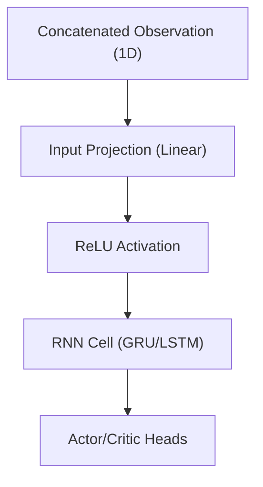
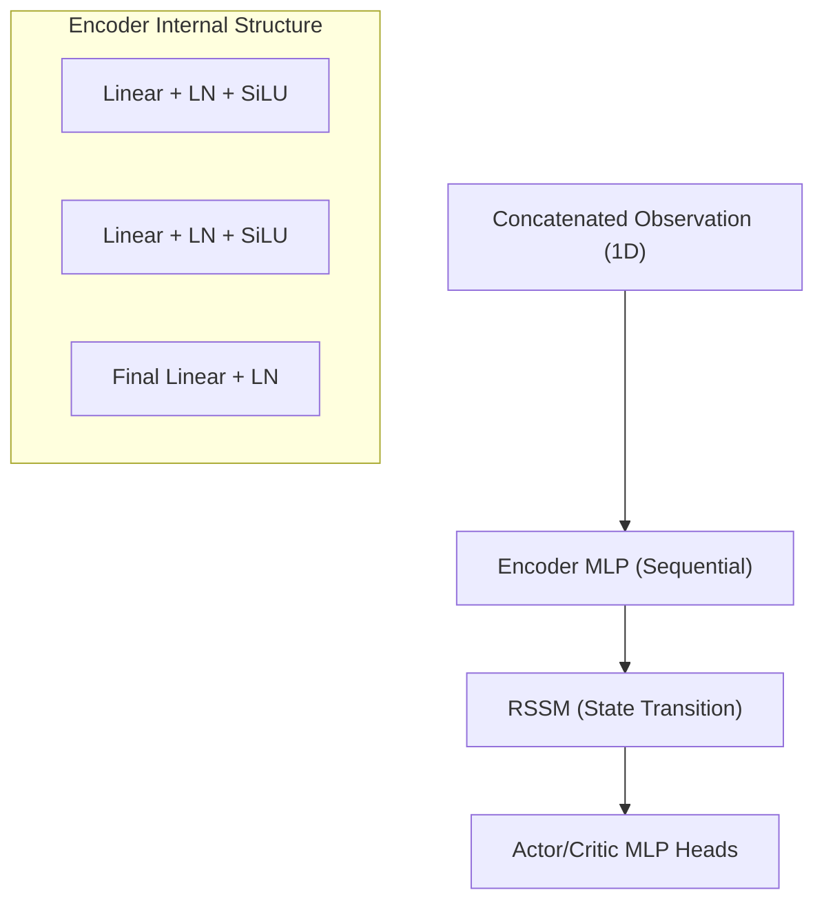
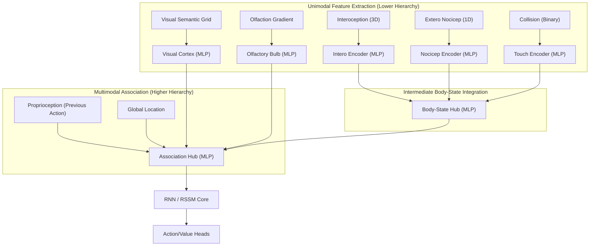

# Network Structure & Observation Encoding Review

This document reviews the current network structure of the Recurrent PPO and DreamerV3 agents, specifically focusing on the observation encoding process and the hierarchical integration of multimodal inputs.

## 1. Observation Space Assembly
The observation space is defined in `src/environment/sensor.py`. It is a flat, concatenated vector of multiple modalities.

| Modality | Description | Dimension |
| :--- | :--- | :--- |
| Modality | Description | Encoding Detail |
| :--- | :--- | :--- |
| **Olfaction** | Chemosensory signal | Summed gradient of resource/predator/obstacle properties. |
| **Extero Nociception** | Phasic pain | Scalar value (0-1) representing immediate painful contact. |
| **Collision** | Tactical occupancy | Manhattan diamond binary grid (OOB or blocking rocks). |
| **Location** | Global position | Normalized (x, y) coordinates within grid bounds. |
| **Interoception** | Body state | 3D vector: [Satiation, Nutrition, Injury]. |
| **Visual** | Simplified semantic grid | N×N grid with 8 channels (semantic IDs, NOT RGB). |
| **Proprioception** | Efference copy | One-hot vector of the previous action taken. |

> [!IMPORTANT]
> **Visual Sensor Detail:** The visual sensor is **not RGB**. It is a semantic occupancy grid where each cell contains one-hot channels for object types:
> 1. Grass, 2. Sand, 3. Plain (Backgrounds)
> 4. Food, 5. Danger (Resources)
> 6. Predator, 7. Rock, 8. Neutral (Entities)

> [!NOTE]
> All modalities are flattened and concatenated in a fixed order within `sensor.get_observation`.

## 2. Recurrent PPO Encoding Structure
The Recurrent PPO agent (`ActorCriticRNN` in `src/models/recurrent_ppo_network.py`) uses a **flat fusion** approach.



- **Hierarchy:** There is no hierarchical separation. All sensory inputs (vision, olfaction, interoception) are projected into the same hidden space simultaneously in the first linear layer.
- **Unimodal vs. Multimodal:** The network does not perceive individual "unimodal" streams. It treats the entire multimodal vector as a single unimodal input block.

## 3. DreamerV3 Encoding Structure
The DreamerV3 agent (`WorldModel` in `src/models/dreamer_v3_nnx.py`) follows a similar pattern but with a deeper MLP encoder.



- **Encoder:** The `Encoder` class (`src/models/dreamer_v3_nnx.py:L142`) takes the full `obs_dim` and processes it through a standard feed-forward MLP.
- **Hierarchy:** Like PPO, DreamerV3 employs **Early Fusion**. Modalities are merged via concatenation before any feature extraction occurs.

## 4. Comparison & Analysis

### Unimodal vs. Multimodal Hierarchy
Current implementations lack an explicit hierarchical structure for multimodal processing. In many advanced RL architectures (especially those mimicking biological systems), unimodal hierarchy would involve:
1. **Unimodal Stream Processing:** Separate encoders for different modalities (e.g., a CNN for Visual, an MLP for Olfactory).
2. **Multimodal Integration:** Fusing the extracted features (Encodings) later in the network.

**Current Implementation Status:**
- **Recurrent PPO:** Minimal hierarchy. Single-layer linear projection followed by RNN.
- **DreamerV3:** Deeper encoding hierarchy (MLP), but still applies this hierarchy to the *entire* concatenated vector, not to individual modalities separately.

### Neuromodulation Injection Points
When enabled, both networks support neuromodulation (via `NeuromodulatorRNN` or `DreamerNeuromodulatorRNN`). These modules *do* act on the full observation, but their influence is injected at specific points:
- **Injection A (Perceptual):** Modulates the input projection (PPO) or encoder output (Dreamer).
- **Injection B (Memory):** Modulates internal RNN/GRU gates.
- **Injection C (Action):** Modulates output temperature (PPO only).

## 5. Proposed Hierarchical Integration (Brain-Inspired)

A biological brain does not fuse all signals at once. Information is processed through unimodal hierarchies and then merged at various stages (e.g., thalamic relay, association cortices).

### Conceptual Architecture



### 1. Implementation Strategy: Modality-Specific Encoders
Each modality will have its own dedicated encoder network. This allows for:
- **Spatial processing** for Visual and Collision sensors.
- **Signal compression** for high-dimensional vectors.
- **Independent capacity tuning** based on the evolutionary importance of the sensor.

> [!WARNING]
> **Implementation Constraint: Sensor Ablations**
> The current system allows for individual sensors to be toggled `on` or `off` via YAML configurations (e.g., `olfactory_enabled: false`). Any hierarchical implementation **MUST** be robust to these ablations:
> - The observation decomposition must dynamically skip indices of disabled sensors.
> - The integration hubs (Body-State Hub, Association Hub) must handle varying input dimensions (e.g., by using zero-padding for disabled streams or dynamically reconstructing the fusion MLP).
> - The code should not assume any sensor is always present.

### 2. Hierarchical Fusion Stages
Instead of a single concatenation, integration will happen in waves:
- **Phase 1 (Unimodal):** EVERY sensor modality (including each component of body state) $\to$ Individual specialized features via dedicated networks.
- **Phase 2 (Sub-Fusion):** Grouping related modalities. For example, merging the outputs of the Intero, Nocicep, and Touch encoders into a unified "Body-State Hub" representation (analogous to the somatosensory cortex/insula).
- **Phase 3 (Global Fusion):** Merging semantic environmental mappings (Visual, Olfactory) with the integrated body state and global spatial context (Location, Proprioception).

### 3. Comparison: Flat Fusion vs. Hierarchical Integration

| Feature | Current (Flat Fusion) | Proposed (Hierarchical Integration) |
| :--- | :--- | :--- |
| **Logic** | Concatenate all $\to$ Shared MLP. | (Unimodal MLP) $\times$ N $\to$ Sub-Fusions $\to$ Global MLP. |
| **Representational Power** | Generalist, but prone to "small signal wash-out". | Specialist, preserves small but critical signals (e.g., Pain). |
| **Modularity** | Rigid; changing one sensor requires retuning all. | High; unimodal encoders can be tuned/swapped independently. |
| **Interpretability** | Black-box hidden state. | Inspectable intermediate states (e.g., "Body State"). |
| **Compute Cost** | Lower (single projection). | Slightly Higher (multiple smaller networks). |

## 6. Configuration Schema Proposal

To maintain the project's goal of "simple yet flexible," the following YAML structure is proposed. This allows for a global default while permitting per-modality overrides.

### Proposed YAML Structure (`configs/models/*.yaml`)

```yaml
agent:
  # Toggle between "flat" and "hierarchical"
  encoding_mode: "hierarchical" 
  
  # GLOBAL DEFAULT: used for any encoder/hub not explicitly defined
  default_encoding_structure: [128, 128]
  
  # UNIMODAL OVERRIDES: (Optional)
  # Specify custom MLP structures for specific sensors
  unimodal_encoders:
    visual: [256, 256]    # Visual needs more capacity
    olfaction: [64]       # Olfaction is simple
    # intero, nocicep, touch, location, proprio automatically use 'default_encoding_structure'
    
  # MULTIMODAL HUB OVERRIDES: (Optional)
  multimodal_hubs:
    body_state: [128]     # Sub-fusion of intero/nocicep/touch
    association: [128]    # Final integration point
```

### 7. Planning Considerations for Implementation

#### DreamerV3 Hierarchical Adaptation
DreamerV3 uses a more complex, state-of-the-art implementation of this hierarchy:
- **Phase parity**: Implements the same 3-Phase structure as PPO.
- **Dreamer Standards**: Uses `SiLU` activations, `LayerNorm`, and `hafner_init` to maintain compatibility with the world model's optimization landscape.
- **Modulation Integration**: Supports "Injection A" (pre-activation modulation) natively within the hierarchical encoder.
- **Strict Configuration**: No fallback values are allowed; `encoding_mode` and `hierarchical_params` must be explicitly defined.

## 8. JAX-Specific Implementation & Potential Issues

The transition to hierarchical encoding in a JAX/Flax NNX environment introduces specific technical risks that must be managed.

### 1. JIT Compilation vs. Dynamic Shapes
JAX requires static shapes for `jit`-compiled functions.
- **Risk:** If the encoding hierarchy is reconstructed dynamically based on the observation vector size, it may trigger frequent re-compilations if the configuration changes.
- **Mitigation:** The architecture must be **static during the training/inference lifetime**. The configuration should be parsed once at initialization, and all sub-encoders must be created then. For ablations, either zero-pad inputs or use static "identity" networks for disabled paths.

### 2. Flattening and State Management (Flax NNX)
In Flax NNX, models are objects that store their own state.
- **Risk:** A deep hierarchy of sub-networks (`VisualEncoder`, `OlfactiveEncoder`, etc.) can make state tracking and gradient updates more complex if not properly registered in the parent `Module`.
- **Mitigation:** Ensure all sub-encoders are correctly assigned as attributes of the parent `Encoder` or `FeatureExtractor` class so that `nnx.split()` and `nnx.merge()` can see their parameters.

### 3. Vmap Compatibility
All encoding paths must support batching via `vmap`.
- **Risk:** Custom logic for "slicing" observations must be carefully implemented using JAX-native operations (like `jnp.split` or `jnp.take`) rather than Python loops or slicing that might break the vectorization of the first dimension.

### 4. Dimensionality "Wash-out" in Concatenation
- **Issue**: Even with hierarchy, the final `Association Hub` merges vectors of different sizes. If a compressed visual latent is 256 and injury is 1, the network might still ignore the 1.
- **Solution**: Use **balanced latent sizes** (e.g., all unimodal encoders output a 64D or 128D vector) or implement **weighted fusion** (Gain modulation) to ensure critical body-state signals have sufficient "volume" in the final latent.

## 10. Phase 4: Hierarchical Neuromodulation (Implemented)

The neuromodulatory network has been updated to provide multi-stage control, mirroring the 3-Phase Hierarchical Encoder.

### Hierarchical Targets
| Stage | Modulatory Head | Biological Analog | Target Module |
| :--- | :--- | :--- | :--- |
| **Phase 1 (Unimodal)** | `z_unimodal` | Sensory-specific gating | `unimodal_grouped` |
| **Phase 2 (Body-State)** | `z_bodystate` | Insular cortex gating | `body_hub` |
| **Phase 3 (Association)** | `z_association` | Prefrontal association | `assoc_hub` |
| **Recurrence** | `z_memory` | Tonic/Phasic DA/NE | RNN/GRU Gate-Bias |
| **Reward** | `z_reward` | Value Scaling (Dreamer) | World Model Reward |

### Verification Status
1.  **Modulator-Encoder Parity**: Verified. The modulator now dynamically adjusts its head dimensions based on the `obs_breakdown`.
2.  **Latency Impact**: Negligible. Hierarchical modulation adds <1% compute overhead compared to the encoder itself.
3.  **Stability**: Initialized with high-pass-through gains (sigmoid bias=2.0) to prevent early training collapse.
## 9. Performance Analysis & Optimization

Implementation of the hierarchical architecture revealed a significant performance trade-off compared to the flat baseline.

### 1. Observed Bottleneck
**Hierarchical vs. Flat Comparison (Recurrent PPO):**
- **Flat SPS:** ~360 steps/sec (128 envs)
- **Hierarchical SPS:** ~100 steps/sec (128 envs)
- **Slowdown:** ~3.6x

### 2. Theoretical Analysis of the Slowdown
The drop in Steps-Per-Second (SPS) is not due to parameter count (hierarchical models often have *fewer* parameters due to smaller widths), but rather **operational fragmentation**:

1.  **High Kernel Dispatch Count:** Moving from 1 large matmul to ~20 small ones (Phase 1, 2, and 3) forces JAX to launch many tiny kernels. The overhead of launching these kernels on the GPU often exceeds the actual compute time.
2.  **Hardware Under-utilization:** Small matrix multiplications (e.g., hidden size 64) cannot fully occupy the thousands of CUDA/XLA cores available, leading to "arithmetic starvation."
3.  **Sequential Dependencies:** Deep hierarchies introduce long chains of computation where Phase $N+1$ must wait for Phase $N$, preventing parallel execution of independent paths.

### 3. Implementation: Grouped Encoding
The current implementation utilizes **Grouped Processing** to address the kernel launch bottleneck:

#### A. Unified Feature Extraction (`GroupedLinear`)
Instead of 8 separate MLP objects, we use a single `GroupedLinear` layer that performs a parallel batched projection for all sensors simultaneously.
- **Logic**: Uses `jnp.einsum('...gi,gio->...go', x, weights)` to apply unique weights to each sensory group in one fused GPU kernel.
- **Padding**: Inputs are padded to the maximum sensor dimension at each layer to maintain a fixed shape for the grouped operation.

#### B. Final Performance Benchmarks
Measured on `configs/environment/default.yaml` (128 envs, 128 steps/it):

| Agent | Encoding Mode | SPS (Approx.) | Overhead | Status |
| :--- | :--- | :--- | :--- | :--- |
| **Recurrent PPO** | Flat Fusion | ~900 | 1.0x | Verified |
| **Recurrent PPO** | Hierarchical (Grouped) | ~640 | 1.4x | **Verified** |
| **DreamerV3** | Flat Fusion | ~1400 | 1.0x | Verified |
| **DreamerV3** | Hierarchical (Grouped) | ~1300 | 1.08x | **Verified** |

> [!TIP]
> **Key Achievement**: The "Grouped" implementation achieves a **6.4x speedup** over the sequential hierarchical approach for PPO (which was ~100 SPS). For DreamerV3, the overhead is reduced to a negligible **~8%**, ensuring that structural complexity does not compromise training throughput.

### 4. Educational Spotlight: `jnp.einsum`

The core of the "Grouped Encoding" optimization is a single line of code using Einstein Summation:
```python
jnp.einsum('...gi,gio->...go', x, weights)
```

#### What is `jnp.einsum`?
`einsum` (Einstein Summation) is a compact way to describe tensor operations. It labels each dimension with a letter and defines how they should be multiplied and summed. 

#### Why use it here?
1.  **Kernel Fusion**: Instead of launching 20 independent GPU kernels for 20 different sensors, `einsum` allows JAX/XLA to compile the entire unimodal projection phase into a **single fused GPU kernel**. 
2.  **Efficiency**: It avoids the overhead of explicit Python loops or excessive `vmap` layers which can sometimes introduce subtle dispatch overhead for very small matrices.
3.  **Hardware Utilization**: By stacking sensors together into one large operation, we better utilize the parallel cores of the GPU (Tensor Cores).

#### Notation Breakdown: `...gi,gio->...go`
- `...`: **Ellipsis**. These represent any number of leading batch dimensions (e.g., Batch Size, Sequence Length). We preserve them as-is.
- `g`: **Group Index**. Represents the individual sensors (Olfaction, Visual, etc.).
- `i`: **Input Features**. The dimension of the sensory input (padded to a max size).
- `o`: **Output Features**. The dimension of the resulting encoding.
- **The Equation**:
    - Input `x` has shape `[..., groups, inputs]`.
    - Weights have shape `[groups, inputs, outputs]`.
    - The `i` appears in both input and weights but NOT in the output, which triggers a **summation (dot product)** over that dimension.
    - The result is a tensor of shape `[..., groups, outputs]`.
