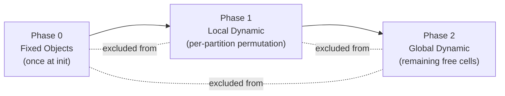

# Object Generation, Placement, and Rest Mechanics

## Grid Layout

The default config defines a **10×10 grid**. The agent starts at a random position (`random_start_pos: true`), with a fallback of `[5, 5]`.

---

## How Objects Are Generated (Config → Code)

Each object type in the YAML specifies a `count`. The config loader (`config_loader.py`) **expands** each entry by its `count`, creating one individual entity per unit. For example, a `count: 2` danger entry becomes 2 separate danger objects, each inheriting the same properties.

The grid is divided into **4 quadrants** for balanced distribution:

| Quadrant | Area (1-based) | Object Types |
|---|---|---|
| Top-Left | `[1,1]` → `[5,5]` | 1 food, 2 dangers, 3 rocks, 5 bushes |
| Top-Right | `[1,6]` → `[5,10]` | 1 food, 2 dangers, 3 rocks, 5 bushes |
| Bottom-Left | `[6,1]` → `[10,5]` | 1 food, 2 dangers, 3 rocks, 5 bushes |
| Bottom-Right | `[6,6]` → `[10,10]` | 1 food, 2 dangers, 3 rocks, 5 bushes |

**Totals**: 4 food, 8 dangers, 12 rocks, 20 bushes, 5 rabbits, 2 predators = **51 entities** on a 100-cell grid.

---

## How Objects Are Located (Placement at Reset)

All placement happens in `jax_reset()` in `core.py` via **independent random sampling** within each entity's `spawn_area`:

```python
def sample_res_pos(rk, area):
    return jax.random.randint(rk, (2,), area[:2], area[2:])

res_pos = jax.vmap(sample_res_pos)(res_keys, params.res_spawn_area)
```

**Key details:**
1. The YAML `spawn_area` uses **1-based inclusive** coordinates (e.g., `[[1, 1], [5, 5]]`).
2. The config loader converts these to **0-based min, exclusive max** for `jax.random.randint`: `[min_r-1, min_c-1, max_r, max_c]` — so `[[1,1],[5,5]]` becomes `[0, 0, 5, 5]`, generating positions in rows 0–4 and columns 0–4.
3. Each entity is sampled **independently** via `vmap` — **no overlap checking** is performed. The docstring notes this is intentional for JIT speed, with overlap probability <4%.
4. **Predators** and **neutral animals** (rabbits) spawn anywhere on the full grid `[[1,1],[10,10]]` (i.e., 0-indexed `[0,0]` to `[9,9]`).

**Resource regeneration/respawn**: When a food source is depleted (`max_consumption: 35` uses), it deactivates for `regeneration_delay: 250` steps. When it respawns, it gets a **new random position** within its `spawn_area`.

---

## How Rest Works

Rest is **action index 4** (`rest_action_enabled: true`). The action space is:

| Index | Action |
|---|---|
| 0 | Up |
| 1 | Right |
| 2 | Down |
| 3 | Left |
| 4 | **Rest** (stay in place) |
| 5 | Eat (stay in place) |

**Rest mechanics** (from `update_body()` in `core.py`):

1. **Rest streak tracking**: Consecutive rest actions increment `rest_streak`; any non-rest action resets it to 0.
2. **Exponential injury recovery**: `recovery = base_rate × (1 + accel_rate)^(streak - 1)`
   - Streak 1: `0.1 × 1.0 = 0.1` injury healed
   - Streak 2: `0.1 × 1.5 = 0.15`
   - Streak 3: `0.1 × 2.25 = 0.225`
   - ...and so on, accelerating with each consecutive rest.
3. **Recovery condition**: The agent can only heal if it is resting **and** not currently taking damage (`applied_inc <= 0`).
4. **No movement**: Rest maps to `[0, 0]` movement, so the agent stays in place.

This creates a **risk-reward trade-off**: resting heals injuries increasingly fast, but the agent is stationary (vulnerable to predators, burning nutrition via `metabolic_cost: 0.5` per step with no food intake).

---

## Overlap Checking: The Problem

With the 10×10 grid, there are **51 entities on 100 cells** (51% density). The previous 20×20 grid had ~13% density where the <4% overlap probability claim held. At 51% density, **overlaps are near-certain** every reset.

Overlapping entities cause compounding problems:
- Stacked danger zones deliver multiplicative damage in a single step.
- Food hidden under obstacles becomes inaccessible or confusing to the olfactory sensor.
- Bushes stacked on dangers undermine the hiding mechanic.

> **Previous Attempt**: A naive overlap-checking loop was applied and caused significant training speed drops due to Python-level iteration breaking JIT compilation and/or data-dependent control flow.

---

## Proposed Overlap Checking Mechanisms

### Option A: Per-Quadrant Permutation

**Idea**: Instead of sampling random (row, col) pairs and hoping for no collisions, **shuffle all valid cell indices** within each spawn area and assign them sequentially. This eliminates overlap by construction with zero rejection sampling.

**Why it's fast**:
- `jax.random.permutation` is a single O(n) JIT-compiled op.
- No loops, no branching, no data-dependent control flow.
- Fully vmap-compatible across quadrants.

**How it works for the default config**:

Each quadrant has 25 cells and 11 entities (1 food + 2 dangers + 3 rocks + 5 bushes):

```python
def place_quadrant(key, num_entities, area):
    """Shuffle cells in a spawn area and take the first N."""
    min_r, min_c, max_r, max_c = area  # 0-based min, exclusive max
    rows = max_r - min_r  # 5
    cols = max_c - min_c  # 5
    num_cells = rows * cols  # 25

    # Flat indices → permute → take first num_entities
    perm = jax.random.permutation(key, num_cells)
    selected = perm[:num_entities]

    # Convert flat index back to (row, col)
    pos_r = selected // cols + min_r
    pos_c = selected % cols + min_c
    return jnp.stack([pos_r, pos_c], axis=-1)
```

**Handling full-grid entities (predators & rabbits)**:

Predators (2) and rabbits (5) spawn across `[[1,1],[10,10]]` (the entire grid), which **overlaps all 4 quadrants**. After placing quadrant entities, these 7 full-grid entities must avoid the 44 already-placed positions.

This requires a **two-phase approach**:
1. **Phase 1**: Run `place_quadrant()` for each of the 4 quadrants → 44 positions placed.
2. **Phase 2**: Build a global occupancy mask from the 44 occupied cells. Permute all 100 grid indices, filter out occupied ones, and take the first 7.

```python
# Phase 2: Place full-grid entities avoiding quadrant entities
all_indices = jax.random.permutation(key, 100)  # shuffle 0..99
occupied_flat = quadrant_pos[:, 0] * width + quadrant_pos[:, 1]  # [44]
is_free = ~jnp.isin(all_indices, occupied_flat)  # [100] bool mask

# Cumulative sum trick to select first N free slots
free_cumsum = jnp.cumsum(is_free)
selected_mask = jnp.logical_and(is_free, free_cumsum <= 7)
selected_flat = all_indices[jnp.where(selected_mask, size=7)]
fullgrid_pos = jnp.stack([selected_flat // width, selected_flat % width], axis=-1)
```

**Estimated speed impact**: **Negligible** — replaces N independent `randint` calls with a single `permutation` + indexing. May actually be faster than the current vmap approach for dense spawn areas.

> [!WARNING]
> **Flexibility Limitation**: This approach **assumes spawn areas are non-overlapping partitions** of the grid. It breaks when:
> - Spawn areas overlap (e.g., food at `[3,3]-[7,7]` and danger at `[1,1]-[10,10]`) — two independent permutations can produce the same cell.
> - There are no clean quadrants — a single `[1,1]-[10,10]` area for all entity types would require falling back to a global permutation anyway.
> - Future experiments add entities with arbitrary spawn regions.
>
> If the environment config is expected to change frequently, **Option C is more robust**.

---

### Option B: Scan-Based Sequential Placement with Occupancy Mask

**Idea**: Place entities one at a time using `jax.lax.fori_loop`, maintaining a flat occupancy mask. Each entity samples a position; if occupied, hash-shift to the next free cell.

**Why it's JIT-friendly**:
- `jax.lax.fori_loop` has fixed iteration count (no Python loops).
- The occupancy mask is a static-shape array.
- Hash-shifting (linear probing) avoids data-dependent branching.

```python
def place_with_occupancy(key, num_entities, area, grid_width):
    """Place entities sequentially, linear-probing on collision."""
    min_r, min_c, max_r, max_c = area
    rows, cols = max_r - min_r, max_c - min_c
    num_cells = rows * cols
    occupied = jnp.zeros(num_cells, dtype=jnp.bool_)

    def body_fn(i, carry):
        occupied, positions, key = carry
        key, subkey = jax.random.split(key)
        idx = jax.random.randint(subkey, (), 0, num_cells)

        # Linear probe to find free cell (fixed max probes = num_cells)
        def probe(j, state):
            idx, found = state
            is_free = jnp.logical_not(occupied[(idx + j) % num_cells])
            new_idx = jnp.where(jnp.logical_and(is_free, jnp.logical_not(found)),
                               (idx + j) % num_cells, idx)
            found = jnp.logical_or(found, is_free)
            return new_idx, found

        final_idx, _ = jax.lax.fori_loop(0, num_cells, probe, (idx, False))

        r = final_idx // cols + min_r
        c = final_idx % cols + min_c
        positions = positions.at[i].set(jnp.array([r, c]))
        occupied = occupied.at[final_idx].set(True)
        return occupied, positions, key

    positions = jnp.zeros((num_entities, 2), dtype=jnp.int32)
    _, positions, _ = jax.lax.fori_loop(0, num_entities, body_fn,
                                         (occupied, positions, key))
    return positions
```

**Estimated speed impact**: **Low-moderate** — sequential by nature, but all ops are JIT-compiled with static shapes. The inner probe loop has a fixed bound (`num_cells`), so JAX can unroll or compile it efficiently. For 25-cell quadrants with 11 entities, this is 11 × 25 = 275 total ops worst case.

**When to use**: When entities from different config groups share the same spawn area and you need global cross-group overlap prevention without restructuring the config.

---

### Option C: Sample + Resolve (⭐ Recommended)

**Idea**: Keep the current independent `vmap` sampling logic untouched. After all entities are placed, run a single JIT-compiled global pass that detects and resolves overlaps by displacing colliding entities to random free cells **within their own spawn area**.

**Why this is the most flexible approach**:
- Works with **any spawn area geometry** — overlapping, nested, arbitrary rectangles, full-grid.
- **Zero code changes** to the existing `jax_reset` sampling logic — just append the resolver.
- Each entity respects its own `spawn_area` constraint even during displacement.
- Future config changes (new areas, removed quadrants, etc.) require **no code updates**.

**How it works**:

1. All entities are sampled independently (current logic).
2. All positions are concatenated into a single `[N, 2]` array.
3. A `lax.fori_loop` scans entity-by-entity. For each entity, it checks if its cell is already taken by an earlier entity.
4. If duplicate, it finds a free cell **within that entity's spawn area** using a permutation-based fallback.

```python
def resolve_overlaps_global(all_positions, all_spawn_areas, grid_height, grid_width, key):
    """
    Global overlap resolver for all entity types.
    
    Args:
        all_positions: [N, 2] — concatenated positions of ALL entities
        all_spawn_areas: [N, 4] — per-entity spawn area (min_r, min_c, max_r, max_c)
        grid_height, grid_width: grid dimensions
        key: JAX PRNG key
    """
    num_entities = all_positions.shape[0]
    total_cells = grid_height * grid_width
    
    # Flatten to 1D grid index for fast comparison
    flat = all_positions[:, 0] * grid_width + all_positions[:, 1]
    
    def resolve_one(i, carry):
        flat_indices, positions, key = carry
        
        # Check if current cell is already taken by any earlier entity
        earlier = jnp.arange(num_entities) < i
        is_dup = jnp.any(jnp.logical_and(earlier, flat_indices == flat_indices[i]))
        
        # If duplicate: find a free cell within this entity's spawn area
        key, subkey = jax.random.split(key)
        area = all_spawn_areas[i]
        min_r, min_c, max_r, max_c = area[0], area[1], area[2], area[3]
        area_rows = max_r - min_r
        area_cols = max_c - min_c
        area_cells = area_rows * area_cols
        
        # Permute cells within spawn area
        perm = jax.random.permutation(subkey, area_cells)
        
        # Convert local flat index to global flat index
        local_r = perm // area_cols + min_r
        local_c = perm % area_cols + min_c
        candidate_flat = local_r * grid_width + local_c
        
        # Find first candidate not in earlier occupied set
        occupied_by_earlier = jnp.isin(candidate_flat, flat_indices,
                                       assume_unique=False)
        # We need to also account for what we've resolved so far
        is_candidate_free = jnp.logical_not(occupied_by_earlier)
        free_cumsum = jnp.cumsum(is_candidate_free)
        first_free_mask = jnp.logical_and(is_candidate_free, free_cumsum == 1)
        # Default to original if no conflict
        replacement_flat = jnp.where(first_free_mask, candidate_flat, 0).sum()
        
        new_flat = jnp.where(is_dup, replacement_flat, flat_indices[i])
        new_r = new_flat // grid_width
        new_c = new_flat % grid_width
        
        positions = positions.at[i].set(jnp.array([new_r, new_c]))
        flat_indices = flat_indices.at[i].set(new_flat)
        return flat_indices, positions, key
    
    flat, all_positions, _ = jax.lax.fori_loop(
        0, num_entities, resolve_one, (flat, all_positions, key)
    )
    return all_positions
```

**Integration into `jax_reset()`**:

```python
# After current sampling (unchanged):
res_pos = jax.vmap(sample_res_pos)(res_keys, params.res_spawn_area)    # [N_res, 2]
pred_pos = jax.vmap(sample_pred_pos)(pred_keys, params.pred_spawn_area) # [N_pred, 2]
obs_pos = jax.vmap(sample_obs_pos)(obs_keys, params.obs_spawn_area)     # [N_obs, 2]
neutral_pos = jax.vmap(sample_neutral_pos)(nkeys, params.neutral_spawn_area) # [N_neutral, 2]

# Concatenate ALL positions and spawn areas
all_positions = jnp.concatenate([res_pos, pred_pos, obs_pos, neutral_pos], axis=0)
all_spawn_areas = jnp.concatenate([
    params.res_spawn_area, params.pred_spawn_area,
    params.obs_spawn_area, params.neutral_spawn_area
], axis=0)

# Resolve overlaps globally
all_positions = resolve_overlaps_global(
    all_positions, all_spawn_areas, params.height, params.width, resolve_key
)

# Split back into per-type arrays
res_pos = all_positions[:N_res]
pred_pos = all_positions[N_res:N_res+N_pred]
obs_pos = all_positions[N_res+N_pred:N_res+N_pred+N_obs]
neutral_pos = all_positions[N_res+N_pred+N_obs:]
```

**Estimated speed impact**: **Low**. The `lax.fori_loop` runs N iterations (51 in default config), each doing a `permutation` of at most 25 cells + an `isin` check against 51 elements. All ops are JIT-compiled with static shapes. In practice, most entities won't be duplicates, so the permutation fallback is computed but its result is discarded via `jnp.where`.

**Why this handles all config variations**:

| Scenario | How it's handled |
|---|---|
| Clean quadrants (current default) | Works — resolves the few cross-quadrant overlaps (predators/rabbits) |
| Overlapping areas (e.g., `[3,3]-[7,7]` + `[1,1]-[10,10]`) | Works — global `flat_indices` catches all cross-area collisions |
| No quadrants (all entities share `[1,1]-[10,10]`) | Works — effectively becomes a global permutation |
| Future entity types with new spawn areas | Works — just concatenate the new positions/areas, no code changes |

---

### Why Option C Maintains Low Speed Impact

A common concern is that resolving overlaps requires repeated resampling — "keep trying until you find a free cell" — which is what likely caused the previous training speed drop. Option C avoids this entirely.

**The naive approach that breaks JIT** (likely the previous attempt):

```python
# ❌ SLOW: Rejection sampling with data-dependent loop
while position_is_occupied:
    position = random_sample()  # retry until lucky
```

This is a **variable-length loop** — JAX can't compile it because the iteration count depends on runtime data.

**What Option C does instead** — deterministic one-pass resolution:

```python
# ✅ FAST: Permute all candidates, pick the first free one
perm = jax.random.permutation(subkey, area_cells)  # shuffle all 25 cells
candidate_flat = convert_to_grid_indices(perm)       # all candidates, pre-computed
is_free = ~jnp.isin(candidate_flat, flat_indices)    # which are unoccupied?
first_free = pick_first_true(is_free)                 # deterministic, no loop
```

For each overlapping entity, it **pre-shuffles every cell in the spawn area** and picks the first unoccupied one. This is O(area_cells) array ops — always exactly 25 ops for a 5×5 quadrant, regardless of how many overlaps exist.

**The global assignment tracking**:

The `flat_indices` array (shape `[51]`) is the shared **global assignment vector**. It stores the flat grid index for every entity across all types:

```
flat_indices = [cell_of_food_0, ..., cell_of_pred_0, ..., cell_of_rock_0, ..., cell_of_bush_19]
```

As the `lax.fori_loop` scans entity-by-entity:
- Entity `i` checks `flat_indices[0:i]` — everything already assigned.
- If `flat_indices[i]` duplicates an earlier entry → it's overlapping.
- The replacement cell is written to `flat_indices[i]` **before** the next iteration.
- Entity `i+1` sees the **updated** assignment, so it knows entity `i`'s corrected position.

**Per-iteration cost breakdown**:

| Operation | Cost |
|---|---|
| `jnp.arange(N) < i` (earlier mask) | O(51) |
| `jax.random.permutation(area_cells)` | O(25) |
| `jnp.isin(candidates, flat_indices)` | O(25 × 51) |
| `jnp.cumsum` + first-true selection | O(25) |
| `.at[i].set(...)` (update assignment) | O(1) |

**Total**: ~51 iterations × ~1,300 ops = **~66K array ops** on tiny arrays that fit in L1 cache. For comparison, the current `vmap` sampling is ~51 `randint` calls with similar overhead. Every operation has a **fixed, data-independent shape**, so XLA can fully optimize it.

---

### Q\&A: Why Not a Parallel (Cells × Entities) Matrix?

**Question**: What if we create a `(100 × 51)` assignment matrix, where `M[cell, entity] = 1` if entity is at that cell? Then column sums would instantly reveal all overlapping cells. Wouldn't this avoid the sequential checking entirely?

**Answer**: This is an excellent intuition. A matrix approach **does** enable fully parallel overlap **detection** — but the bottleneck isn't detection, it's **resolution**. Here's why:

**Parallel detection (easy):**

```python
# Build (100, 51) one-hot assignment matrix
M = jnp.zeros((100, 51), dtype=jnp.bool_)
M = M.at[flat_indices, jnp.arange(51)].set(True)

# Cells with >1 entity = overlaps
cell_counts = M.sum(axis=1)          # [100] — how many entities per cell
overlap_cells = cell_counts > 1       # instant parallel detection ✅
```

This is O(100 × 51) = 5,100 ops and runs in parallel — great!

**Parallel resolution (the hard part):**

Once you know which entities overlap, you need to **move them to free cells**. But this creates a **sequential dependency chain**:

1. Entities 3, 7, and 12 all land on cell 42.
2. You keep entity 3 (first arrival) and need to relocate entities 7 and 12.
3. You assign entity 7 to free cell 17 → cell 17 is now occupied.
4. Entity 12 must see that cell 17 is now taken before choosing its new cell.

If you try to relocate entities 7 and 12 **in parallel**, they might both pick the same free cell — creating a new overlap. You'd then need another round of detection + resolution, and another, until convergence. This is essentially iterative refinement:

```python
# ❌ Multiple parallel rounds (unpredictable convergence)
for round in range(max_rounds):
    detect_overlaps()
    relocate_in_parallel()  # may create NEW overlaps
    if no_overlaps: break   # data-dependent termination → JIT-unfriendly
```

**Additionally**, each entity has a **per-entity spawn area** constraint. Entity 7 (food in quadrant TL) can only move within `[0,0]-[4,4]`, while entity 12 (predator) can move within `[0,0]-[9,9]`. A global matrix doesn't naturally encode these per-entity constraints — you'd need a masked version per entity or per spawn area, increasing complexity.

**Bottom line**: The matrix approach and Option C perform roughly the same total work (~66K ops).  The matrix parallelizes detection but still needs sequential resolution. Option C combines both in a single sequential pass that JAX compiles into a tight loop. The computational cost is equivalent, but Option C is simpler to implement and naturally respects per-entity spawn areas.

| Aspect | Matrix Approach | Option C (fori_loop) |
|---|---|---|
| Detection | ✅ Parallel, O(5,100) | Sequential, O(51 per step) |
| Resolution | ❌ Needs multiple rounds | ✅ Single pass |
| Per-entity spawn area | ❌ Extra masking needed | ✅ Built-in |
| Total ops | ~66K | ~66K |
| Code complexity | Higher | Lower |
| JIT compatibility | ⚠️ Convergence loop | ✅ Fixed iterations |

## Strict Config Rules: Enabling the Fastest Approach

### The Core Insight

The sequential dependency in overlap resolution exists because entities with **overlapping spawn areas** compete for the same cells. If we enforce strict rules that **eliminate spawn area overlap**, the competition disappears and we can use pure parallel permutation (Option A) — the fastest possible approach.

The key idea: **sort entities by spawn area size (ascending) and place small-area entities first, global entities last**. This ordering is determined once at config-load time and reused for every reset.

### Proposed Strict Rules

**Rule 0: Fixed objects placed once at initialization**

Some objects have **permanent, unchanging positions** across all resets (e.g., trees, walls, terrain features). These are:
- Placed **once** during `load_env_params()` (config-load time), not during `jax_reset()`.
- Stored in `EnvParams` as static arrays (e.g., `params.fixed_obs_pos`).
- Their cells are **pre-excluded** from all subsequent permutation phases.

This is critical because fixed objects are never repositioned — computing their placement per-reset is wasted work.

```
Example (trees in default config — currently count=0, but if enabled):
  Trees at [4,4], [4,5], [5,4] → stored in params, excluded from dynamic placement
```

**Rule 1: Non-overlapping partition for local dynamic entities**

All dynamic entities with restricted spawn areas must be assigned to **non-overlapping rectangular partitions** of the grid. Within each partition, entities are placed via permutation — zero overlap by construction. Fixed-object cells within a partition are excluded from the permutation.

```
Example (current default — already compliant):
  Quadrant TL [0,0]-[4,4]: 1 food, 2 dangers, 3 rocks, 5 bushes = 11 entities / 25 cells ✅
  Quadrant TR [0,5]-[4,9]: 1 food, 2 dangers, 3 rocks, 5 bushes = 11 entities / 25 cells ✅
  Quadrant BL [5,0]-[9,4]: 1 food, 2 dangers, 3 rocks, 5 bushes = 11 entities / 25 cells ✅
  Quadrant BR [5,5]-[9,9]: 1 food, 2 dangers, 3 rocks, 5 bushes = 11 entities / 25 cells ✅
```

**Rule 2: Global entities placed last**

Entities with full-grid spawn areas (predators, rabbits) are always placed **after** all local entities. They select from the remaining free cells (excluding both fixed objects and local entities).

**Rule 3: Entity count ≤ available cell count per area**

Each partition must have more **available cells** (total cells minus fixed objects in that area) than dynamic entities assigned to it. Violation = config error (fail fast at load time).

### Three-Phase Permutation (Option A Extended)

With these rules, the entire placement becomes **three phases** — one computed once, two per-reset — with **zero sequential loops**:

```python
# ═══════════════════════════════════════════════════════════════
# Phase 0: Fixed objects (computed ONCE in load_env_params)
# ═══════════════════════════════════════════════════════════════
# Fixed objects (trees, walls) are placed at config-load time.
# Their positions are stored in EnvParams and never change.
#
# fixed_obs_pos: [N_fixed, 2]  — e.g., tree positions
# fixed_flat: [N_fixed]        — flat grid indices of fixed cells
#
# Example:
#   trees = [(4,4), (4,5), (5,4)]  → fixed_flat = [44, 45, 54]
#
# Also precompute per-partition available cell masks:
#   For each partition, remove fixed cells from the permutation pool.
#   partition_available_cells[q] = partition_cells[q] - fixed_in_partition[q]


# ═══════════════════════════════════════════════════════════════
# Phase 1 & 2: Dynamic placement (computed EVERY reset)
# ═══════════════════════════════════════════════════════════════
def place_all_entities(key, params):
    """Three-phase placement: fixed (precomputed) → local → global."""
    key1, key2 = jax.random.split(key)
    
    # ── Phase 1: Local dynamic entities (per-partition permutation) ──
    # Each partition is independent → fully parallel via vmap
    # Fixed cells within each partition are excluded from the pool.
    #
    # partition_valid_indices: [num_partitions, max_cells_per_partition]
    #   Pre-computed at config time: flat indices within each partition
    #   that are NOT occupied by fixed objects.
    
    def place_partition(subkey, valid_indices, num_valid, num_entities):
        # Permute only the available (non-fixed) cells
        perm = jax.random.permutation(subkey, num_valid)
        selected = valid_indices[perm[:num_entities]]
        
        pos_r = selected // params.width
        pos_c = selected % params.width
        return jnp.stack([pos_r, pos_c], axis=-1)
    
    partition_keys = jax.random.split(key1, num_partitions)
    local_positions = jax.vmap(place_partition)(
        partition_keys, params.partition_valid_indices,
        params.partition_num_valid, params.entities_per_partition
    )  # [num_partitions, max_entities_per_partition, 2]
    
    # Flatten: [total_local_entities, 2]
    local_flat = local_positions.reshape(-1, 2)[:total_local]
    
    # ── Phase 2: Global dynamic entities (avoid fixed + local cells) ──
    # Combine fixed and local occupied cells
    local_flat_idx = local_flat[:, 0] * params.width + local_flat[:, 1]
    all_occupied = jnp.concatenate([params.fixed_flat, local_flat_idx])
    
    all_cells = jax.random.permutation(key2, params.height * params.width)
    is_free = ~jnp.isin(all_cells, all_occupied)
    free_cumsum = jnp.cumsum(is_free)
    selected_mask = jnp.logical_and(is_free, free_cumsum <= num_global_entities)
    selected_flat = all_cells[jnp.where(selected_mask, size=num_global_entities)]
    
    global_positions = jnp.stack([
        selected_flat // params.width,
        selected_flat % params.width
    ], axis=-1)
    
    return local_flat, global_positions
```

**Placement order summary**:



**Speed**: Phase 0 is **zero cost per-reset** (precomputed). Phase 1 is a single `vmap`'d permutation (~4 parallel calls). Phase 2 is one permutation + one `isin`. No `fori_loop`, no sequential scanning. This is **as fast as the current code** (which does vmap'd `randint`), potentially faster.

### What About Arbitrary Spawn Areas?

If a future experiment uses something like `[3,3]-[7,7]` (the center area) that overlaps with quadrants:

**Option 1 — Adjust partitions**: Repartition the grid to accommodate. For example, if one entity type uses `[3,3]-[7,7]`, create 5 partitions instead of 4:

```
  Border-TL, Border-TR, Border-BL, Border-BR, Center
```

This is a config-time decision — the code doesn't change, only the partition definitions.

**Option 2 — Treat overlapping entities as "global"**: Any entity whose spawn area overlaps multiple partitions gets placed in Phase 2 (after local entities). Its spawn area is respected by filtering Phase 2 candidates to cells within `[3,3]-[7,7]` that are free.

**Option 3 — Fall back to Option C for that config**: If the partitioning gets too complex, use Option C's `fori_loop` resolver. The config loader can detect overlapping spawn areas at load time and automatically dispatch to the appropriate strategy.

### Automatic Strategy Selection and Diagnostic Logging

Rather than auto-adjusting misconfigured ranges (which would hide bugs), the config loader should **detect the strategy and print a clear diagnostic** at initialization. This way, if you accidentally set `[1,1]-[6,6]` instead of `[1,1]-[5,5]`, you'll immediately see a warning that overlapping areas forced a fallback to the slower strategy.

```python
import logging
log = logging.getLogger("env.placement")

def select_placement_strategy(spawn_areas, fixed_positions, grid_h, grid_w):
    """Analyze spawn areas at config-load time. Print strategy and warnings."""
    
    # 1. Detect pairwise overlaps
    overlaps = check_pairwise_overlap(spawn_areas)
    
    # 2. Compute per-partition stats
    partitions = group_into_partitions(spawn_areas)
    
    # ── Print Diagnostic ──
    log.info("=" * 60)
    log.info("ENTITY PLACEMENT STRATEGY")
    log.info("=" * 60)
    log.info(f"Grid: {grid_h}×{grid_w} ({grid_h * grid_w} cells)")
    log.info(f"Fixed objects: {len(fixed_positions)} cells pre-occupied")
    log.info(f"Total dynamic entities: {len(spawn_areas)}")
    log.info("")
    
    if not overlaps:
        strategy = "three_phase_permutation"  # Option A — fastest
        log.info("Strategy: THREE-PHASE PERMUTATION (Option A)")
        log.info("  All spawn areas are non-overlapping ✅")
        log.info("")
        
        for i, p in enumerate(partitions):
            available = p.total_cells - p.fixed_count
            density = p.entity_count / available * 100 if available > 0 else 999
            status = "✅" if p.entity_count <= available else "❌ OVERFLOW"
            log.info(f"  Partition {i}: {p.area}  "
                     f"entities={p.entity_count}  "
                     f"available_cells={available}  "
                     f"density={density:.0f}%  {status}")
    else:
        strategy = "sample_and_resolve"  # Option C — fallback
        log.warning("Strategy: SAMPLE + RESOLVE (Option C — fallback)")
        log.warning("  Overlapping spawn areas detected ⚠️")
        log.warning("")
        
        for a, b, overlap_area in overlaps:
            log.warning(f"  OVERLAP: area {a.name}{a.area} ∩ "
                        f"area {b.name}{b.area} = {overlap_area} cells")
        
        log.warning("")
        log.warning("  → To use the faster Option A, adjust spawn areas "
                     "to non-overlapping partitions.")
    
    log.info("")
    log.info(f"Selected: {strategy}")
    log.info("=" * 60)
    
    return strategy
```

**Example output — clean config (Option A selected)**:

```
============================================================
ENTITY PLACEMENT STRATEGY
============================================================
Grid: 10×10 (100 cells)
Fixed objects: 0 cells pre-occupied
Total dynamic entities: 51

Strategy: THREE-PHASE PERMUTATION (Option A)
  All spawn areas are non-overlapping ✅

  Partition 0: [0,0]-[4,4]  entities=11  available_cells=25  density=44%  ✅
  Partition 1: [0,5]-[4,9]  entities=11  available_cells=25  density=44%  ✅
  Partition 2: [5,0]-[9,4]  entities=11  available_cells=25  density=44%  ✅
  Partition 3: [5,5]-[9,9]  entities=11  available_cells=25  density=44%  ✅
  Global: predators=2, rabbits=5  remaining_cells=56  ✅

Selected: three_phase_permutation
============================================================
```

**Example output — misconfigured ranges (Option C fallback)**:

```
============================================================
ENTITY PLACEMENT STRATEGY
============================================================
Grid: 10×10 (100 cells)
Fixed objects: 3 cells pre-occupied
Total dynamic entities: 51

Strategy: SAMPLE + RESOLVE (Option C — fallback)
  Overlapping spawn areas detected ⚠️

  OVERLAP: area food[0,0]-[5,5] ∩ area danger[0,0]-[4,4] = 25 cells
  OVERLAP: area food[0,0]-[5,5] ∩ area rock[5,0]-[9,4]  = 5 cells

  → To use the faster Option A, adjust spawn areas to non-overlapping partitions.

Selected: sample_and_resolve
============================================================
```

This prints **once** at initialization (not per-reset), adds zero runtime cost, and immediately tells you:
- Which strategy was selected and why.
- Exact overlap details if the fast path was skipped.
- Per-partition density so you can spot overpacked areas.
- A clear fix instruction to get back to Option A.

---

## Comparison Summary

| Approach | JIT-Safe | Speed Impact | Code Change | Flexibility | Overlap Guarantee |
|---|---|---|---|---|---|
| **A: Two-Phase Permutation** ⭐ | ✅ fully | **Negligible** | Moderate | ✅ With strict rules | ✅ by construction |
| **B: Scan + Occupancy** | ✅ fully | Low-moderate | Moderate | ⚠️ Per-area only | ✅ by construction |
| **C: Sample + Resolve** | ✅ fully | Low | **Minimal** | ✅ Any geometry | ✅ post-hoc fix |

### Final Recommendation

**Implement both A and C**, with automatic dispatch:

1. **Default path (Option A — Two-Phase Permutation)**: Used when strict rules are satisfied (non-overlapping partitions). This is the fastest approach — pure parallel permutation with no sequential loops. The current default config already satisfies these rules.

2. **Fallback path (Option C — Sample + Resolve)**: Automatically activated when the config loader detects overlapping spawn areas. Handles any geometry with low speed impact.

**Strict rules to follow when designing configs**:
- Assign restricted entities to non-overlapping rectangular partitions when possible.
- Keep total entities per partition ≤ partition cell count.
- Place full-grid entities (predators, rabbits, etc.) in the "global" category.
- If an experiment requires overlapping spawn areas, Option C kicks in automatically — no code changes needed.

This gives you **the fastest speed for well-structured configs** (current default and future quadrant-based experiments) while **never breaking** on arbitrary configs.

