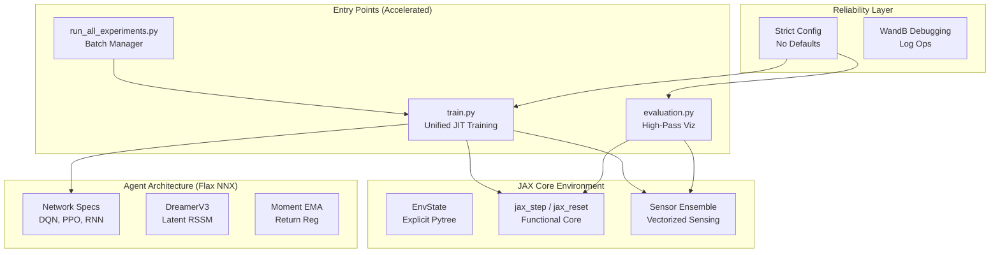

# 🧠 GridWorld Pain Project - Comprehensive System Documentation

> **Last Updated**: 2026-02-09  
> **Backend**: 100% JAX/Flax NNX Optimized  
> **Protocol**: Strict Configuration (No Safe Defaults)

---

## 📖 Executive Overview

**GridWorld Pain** is a specialized RL research platform for **Interoceptive AI**. It models agents that balance external reward-seeking with internal homeostatic regulation (maintaining hunger and injury setpoints).

### Core Research Pillars
1. **Homeostatic RL**: Utilizing Drive-Reduction theory where rewards are inversely proportional to physiological distance from optimal states.
2. **Sensory Fusion**: Combining N-dimensional chemical gradients, discrete nociceptors, and prophetic motor feedback into a unified observation space.
3. **Massive Parallelism**: Leveraging JAX's functional paradigm to eliminate CPU-GPU synchronization bottlenecks.

---

## 🏗️ System Architecture (JAX-Native)

---

## 📁 File Manifest

| Path | Purpose |
|------|---------|
| [train.py](file:///media/nas01/projects/Interoceptive-AI/grid_world_pain/train.py) | Main JIT-compiled training loop; handles key splitting and rollout scans. |
| [evaluation.py](file:///media/nas01/projects/Interoceptive-AI/grid_world_pain/evaluation.py) | Vectorized evaluation with video rendering and metric logging. |
| [src/environment/core.py](file:///media/nas01/projects/Interoceptive-AI/grid_world_pain/src/environment/core.py) | Functional grid-world logic; no side-effects. |
| [src/environment/sensor.py](file:///media/nas01/projects/Interoceptive-AI/grid_world_pain/src/environment/sensor.py) | Vectorized implementation of Olfaction, Nociception, and Proprioception. |
| [src/environment/config_loader.py](file:///media/nas01/projects/Interoceptive-AI/grid_world_pain/src/environment/config_loader.py) | Strict YAML-to-EnvParams mapper (Mandatory values only). |

---

## 📦 Sensory Modalities

1. **Olfactory (Chemical)**: Detects entity properties using $1/\text{dist}^d$ decay.
2. **Nociception (Pain)**: Detects contact with harmful entities (Predators/Danger).
3. **Collision**: Manhattan diamond directional detection for obstacles.
4. **Proprioception**: One-hot feedback of the agent's **previous action**.
5. **Interoception**: Normalized status of Satiation and Injury.
6. **Location**: Normalized spatial coordinates $[-1, 1]$.

---

## 🔬 Implementation Protocols

### No Safe Defaults Policy
To prevent experimental drift, the system **raises an error** if a configuration key is missing. 
- **Incorrect**: `val = config.get('lr', 0.001)`
- **Correct**: `val = config.get_mandatory('lr')`

### Conditional Action Space
The action dimension is dynamically calculated at runtime based on the `rest_action_enabled` and `eat_action_enabled` flags, ensuring the network heads always match the environment capability.

---

## 🚀 Execution Environment
**Mandatory Path**: `/home/vncuser/miniconda3/envs/grid_world_pain/bin/python`  
**Deployment**: Use `run_all_experiments.py` for large-scale ablation studies.
