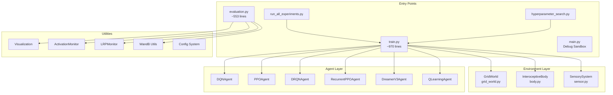
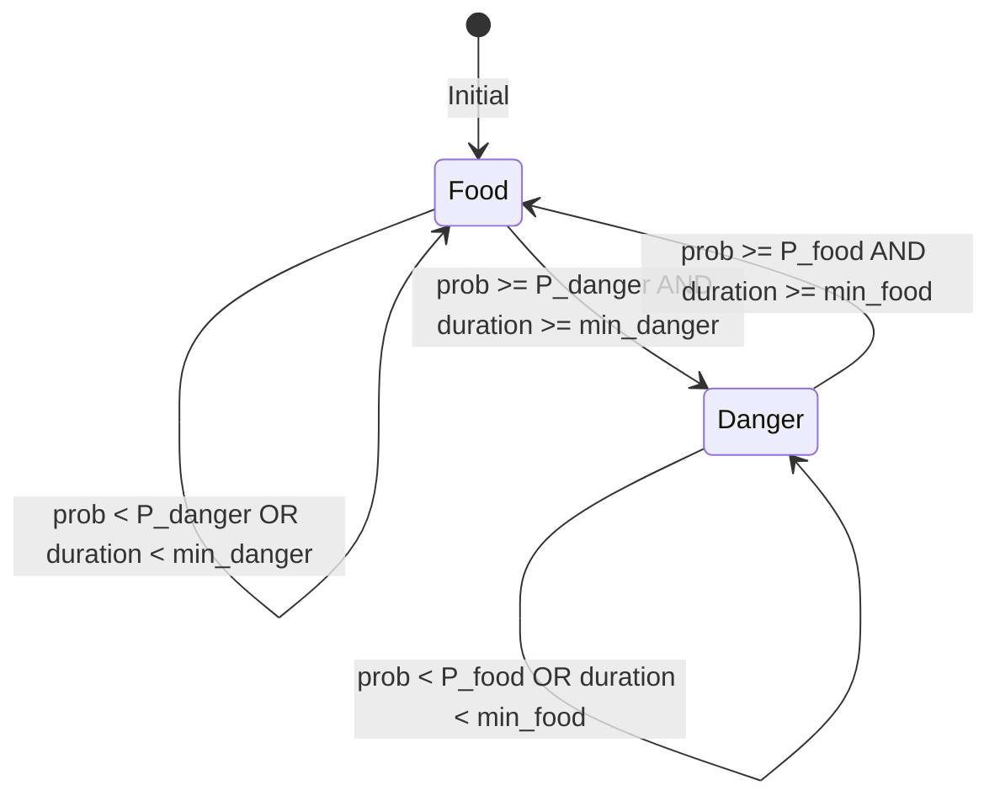

# 🧠 GridWorld Pain Project - Comprehensive System Documentation

> **Project Location**: `/media/nas01/projects/Interoceptive-AI/grid_world_pain`  
> **Last Updated**: 2026-01-27  
> **Purpose**: LLM Agent Context Document

---

## 📖 Executive Overview

**GridWorld Pain** is a sophisticated Reinforcement Learning research platform designed to study **Interoceptive AI** - agents that perceive and act based on internal body states (hunger, pain) rather than just external goals. The project implements a custom grid-based environment with homeostatic regulation and supports multiple state-of-the-art RL algorithms.

### Key Research Concepts
- **Interoception**: Internal body-state awareness (satiation, health)
- **Homeostatic RL**: Reward signals based on drive reduction (maintaining physiological setpoints)
- **Sensory Integration**: Gradient-based olfactory sensors and nociceptors

---

## 🏗️ System Architecture



---

## 📁 Project Structure

| Path | Lines | Description |
|------|-------|-------------|
| [train.py](file:///media/nas01/projects/Interoceptive-AI/grid_world_pain/train.py) | ~970 | Main training script with full RL loop |
| [evaluation.py](file:///media/nas01/projects/Interoceptive-AI/grid_world_pain/evaluation.py) | ~553 | Evaluation and video generation |
| [main.py](file:///media/nas01/projects/Interoceptive-AI/grid_world_pain/main.py) | ~348 | Debug sandbox with random agent |
| [run_all_experiments.py](file:///media/nas01/projects/Interoceptive-AI/grid_world_pain/run_all_experiments.py) | ~163 | Parallel training launcher |
| [hyperparameter_search.py](file:///media/nas01/projects/Interoceptive-AI/grid_world_pain/hyperparameter_search.py) | ~301 | Grid search automation |

### Source Directory (`src/`)

```
src/
├── environment/
│   ├── __init__.py
│   ├── grid_world.py      # GridWorld class (~533 lines)
│   ├── body.py            # InteroceptiveBody class (~167 lines)
│   └── sensor.py          # SensorySystem, ResourceSensor, Nociceptor (~143 lines)
│
├── models/
│   ├── __init__.py
│   ├── dqn.py             # DQNAgent, DQN network, ReplayBuffer (~189 lines)
│   ├── drqn.py            # DRQNAgent with LSTM (~322 lines)
│   ├── ppo.py             # PPOAgent, ActorCritic (~266 lines)
│   ├── recurrent_ppo.py   # RecurrentPPOAgent with LSTM (~347 lines)
│   ├── dreamer_v3.py      # DreamerV3Agent, RSSM world model (~877 lines)
│   └── q_learning.py      # Tabular QLearningAgent (~149 lines)
│
└── utils/
    ├── activation_monitor.py  # Hook-based activation capture (~135 lines)
    ├── config.py              # Config class with strict validation (~83 lines)
    ├── lrp_monitor.py         # Layerwise Relevance Propagation (~79 lines)
    ├── visualization.py       # Video, Q-table, activation viz (~635 lines)
    └── wandb_utils.py         # WandB login, video upload (~169 lines)
```

---

## 🌍 Environment Module - Detailed

### GridWorld ([src/environment/grid_world.py](file:///media/nas01/projects/Interoceptive-AI/grid_world_pain/src/environment/grid_world.py))

The core navigation environment implementing a 2D grid with dynamic food/danger resources.

#### Constructor Parameters
```python
GridWorld(
    height, width,                    # Grid dimensions
    start,                            # Agent start position (row, col)
    resource_pos,                     # Initial resource position
    with_satiation,                   # Enable interoceptive mode
    max_steps,                        # Episode step limit
    prob_switch_to_danger,            # P(Food→Danger) per step
    min_danger_duration,              # Minimum steps before Danger can switch
    prob_switch_to_food,              # P(Danger→Food) per step  
    min_food_duration,                # Minimum steps before Food can switch
    damage_amount,                    # Health damage in danger zone
    relocate_resource,                # Enable periodic relocation
    relocation_steps,                 # Steps between relocations
    vector_size,                      # Property vector dimension
    food_property,                    # Food chemical signature [N-dim]
    danger_property                   # Danger chemical signature [N-dim]
)
```

#### Key Methods
| Method | Returns | Description |
|--------|---------|-------------|
| `reset()` | `(row, col)` | Resets agent to random position, returns initial state |
| `step(action)` | `(next_state, reward, done, info)` | Executes action (0-4: Up/Right/Down/Left/Stay) |
| `get_active_resources()` | `List[Resource]` | Returns current resources for sensory system |
| `render_rgb_array(...)` | `np.ndarray` | Generates visualization frame with UI elements |

#### Resource State Machine


#### Info Dictionary Structure
```python
info = {
    'ate_food': bool,     # True if agent on food this step
    'damage': int,        # Health damage taken (0 if not in danger)
    'rested': bool        # True if action was Stay (4)
}
```

---

### InteroceptiveBody ([src/environment/body.py](file:///media/nas01/projects/Interoceptive-AI/grid_world_pain/src/environment/body.py))

Simulates the agent's internal physiological state with metabolism and homeostatic regulation.

#### Constructor Parameters
```python
InteroceptiveBody(
    max_satiation,              # Upper bound for satiation
    start_satiation,            # Initial satiation value
    overeating_death,           # If True, satiation >= max kills agent
    random_start_satiation,     # Randomize start between max/2 and max
    food_satiation_gain,        # Satiation increase from eating (+10 default)
    use_homeostatic_reward,     # Use drive reduction vs survival reward
    satiation_setpoint,         # Target satiation for homeostasis
    death_penalty,              # Negative reward on death
    with_health,                # Enable health/pain simulation
    max_health,                 # Maximum health value
    start_health,               # Initial health
    health_recovery,            # Health gained per rest step
    start_health_random         # Randomize starting health
)
```

#### State Update Flow (per step)
```python
# 1. Metabolism
satiation -= 1

# 2. Food Consumption
if ate_food:
    satiation += food_satiation_gain
    satiation = min(satiation, max_satiation + (1 if overeating_death else 0))

# 3. Health Dynamics
if damage > 0:
    health -= damage
elif rested:  # Action 4 (Stay)
    health = min(health + health_recovery, max_health)

# 4. Death Checks
if satiation <= 0: death_type = "starvation"
if overeating_death and satiation >= max_satiation: death_type = "overeating"
if health <= 0: death_type = "injury"
```

#### Reward Calculation
```python
if use_homeostatic_reward:
    # Euclidean distance to ideal state
    target = [satiation_setpoint, max_health]  # if health enabled
    prev_drive = np.linalg.norm(prev_state - target)
    curr_drive = np.linalg.norm(curr_state - target)
    reward = prev_drive - curr_drive  # Positive if moving toward setpoint
    if done: reward -= death_penalty
else:
    # Survival reward
    reward = 1 if alive else -death_penalty
```

---

### SensorySystem ([src/environment/sensor.py](file:///media/nas01/projects/Interoceptive-AI/grid_world_pain/src/environment/sensor.py))

Biologically-inspired sensory inputs using gradient-based chemical detection.

#### Components

| Component | Class | Output | Description |
|-----------|-------|--------|-------------|
| **ResourceSensor** | Olfactory | `np.array[vector_size]` | Weighted sum of resource properties by distance |
| **Nociceptor** | Pain | `np.array[1]` | Binary contact sensor (1.0 if in danger) |

#### ResourceSensor Formula
```python
observation = np.zeros(vector_size)
for resource in resources:
    dist = euclidean_distance(agent_pos, resource.pos)
    if dist <= radius:
        if dist < 0.001:  # On top of resource
            decay = 2.0
        else:
            decay = 1.0 / (dist ** decay_power)
        observation += resource.property * decay
return observation
```

#### SensorySystem.sense() Return Structure
```python
{
    'olfactory': np.array([...]),   # vector_size floats
    'nociception': np.array([0.0])  # or [1.0] if in danger
}
```

---

## 🤖 Agent Implementations - Detailed

### Common Agent Interface

All agents implement:
```python
class Agent:
    def __init__(self, state_dim, action_dim, **hyperparams)
    def choose_action(self, state, eval_mode=False) -> int
    def store_transition(self, state, action, reward, next_state, done)
    def update(self) -> dict  # Returns loss metrics
    def save(self, path)
    def load(self, path, weights_only=False)
    
    # Properties
    epsilon: float  # Exploration rate (DQN/DRQN/Q-Learning)
```

### DQNAgent ([src/models/dqn.py](file:///media/nas01/projects/Interoceptive-AI/grid_world_pain/src/models/dqn.py))

Standard Deep Q-Network with experience replay and target network.

#### Architecture
```
Input → [Linear(in, fc[0])] → ReLU → [Linear(fc[0], fc[1])] → ReLU → ... → Linear(fc[-1], actions)
```

#### Key Configuration
```yaml
agent:
  algorithm: "DQN"
  learning_rate: 0.001
  gamma: 0.99
  buffer_size: 10000
  batch_size: 128
  target_update_freq: 5000
  epsilon_start: 1.0
  epsilon_decay: 0.999
  epsilon_end: 0.05
  frame_stack: 4
  fc_layers: [128, 128]
```

#### Update Logic
- Epsilon-greedy exploration with decay after each update
- Target network soft update every `target_update_freq` steps
- MSE loss between Q(s,a) and r + γ·max(Q_target(s',a'))

---

### DRQNAgent ([src/models/drqn.py](file:///media/nas01/projects/Interoceptive-AI/grid_world_pain/src/models/drqn.py))

Deep Recurrent Q-Network with LSTM for partial observability.

#### Architecture
```
Input → FC Preprocessing → LSTM(hidden_size) → Linear(hidden, actions)
```

#### Key Configuration
```yaml
agent:
  algorithm: "DRQN"
  trace_length: 8        # Sequence length for training
  burn_in_length: 4      # Initial steps to warm up hidden state
  fc_layers: [128]       # Pre-LSTM layers
  recurrent_layers: [128]
```

#### Special Methods
- `reset_hidden()`: Must be called at episode start to reset LSTM state
- Hidden state maintained across steps within episode

---

### PPOAgent ([src/models/ppo.py](file:///media/nas01/projects/Interoceptive-AI/grid_world_pain/src/models/ppo.py))

Proximal Policy Optimization with separate actor-critic networks.

#### Architecture
```
Actor:  Input → FC → Tanh → FC → Tanh → Softmax(actions)
Critic: Input → FC → Tanh → FC → Tanh → Linear(1)
```

#### Key Configuration
```yaml
agent:
  algorithm: "PPO"
  lr_actor: 0.0003
  lr_critic: 0.001
  gamma: 0.99
  K_epochs: 4           # PPO update epochs per batch
  eps_clip: 0.2         # Clipping parameter
  update_timestep: 1000 # Steps before update
  entropy_coef: 0.01
  frame_stack: 4
  actor_fc_layers: [64, 64]
  critic_fc_layers: [64, 64]
```

#### Update Logic
- Collects trajectories until `update_timestep` reached
- Computes GAE advantages
- Multiple epochs of clipped surrogate objective updates

---

### RecurrentPPOAgent ([src/models/recurrent_ppo.py](file:///media/nas01/projects/Interoceptive-AI/grid_world_pain/src/models/recurrent_ppo.py))

PPO with LSTM backbone for temporal dependencies.

#### Architecture
```
Input → FC → LSTM → Actor_Head → Softmax(actions)
                  → Critic_Head → Linear(1)
```

#### Special Methods
- `reset_hidden()`: Reset LSTM state at episode start
- Stores hidden states in rollout buffer for proper credit assignment

---

### DreamerV3Agent ([src/models/dreamer_v3.py](file:///media/nas01/projects/Interoceptive-AI/grid_world_pain/src/models/dreamer_v3.py))

Model-based RL with RSSM world model (Recurrent State Space Model).

#### Components
```
Encoder:     Observation → Embedding
RSSM:        World model (deterministic + stochastic state)
Decoder:     Latent state → Observation reconstruction  
RewardHead:  Latent state → Reward prediction
ContinueHead: Latent state → Continue probability
Actor:       Latent state → Action distribution
Critic:      Latent state → Value estimate
```

#### Key Configuration
```yaml
agent:
  algorithm: "DreamerV3"
  batch_size: 16
  batch_length: 64       # Imagination horizon
  train_steps: 1
  model_lr: 1e-4
  actor_lr: 8e-5
  value_lr: 8e-5
  encoder_dim: 128
  rssm_deter_dim: 512    # Deterministic state size
  rssm_stoch_dim: 32     # Stochastic state size  
  rssm_classes: 32       # Discrete latent classes
```

---

### QLearningAgent ([src/models/q_learning.py](file:///media/nas01/projects/Interoceptive-AI/grid_world_pain/src/models/q_learning.py))

Classic tabular Q-learning for fully observable discrete states.

#### Q-Table Shape
```python
# With health: (height, width, max_satiation+2, max_health+2, 5)
# Without health: (height, width, max_satiation+2, 5)
# No satiation: (height, width, 5)
```

---

## 🔄 Training Pipeline - Detailed

### State Preprocessing Pipeline

```python
def preprocess_state(state_dict):
    """
    Converts dictionary state to flat normalized array for neural networks.
    """
    flat_list = []
    
    if using_sensory:
        # Olfactory: Already normalized floats
        flat_list.extend(state['olfactory'])  # [vector_size]
        # Nociception
        flat_list.extend(state['nociception'])  # [1]
    else:
        # Conventional: Normalize coordinates to [0,1]
        flat_list.append(state['loc'][0] / env.height)
        flat_list.append(state['loc'][1] / env.width)
    
    if with_satiation:
        flat_list.append(state['satiation'] / body.max_satiation)
    if with_health:
        flat_list.append(state['health'] / body.max_health)
        
    return np.array(flat_list, dtype=np.float32)
```

### Input Dimension Calculation
```python
input_dim = 0
if using_sensory:
    input_dim += vector_size      # Olfactory
    input_dim += 1                # Nociceptor
else:
    input_dim += 2                # (row, col)
    
if with_satiation:
    input_dim += 1
if with_health:
    input_dim += 1

# Example: Sensory(5) + Nociceptor(1) + Satiation(1) + Health(1) = 8
```

### Training Loop Structure
```python
for episode in range(episodes):
    env.reset()
    body.reset()
    if hasattr(agent, 'reset_hidden'):
        agent.reset_hidden()
    
    state = get_initial_state()
    flat_state = preprocess_state(state)
    
    while not done:
        action = agent.choose_action(flat_state)
        
        next_env_state, _, env_done, info = env.step(action)
        body_state, reward, body_done = body.step(info)
        
        next_state = construct_state(next_env_state, body_state)
        flat_next = preprocess_state(next_state)
        
        agent.store_transition(flat_state, action, reward, flat_next, done)
        agent.update()  # Returns loss dict for logging
        
        flat_state = flat_next
        done = env_done or body_done
    
    # Log to WandB, save checkpoints at milestones
```

### Checkpointing Logic
```python
milestones = {int(episodes * p): int(p * 100) 
              for p in [0.01, 0.1, 0.25, 0.5, 0.75, 1.0]}

# Saves at 1%, 10%, 25%, 50%, 75%, 100% completion
# Files: {agent}_model_{pct}.pth
```

---

## ⚙️ Configuration System - Detailed

### Config Class ([src/utils/config.py](file:///media/nas01/projects/Interoceptive-AI/grid_world_pain/src/utils/config.py))

```python
class Config:
    def get(key, default=None)          # Nested key access (e.g., 'body.max_satiation')
    def get_mandatory(key, type_converter=None)  # Raises error if missing
    def set(key, value)                 # Set nested key
    def merge(other_config)             # Deep merge configs
    def to_dict()                       # Export as dictionary
```

### Configuration Hierarchy
```
1. environment.yaml (base)      # Environment, body, sensory defaults
2. agent_config.yaml (required) # Algorithm-specific params
3. wandb.yaml (optional)        # WandB settings
4. CLI arguments                # Highest priority overrides
```

### YAML File Locations
```
configs/
├── environment/
│   └── environment.yaml    # Grid, body, sensory configs
├── train/
│   └── default.yaml        # Training episodes, seed, device
├── models/
│   ├── dqn.yaml
│   ├── drqn.yaml
│   ├── ppo.yaml
│   ├── recurrent_ppo.yaml
│   ├── dreamer_v3.yaml
│   └── q_learning.yaml
├── evaluation/
│   └── evaluation.yaml
├── visualization/
│   └── visualization.yaml
└── wandb.yaml              # Optional WandB project settings
```

### Critical Configuration Keys

#### Environment
| Key | Type | Required | Description |
|-----|------|----------|-------------|
| `environment.height` | int | Yes | Grid height |
| `environment.width` | int | Yes | Grid width |
| `environment.max_steps` | int | Yes | Episode step limit |
| `environment.prob_switch_to_danger` | float | Yes | Transition probability |
| `environment.min_danger_duration` | int | Yes | Minimum danger steps |
| `environment.relocate_resource` | bool | Yes | Enable food relocation |

#### Body
| Key | Type | Required | Description |
|-----|------|----------|-------------|
| `body.with_satiation` | bool | Yes | Enable hunger mechanics |
| `body.max_satiation` | int | Yes* | Maximum satiation |
| `body.with_health` | bool | Yes | Enable health/pain |
| `body.use_homeostatic_reward` | bool | Yes* | Drive reduction reward |

#### Sensory
| Key | Type | Required | Description |
|-----|------|----------|-------------|
| `sensory.using_sensory` | bool | Yes | Enable vector observations |
| `sensory.vector_size` | int | Yes* | Olfactory dimension |
| `sensory.sensor_radius` | int | Yes* | Detection range |
| `sensory.food_property` | list | Yes* | Food chemical signature |
| `sensory.danger_property` | list | Yes* | Danger chemical signature |

---

## 🔧 Utility Modules - Detailed

### Visualization ([src/utils/visualization.py](file:///media/nas01/projects/Interoceptive-AI/grid_world_pain/src/utils/visualization.py))

#### Key Functions
```python
def save_video(frames, output_path, fps=5, quiet=False)
def plot_q_table(q_table, save_path, config, food_pos=None)
def plot_q_table_health(q_table, save_path, config, food_pos=None)  # 5D table
def plot_learning_curves(history_csv_path, output_dir, config, max_steps, milestones)
def visualize_activations(activations, target_width, config, input_structure, attributions)
def combine_frame_and_activations(game_frame, act_frame)
```

### ActivationMonitor ([src/utils/activation_monitor.py](file:///media/nas01/projects/Interoceptive-AI/grid_world_pain/src/utils/activation_monitor.py))

```python
class ActivationMonitor:
    def __init__(model, tracked_layers=[nn.Linear, nn.Conv2d, nn.LSTM, nn.GRU])
    def get_current_activations() -> dict  # {layer_name: np.array}
    def record_step()                       # Save to history
    def save_history(filepath)              # Export to HDF5
    def close()                             # Remove hooks
```

### LRPMonitor ([src/utils/lrp_monitor.py](file:///media/nas01/projects/Interoceptive-AI/grid_world_pain/src/utils/lrp_monitor.py))

```python
class LRPMonitor:
    def __init__(model, tracked_layers=[nn.Linear, nn.Conv2d])
    def compute_relevance(input_tensor, target_action) -> dict
        # Returns {layer_name: relevance_scores}
```

### WandB Utils ([src/utils/wandb_utils.py](file:///media/nas01/projects/Interoceptive-AI/grid_world_pain/src/utils/wandb_utils.py))

```python
def wandb_login(quiet=False)
    # Uses .wandb_api_key file if present

def upload_video(video_path, run_path=None, step=None, episode=None, 
                 caption="Evaluation Video", fps=4, quiet=False)
```

---

## 📦 Dependencies

From [pyproject.toml](file:///media/nas01/projects/Interoceptive-AI/grid_world_pain/pyproject.toml):

| Package | Version | Purpose |
|---------|---------|---------|
| `torch` | ≥2.9.1 | Deep learning framework |
| `numpy` | ≥2.4.1 | Numerical computing |
| `matplotlib` | ≥3.10.8 | Visualization |
| `imageio` | ≥2.37.2 | Video encoding |
| `imageio-ffmpeg` | ≥0.6.0 | FFmpeg backend |
| `h5py` | ≥3.10.0 | Activation data storage |
| `captum` | ≥0.7.0 | LRP attribution |
| `wandb` | ≥0.16.0 | Experiment tracking |
| `pyyaml` | ≥6.0.3 | Config parsing |
| `tqdm` | ≥4.67.1 | Progress bars |
| `pandas` | ≥2.3.3 | Data manipulation |

**Python Requirement**: ≥3.11.14

---

## 🚀 Usage Examples

### Training Commands

```bash
# DQN Training (10000 episodes)
/home/vncuser/miniconda3/envs/grid_world_pain/bin/python train.py \
    --agent_config configs/models/dqn.yaml \
    --episodes 10000 \
    --tag my_experiment \
    --wandb-project grid_world_pain

# PPO with custom device
/home/vncuser/miniconda3/envs/grid_world_pain/bin/python train.py \
    --agent_config configs/models/ppo.yaml \
    --episodes 5000 \
    --device cuda:1 \
    --tag ppo_gpu1_run

# DreamerV3 (model-based)
/home/vncuser/miniconda3/envs/grid_world_pain/bin/python train.py \
    --agent_config configs/models/dreamer_v3.yaml \
    --episodes 20000 \
    --debug
```

### Evaluation Commands

```bash
# Evaluate latest checkpoint
/home/vncuser/miniconda3/envs/grid_world_pain/bin/python evaluation.py \
    --results_dir results/DQN/20260127-120000_my_run \
    --episodes 5

# Evaluate specific checkpoint and upload to WandB
/home/vncuser/miniconda3/envs/grid_world_pain/bin/python evaluation.py \
    --results_dir results/PPO/run_name \
    --checkpoint 50 \
    --wandb-run-path entity/project/run_id

# Evaluate all checkpoints
/home/vncuser/miniconda3/envs/grid_world_pain/bin/python evaluation.py \
    --results_dir results/DQN/run_name \
    --all
```

### Parallel Experiments

```bash
/home/vncuser/miniconda3/envs/grid_world_pain/bin/python run_all_experiments.py \
    --tag baseline_v1 \
    --episodes 10000
```

---

## 📂 Output Structure

```
results/{Algorithm}/{timestamp}_{tag}/
├── models/
│   ├── config.yaml           # Saved configuration
│   ├── {agent}_model_1.pth   # 1% checkpoint
│   ├── {agent}_model_10.pth  # 10% checkpoint
│   ├── {agent}_model_25.pth
│   ├── {agent}_model_50.pth
│   ├── {agent}_model_75.pth
│   ├── {agent}_model_100.pth # Final (also saved as _final.pth)
│   └── {agent}_model_final.pth
├── plots/
│   └── learning_curves.png
├── data/
│   ├── training_history.csv
│   └── activations_*.h5      # If recorded during evaluation
└── videos/
    └── video_*.mp4           # Evaluation recordings
```

---

## ⚠️ Development Guidelines

> [!CAUTION]
> From [antigravity_instruction.txt](file:///media/nas01/projects/Interoceptive-AI/grid_world_pain/antigravity_instruction.txt):

1. **Always use conda environment**:
   ```bash
   /home/vncuser/miniconda3/envs/grid_world_pain/bin/python
   # OR
   conda run -n grid_world_pain python ...
   ```

2. **No hardcoded defaults** - Use `config.get_mandatory()` for required values

3. **Update docstrings** when modifying `train.py` or `evaluation.py`

4. **Update this document** when making significant changes

5. **Clean up debugging artifacts** after verification

---

## 📈 Default Configuration Values

### Environment (4×4 Grid)
| Parameter | Value |
|-----------|-------|
| Grid Size | 4×4 |
| Max Steps | 500 |
| Resource Position | (3, 3) |
| Danger Switch Prob | 0.1 |
| Food Switch Prob | 0.5 |
| Min Danger Duration | 5 |
| Min Food Duration | 10 |
| Relocation Steps | 50 |

### Body
| Parameter | Value |
|-----------|-------|
| Max Satiation | 30 |
| Start Satiation | 30 |
| Satiation Setpoint | 30 |
| Food Gain | +10 |
| Max Health | 20 |
| Start Health | 20 |
| Damage Amount | 5 |
| Health Recovery | 1 |
| Death Penalty | 100 |
| Use Homeostatic Reward | false |

### Sensory
| Parameter | Value |
|-----------|-------|
| Using Sensory | true |
| Sensor Radius | 5 |
| Vector Size | 5 |
| Decay Power | 1.0 |
| Nociceptor Radius | 0 |
| Food Property | [1,0,0,0,0] |
| Danger Property | [0,1,0,0,0] |

---

## 🔍 Troubleshooting

### Common Issues

| Issue | Cause | Solution |
|-------|-------|----------|
| `ValueError: Strict Config: key missing` | Required config not set | Add to YAML or CLI |
| CUDA out of memory | Model too large | Reduce batch_size, fc_layers, or use CPU |
| LRP fails for recurrent | Captum limitation | Expected; non-fatal warning |
| WandB login fails | Missing API key | Add key to `.wandb_api_key` |

### Debug Mode
```bash
python train.py --agent_config configs/models/dqn.yaml --debug
# Enables per-step logging with: Ep:X St:X Act:X R:X L:X Time:Xms
```

---

## 🎯 Summary

**GridWorld Pain** is a mature, well-structured research platform for interoceptive RL with:

✅ **6 RL algorithms** from tabular to world models  
✅ **Comprehensive visualization** including activation and LRP overlays  
✅ **Experiment tracking** via WandB  
✅ **YAML-driven strict configuration**  
✅ **Continual learning support**  
✅ **Parallel experiment execution**  

The codebase follows clean separation of concerns with environment, agent, and utility layers, making it extensible for future research directions.
