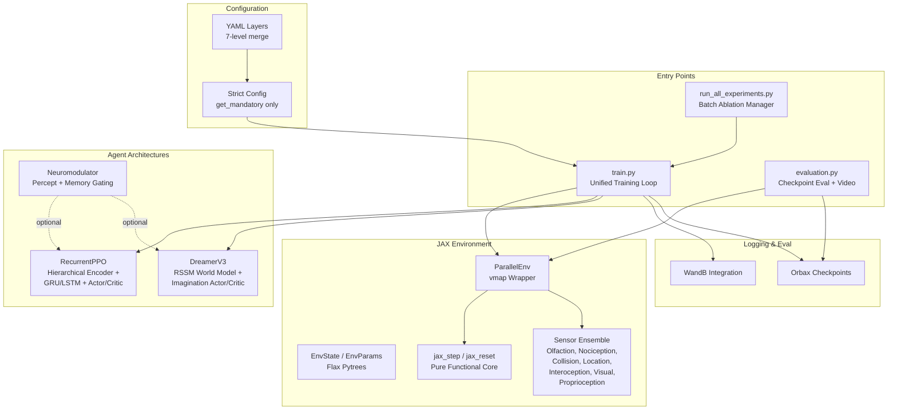

# GridWorld Pain - Comprehensive Project Reference

> **Last Updated**: 2026-03-02
> **Backend**: 100% JAX/Flax NNX
> **Protocol**: Strict Configuration (No Safe Defaults)

---

## LLM Context Rules

This document is the **authoritative reference** for the GridWorld Pain project. Any LLM working on this codebase must follow these rules:

1. **No Safe Defaults**: Never use `config.get('key', default)`. Always use `config.get_mandatory('key')` which raises `ValueError` if the key is missing.
2. **Python Path**: Always use `/home/vncuser/miniconda3/envs/grid_world_pain/bin/python` for execution.
3. **Functional Environment**: `core.py` functions (`jax_step`, `jax_reset`) are pure — no side effects, no global state.
4. **Strict Checkpoints**: Checkpoint restoration raises an error on architecture mismatch (no partial loading).
5. **Dynamic Action Space**: Action dimension is `4 + rest_action_enabled + eat_action_enabled`. Network heads must match.
6. **Config Merge Order**: `environment/default.yaml` → `train/default.yaml` → `evaluation/default.yaml` → `logger/wandb.yaml` → `visualization/default.yaml` → `--config` (ablation) → `--agent_config` (model) → CLI overrides.
7. **Keeping This Document Current**: When adding new files, algorithms, or architectural changes, update the relevant sections of this document. Preserve the structure.

---

## Executive Overview

**GridWorld Pain** is an RL research platform for **Interoceptive AI** — agents that balance external reward-seeking with internal homeostatic regulation (maintaining hunger/satiation and avoiding injury).

### Research Pillars
1. **Homeostatic RL**: Drive-Reduction theory where reward = change in physiological distance from setpoints.
2. **Sensory Fusion**: N-dimensional chemical gradients, discrete nociceptors, proprioception, and interoception unified into a single observation vector.
3. **Massive Parallelism**: JAX `vmap`-based parallel environments (128-1000+ simultaneous instances).
4. **Neuromodulation**: Hierarchical gating of RNN information flow based on physiological state.

### Algorithm Status
| Algorithm | Status | File |
|-----------|--------|------|
| **RecurrentPPO** | Primary (stable) | `src/models/recurrent_ppo_network.py`, `recurrent_ppo_trainer.py` |
| **DreamerV3** | Experimental (entropy collapse issues) | `src/models/dreamer_v3_nnx.py`, `dreamer_v3_trainer.py` |
| **PPO** (feed-forward) | Supporting | `src/models/ppo_network.py`, `ppo_trainer.py` |
| **DQN / DRQN** | Supporting | `src/models/dqn_network.py`, `drqn_network.py` |
| **Neuromodulated variants** | Experimental | `src/models/neuromodulator.py`, configs `neuromodulated_*.yaml` |

---

## System Architecture



---

## File Manifest

### Entry Points
| File | Purpose |
|------|---------|
| `train.py` | Unified training loop for all 5 algorithms. Config loading, algorithm dispatch, WandB logging, checkpointing. ~1380 lines. |
| `evaluation.py` | Load trained checkpoints and run evaluation with video rendering + stats. ~333 lines. |
| `run_all_experiments.py` | Launch parallel training sweeps across ablation levels. ~158 lines. |
| `hyperparameter_search.py` | Hyperparameter sweep utility. |
| `check_env.py` | Environment validation/sanity check. |

### Environment (`src/environment/`)
| File | Purpose |
|------|---------|
| `core.py` | `jax_step()`, `jax_reset()`, body dynamics (`update_body`), predator AI (`update_predators`), resource lifecycle, reward calculation. Pure functional. |
| `state.py` | `EnvState` and `EnvParams` Flax `struct.dataclass` definitions — the complete state and parameter pytrees. |
| `sensor.py` | Observation assembly: `get_observation()` concatenates all enabled sensor modalities. Individual sensors: `sense_resource` (olfaction), `sense_collision`, `sense_location`, `sense_extero_nociception`. |
| `wrapper.py` | `ParallelEnv` — `vmap`-based vectorization of `jax_step`/`jax_reset` across B parallel environments. |
| `config_loader.py` | YAML → `EnvParams` mapper. Converts resource/predator/obstacle definitions into fixed-size JAX arrays. |
| `renderer.py` | Grid visualization for video rendering. |

### Models (`src/models/`)
| File | Purpose |
|------|---------|
| `recurrent_ppo_network.py` | `ActorCriticRNN`: Hierarchical `ObservationEncoder` (GroupedMLP unimodal → body hub → association hub → fusion) + GRU/LSTM + Actor/Critic heads. |
| `recurrent_ppo_trainer.py` | PPO training: rollout collection, GAE/MC returns, clipped surrogate loss, entropy regularization. |
| `ppo_network.py` | Feed-forward `ActorCriticMLP`. |
| `ppo_trainer.py` | Standard PPO training loop. |
| `dqn_network.py` / `dqn_trainer.py` | DQN with replay buffer. |
| `drqn_network.py` / `drqn_trainer.py` | Recurrent DQN. |
| `dreamer_v3_nnx.py` | DreamerV3 full architecture: RSSM (GRU deterministic + categorical stochastic), Encoder, Decoder, Reward/Continue predictors, Actor, Critic. ~656 lines. |
| `dreamer_v3_trainer.py` | DreamerV3 training: `collect_sequence()`, replay buffer, world model BPTT, imagination rollouts for actor/critic. ~771 lines. |
| `dreamer_v3_network.py` | DreamerV3 network spec builder. |
| `dreamer_v3_util.py` | Utilities: `Moments` EMA normalizer, `Ratio` class. |
| `neuromodulator.py` | `HierarchicalNeuromodulator`: percept-driven + memory-driven gating modules producing multiplicative gates for each encoder phase. ~401 lines. |
| `modulated_gru_cell.py` | GRU cell with multiplicative neuromodulation. |
| `modulated_layer_norm_gru_cell.py` | LayerNorm variant of modulated GRU. |

### Utilities (`src/utils/`)
| File | Purpose |
|------|---------|
| `config.py` | `Config` class: strict `get_mandatory()`, nested dot-notation `get()`/`set()`, deep `merge()`. |
| `evaluation_core.py` | Core evaluation logic (shared between train.py and evaluation.py). |
| `wandb_utils.py` | WandB initialization, metric logging, video upload. |
| `visualization.py` | Rendering helpers. |

### Configuration (`configs/`)
| Path | Purpose |
|------|---------|
| `environment/default.yaml` | Base environment: 10x10 grid, 4 food + 8 danger, 3 predators, 12 rocks, 20 bushes, 5 rabbits. |
| `train/default.yaml` | Training defaults: episodes, num_envs, checkpoint frequency. |
| `evaluation/default.yaml` | Eval defaults: seed, episodes, render toggle. |
| `logger/wandb.yaml` | WandB project/entity/group settings. |
| `visualization/default.yaml` | Renderer: local_view_size, icon settings. |
| `models/recurrent_ppo.yaml` | RecurrentPPO: GRU, lr=5e-4/1e-4, gamma=0.95, seq_len=128, hidden=128, hierarchical encoding. |
| `models/dreamer_v3.yaml` | DreamerV3: RSSM deter=512/stoch=32x32, lr=1e-4/3e-5, entropy=3e-4, batch=64. |
| `models/neuromodulated_ppo.yaml` | RecurrentPPO with hierarchical neuromodulation enabled. |
| `models/neuromodulated_dreamer_v3.yaml` | DreamerV3 with neuromodulation. |
| `models/ppo.yaml`, `dqn.yaml`, `drqn.yaml`, `q_learning.yaml` | Other algorithm configs. |
| `experiment/ablation/survival/01-08_*.yaml` | Survival branch ablation levels (extrinsic reward). |
| `experiment/ablation/homeostatic/04-08_*.yaml` | Homeostatic branch ablation levels (drive-reduction reward). |

### Scripts & Analysis
| File | Purpose |
|------|---------|
| `scripts/benchmark_wandb_speed.py` | Training speed profiling with WandB overhead measurement. |
| `scripts/record_env_demo.py` | Record environment demo video. |
| `scripts/video_to_gif.py` | Video → GIF converter. |
| `analysis/agentActionAnalysis.py` | Action distribution visualization across checkpoints. |
| `plot_physiology.py` | Physiological state (satiation, nutrition, injury) plots. |

### Documentation (`docs/`)
| File | Key Content |
|------|-------------|
| `PROJECT_SUMMARY.md` | This document — authoritative project reference. |
| `DREAMER_DIAGNOSTICS_PLAN.md` | **Active**: DreamerV3 performance investigation. Entropy collapse, reward MAE, parallel env audit. |
| `DREAMER_REVIEW.md` | DreamerV3 architecture audit. |
| `DREAMER_IMPLEMENTATION_AUDIT.md` | Code-level DreamerV3 review. |
| `ABLATION_REVIEW.md` | Per-level ablation config validation. Documents inheritance issues. |
| `RPPO_DIAGNOSTICS_PLAN.md` | RecurrentPPO debugging guide. |
| `NEUROMODULATION_ALGORITHM.md` | Neuromodulation theory and implementation details. |
| `NETWORK_ENCODING_REVIEW.md` | Observation encoder architecture deep-dive. |
| `OLFACTORY_SYSTEM_REVIEW.md` | Chemical gradient sensing implementation. |
| `OBSTACLE_SYSTEM_REVIEW.md` | Obstacle mechanics (blocking, bush concealment, damage). |
| `CONTINUAL_LEARNING_REVIEW.md` | Checkpoint restoration and transfer learning. |
| `IMPORTANT_ISSUES.md` | Critical performance regressions and lessons learned. |
| `BEHAVIOR_ANALYSIS.md` | Agent behavior metrics and analysis. |
| `OBJECT_GENERATION_AND_REST.md` | Entity placement and rest action mechanics. |
| `EVALUATION_RECORDING_STATS.md` | Evaluation metrics documentation. |
| `PRECISION_MODULATION.md` | Neuromodulator tuning details. |

---

## Environment Architecture

### State Structures (key fields, full definitions in `src/environment/state.py`)

**EnvState** — mutable per-step state:
- Agent: `agent_pos [2]`, `current_step`, `last_action`
- Resources: `res_pos [N,2]`, `res_active [N]`, `res_cons_count [N]`, `res_reg_timer [N]`
- Predators: `pred_pos [P,2]`, `pred_state [P]` (0=patrol, 1=hunt, 2=return), `pred_stamina [P]`
- Neutral Animals: `neutral_pos [M,2]`, `neutral_move_timer [M]`
- Obstacles: `obs_pos [O,2]`
- Body: `satiation`, `nutrition`, `injury_level`, `injury_buffer [smoothing_dur]`, `rest_streak`
- Meta: `terminated`, `key` (PRNGKey)

**EnvParams** — immutable per-episode configuration:
- Grid: `height`, `width`, `max_steps`, `grid_location_type [H,W]`
- Resource properties: `res_type`, `res_property [N,5]` (chemical vector), `res_damage [N,2]`, `res_nociception [N]`, spawn/regen params
- Predator properties: `pred_property [P,5]`, `pred_damage [P,2]`, `pred_detect [P]`, patrol/stamina/hunt params
- Obstacle properties: `obs_blocking [O]`, `obs_hides_agent [O]` (bush concealment), `obs_damage [O,2]`
- Body: `max_satiation/nutrition/injury`, `metabolic_cost`, `food_nutrition_gain`, `setpoint`, recovery rates, `use_homeostatic_reward`
- Sensors: `olfactory_enabled`, `nociception_enabled`, `location_sensor_enabled`, `visual_sensor_enabled`, `proprioception_enabled`, `sensor_radius`, `sensor_decay`
- Actions: `rest_action_enabled`, `eat_action_enabled`
- Noise: `perceptual_noise_enabled`, per-modality `noise_modes/sigmas/injury_scales/clip` arrays
- Placement: `placement_mode` ("per_entity" or "per_type")

### Core Loop (`jax_step` in `core.py`)

Each step executes in order:
1. **Resource regeneration** — timers tick, respawn where timer=0, reposition within spawn area
2. **Agent movement** — 4 cardinal directions + rest (action=4) + eat (action=5), obstacle collision check
3. **Predator update** — state machine (patrol→hunt→return), Manhattan pursuit, stamina system, obstacle collision, bush concealment suppresses hunting
4. **Neutral animal update** — random patrol within patrol area
5. **Interaction logic** — resource consumption (auto or eat-action), danger/predator/obstacle damage calculation
6. **Body update** — nutrition decay, satiation (non-linear from nutrition), injury (smoothed buffer + exponential streak recovery on rest)
7. **Reward calculation** — see Reward Modes below
8. **Termination check** — starvation (nutrition=0), max injury, max steps. Codes: 0=active, 1=truncated, 2=starvation, 3=overeating, 4=injury

### Reward Modes

**Survival** (`use_homeostatic_reward: false`):
- `+1.0` for eating food, `-death_penalty` on death, `0` otherwise

**Homeostatic** (`use_homeostatic_reward: true`):
- `reward = prev_drive - curr_drive` where `drive = sqrt((satiation - setpoint)^2 + injury^2)`
- `-death_penalty` added on death
- Drive-reduction: getting closer to setpoint = positive reward

### Body Dynamics

- **Nutrition**: Linear decay by `metabolic_cost` per step. Food gives `food_nutrition_gain - eating_nutrition_cost`. Clipped to `[0, max_nutrition]`.
- **Satiation**: Derived non-linearly: `S = max_S * (N/max_N)^k` where k = `nutrition_to_satiation_scaling_factor`.
- **Injury**: Damage spread over `smoothing_duration` steps via ring buffer. Recovery on rest: `base_rate * (1 + accel_rate)^(streak-1)` — exponential with consecutive rest.
- **Termination**: Nutrition ≤ 0 → starvation. Injury ≥ max_injury → death. Without injury system, any damage = instant death.

---

## Sensory System (POMDP Mapping)

| State Category | State Component | Observation Modality | Obs. Component | Mapping |
|:---|:---|:---|:---|:---|
| **Agent** | `agent_pos` | **Location** | `loc_obs` | Normalized (r,c) to [-1, 1] |
| | `agent_pos` | **Collision** | `coll_obs` | Manhattan diamond of blocked/OOB cells |
| | `last_action` | **Proprioception** | `proprio_obs` | One-hot of previous action |
| **Body** | `satiation` | **Interoception** | `intero_obs[0]` | `satiation / max_satiation` |
| | `nutrition` | **Interoception** | `intero_obs[1]` | `nutrition / max_nutrition` |
| | `injury_level` | **Interoception** | `intero_obs[2]` | `injury / max_injury` |
| | `injury_level` | **Nociception** | `noc_obs` | Phasic: max contact intensity (danger/predator/obstacle) |
| **Resources** | `res_pos`, `res_active` | **Olfaction** | `chem_obs` | Chemical gradient: `property * decay(dist) * active_mask`, summed per vector dim |
| **Predators** | `pred_pos` | **Olfaction** | `chem_obs` | Chemical gradient (same mechanism) |
| | `pred_pos` | **Nociception** | `noc_obs` | Contact intensity on overlap |
| **Neutral** | `neutral_pos` | **Olfaction** | `chem_obs` | Olfactory decoy (chemical signature) |
| **Obstacles** | `obs_pos` | **Collision** | `coll_obs` | Blocking obstacles detected by collision sensor |
| | `obs_pos` | **Olfaction** | `chem_obs` | Chemical signature (e.g., bush) |

**Visual sensor** (optional): Local occupancy grid around agent. Enabled via `visual_sensor_enabled`.

**Perceptual Noise**: Per-modality Gaussian noise with configurable modes (constant or state-dependent where injury amplifies noise). Configured in `perceptual_noise` section of environment YAML.

**Observation dimension** is computed dynamically by `get_observation_breakdown()` based on enabled sensors and entity counts.

---

## Agent Architectures

### RecurrentPPO (Primary)

**Architecture** (`recurrent_ppo_network.py`):
```
Observation → ObservationEncoder (hierarchical mode):
  Phase 1: GroupedMLP — parallel per-sensor MLPs via einsum (single kernel)
    [Location(2)] → [128]
    [Collision(~9)] → [128]
    [Olfaction(5)] → [128]
    [Nociception(1)] → [128]
    [Interoception(3)] → [128]
    [Proprioception(6)] → [128]
    [Visual(optional)] → [128]

  Phase 2: Body-State Hub — MLP([intero + nociception + collision]) → [128]
  Phase 3: Association Hub — MLP([proprioception + olfaction]) → [128]
  Fusion: concat all → Linear → [128]

→ GRU or LSTM (hidden_size=128)
→ Actor Head (MLP → action logits)
→ Critic Head (MLP → V(s))
```

**Training** (`recurrent_ppo_trainer.py`):
- Rollout: `sequence_length` steps across `num_envs` parallel environments
- Returns: GAE (`gae_lambda=0.95`) or Monte Carlo (`return_mode`)
- Loss: Clipped PPO surrogate + `vf_coef * value_loss` + `entropy_coef * entropy`
- Optimization: Separate Adam optimizers for actor (`lr=5e-4`) and critic (`lr=1e-4`)

### DreamerV3 (Experimental)

**Architecture** (`dreamer_v3_nnx.py`):
```
Encoder: obs → latent embedding (shared with RecurrentPPO's ObservationEncoder)
RSSM (Recurrent State-Space Model):
  Deterministic: h_t = GRU(h_{t-1}, z_{t-1}, a_{t-1})   [deter_dim=512]
  Stochastic:    z_t ~ Cat(32 dims x 32 classes)
  Posterior:     q(z_t | h_t, obs_t)   [uses real observations]
  Prior:         p(z_t | h_t)          [used in imagination]

Decoder:    (h_t, z_t) → obs reconstruction
Reward:     (h_t, z_t) → predicted reward
Continue:   (h_t, z_t) → P(not_done)

Actor:  π(a | h_t, z_t)  [trained on imagined trajectories]
Critic: V(h_t, z_t)      [Moments EMA normalization]
```

**Training** (`dreamer_v3_trainer.py`):
- Collection: `collect_interval` steps per env → replay buffer (capacity 100k)
- World model: BPTT on reconstruction + reward + KL losses
- Policy: Reinforce on 15-step imagined rollouts through learned world model
- Known issues: See [Known Issues](#known-issues) section

### Neuromodulation (`neuromodulator.py`)

Hierarchical gating applied to RecurrentPPO (or DreamerV3) encoder phases:
```
HierarchicalNeuromodulator:
  Percept Module: MLP([satiation, nutrition, injury, collision]) → φ_perceptual
  Memory Module:  MLP(prior_hidden_state) → φ_memory

  Outputs (per encoder phase):
    γ_unimodal    = softmax(φ_p + φ_m)    # Weights sensor channels
    γ_body_state  = softmax(φ_p + φ_m)    # Weights body integration
    γ_association = softmax(φ_p + φ_m)    # Weights motor-olfactory
    z_memory      = tanh(φ_m)             # Memory gating
    temperature   = sigmoid(φ_p)          # Softmax entropy control
```

Multiplicative application: `encoded_phase *= γ_phase`. Tracked in WandB as `modulator/gamma_*`.

---

## Experimental Framework (Ablations)

### Dual-Branch Design

All ablation configs live in `configs/experiment/ablation/`:
- **Survival branch** (`survival/`): `use_homeostatic_reward: false` — extrinsic +1 for eating
- **Homeostatic branch** (`homeostatic/`): `use_homeostatic_reward: true` — drive-reduction reward

### Level Progression

| Level | Config | Grid | Entities | New Sensor | Goal |
|:---:|:---|:---:|:---|:---|:---|
| 01 | `01_goal_only.yaml` | 4x4 | 1 food | None | Pathfinding baseline |
| 02 | `02_danger_only.yaml` | 4x4 | 1 food + 1 danger | None | Static threat avoidance |
| 03 | `03_predator_intro.yaml` | 4x4 | 1 food + 1 predator | None | Mobile threat evasion |
| 04 | `04_nociception.yaml` | 4x4 | Food + danger + predator | Nociception | Pain sensing + rest |
| 05 | `05_olfactory.yaml` | 4x4 | Food + danger | Olfaction | Chemical gradient following |
| 06 | `06_proprioception.yaml` | 4x4 | Food + danger | Proprioception | Motor feedback |
| 07 | `07_collision.yaml` | 4x4 | Food + obstacles | Collision | Obstacle detection |
| 08 | `08_location.yaml` | 4x4 | All entity types | Location + ALL | Full integrated homeostasis |

**Known config issues** (documented in `docs/ABLATION_REVIEW.md`):
- Levels 01-07 inherit obstacles, neutral animals, and visual sensor from `default.yaml` when they should be empty/disabled
- `sensor_radius=20` on a 4x4 grid = full observability (should be ~4)

---

## Execution Reference

### Training (`train.py`)
```bash
/home/vncuser/miniconda3/envs/grid_world_pain/bin/python train.py \
  --agent_config configs/models/recurrent_ppo.yaml \
  --config configs/experiment/ablation/homeostatic/08_location.yaml \
  --episodes 50000 \
  --num-envs 128 \
  --seed 42 \
  --tag my_experiment \
  --wandb-project gridworld \
  --checkpoint-frequency 5000
```

Key CLI args: `--config` (env/ablation), `--agent_config` (model, required), `--episodes`, `--total-timesteps`, `--num-envs`, `--seed`, `--tag`, `--wandb-project/group/name`, `--checkpoint-frequency`, `--load-checkpoint`, `--quiet/--debug`, `--device`.

### Evaluation (`evaluation.py`)
```bash
python evaluation.py --results_dir results/JAX_RecurrentPPO/run_name/ \
  --episodes 100 --checkpoint latest --render --num_envs 16
```

### Batch Experiments (`run_all_experiments.py`)
```bash
python run_all_experiments.py --tag ablation_v2 --episodes 50000
```
Launches all ablation configs x algorithms in parallel subprocesses.

### Checkpointing
- **Backend**: Orbax (`orbax-checkpoint`)
- **Frequency**: Every `--checkpoint-frequency` episodes
- **Retention**: Max 5 most recent checkpoints
- **Restoration**: Strict architecture matching — raises error if layer shapes differ between saved and current model

---

## Known Issues

### DreamerV3 Performance (Active Investigation — `docs/DREAMER_DIAGNOSTICS_PLAN.md`)
- **Entropy collapse**: Policy becomes deterministic by ~20k episodes (`mean_entropy` drops from 0.32 to 0.07)
- **Reward prediction failure**: `model_reward_mae_pos = 0.0` — world model never learns to predict positive rewards
- **KL collapse**: Posterior ≈ prior, latent state carries no observation information

### Parallel Environment Bugs (DreamerV3-specific)
- **Replay ratio inflation**: Fixed `train_steps` with scaled collection → 1 env gets 64x more training intensity than 64 envs
- **PRNG key sharing**: `collect_sequence()` passed single key to all envs → identical actions in similar states
- **Buffer alignment**: Buffer capacity (100k) not multiple of `sequence_length` (128) → temporal corruption on wrap-around

### Ablation Config Inheritance
- Early ablation levels (01-07) inherit unintended entities from `default.yaml` (obstacles, neutral animals)
- Visual sensor always enabled even in levels that shouldn't have it
- See `docs/ABLATION_REVIEW.md` for full audit

### JAX Performance Lesson
- **Never** use `lax.scan` or nested `vmap` for spatial/entity checks — use `jnp.matmul` or single `vmap`
- Full regression case documented in `docs/IMPORTANT_ISSUES.md`
