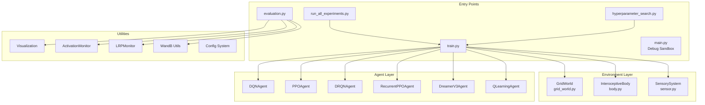
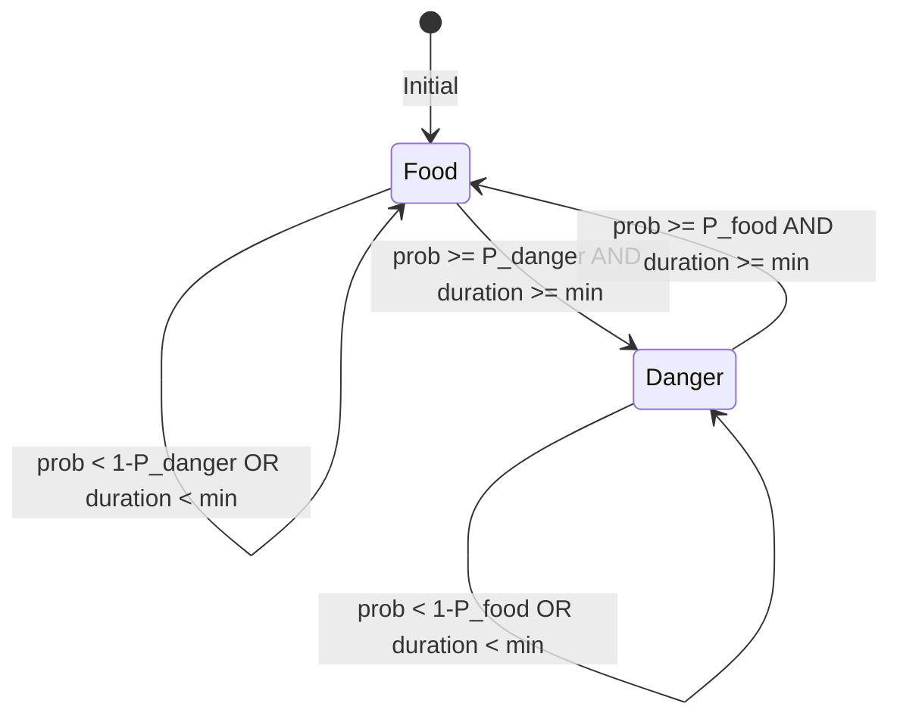

# 🧠 GridWorld Pain Project - Comprehensive System Summary

> **Project Location**: `/media/nas01/projects/Interoceptive-AI/grid_world_pain`
> **Review Date**: 2026-01-27

---

## 📖 Executive Overview

**GridWorld Pain** is a sophisticated Reinforcement Learning research platform designed to study **Interoceptive AI** - agents that perceive and act based on internal body states (hunger, pain) rather than just external goals. The project implements a custom grid-based environment with homeostatic regulation and supports multiple state-of-the-art RL algorithms.

### Key Research Concepts
- **Interoception**: Internal body-state awareness (satiation, health)
- **Homeostatic RL**: Reward signals based on drive reduction (maintaining physiological setpoints)
- **Sensory Integration**: Gradient-based olfactory sensors and nociceptors

---

## 🏗️ System Architecture



---

## 📁 Project Structure

| Path | Description |
|------|-------------|
| [train.py](file:///media/nas01/projects/Interoceptive-AI/grid_world_pain/train.py) | Main training script (~1095 lines) |
| [evaluation.py](file:///media/nas01/projects/Interoceptive-AI/grid_world_pain/evaluation.py) | Evaluation and video generation (~553 lines) |
| [main.py](file:///media/nas01/projects/Interoceptive-AI/grid_world_pain/main.py) | Debug sandbox with random agent |
| [run_all_experiments.py](file:///media/nas01/projects/Interoceptive-AI/grid_world_pain/run_all_experiments.py) | Parallel training launcher |
| [hyperparameter_search.py](file:///media/nas01/projects/Interoceptive-AI/grid_world_pain/hyperparameter_search.py) | Grid search automation |

---

## 🌍 Environment Module

### GridWorld ([grid_world.py](file:///media/nas01/projects/Interoceptive-AI/grid_world_pain/src/environment/grid_world.py))

The core environment implementing a 2D grid navigation task with dynamic resources.

#### Key Features
| Feature | Description | Configuration |
|---------|-------------|---------------|
| **Grid Navigation** | 5 actions: Up, Right, Down, Left, Stay | `environment.height/width` |
| **Resource Dynamics** | Food/Danger can switch probabilistically | `prob_switch_to_danger`, `prob_switch_to_food` |
| **Minimum Durations** | Resources have cooldown periods | `min_danger_duration`, `min_food_duration` |
| **Resource Relocation** | Food can move periodically | `relocate_resource`, `relocation_steps` |
| **Property Vectors** | Chemical signatures for olfactory sensing | `food_property`, `danger_property` |

#### State Transitions


---

### InteroceptiveBody ([body.py](file:///media/nas01/projects/Interoceptive-AI/grid_world_pain/src/environment/body.py))

Simulates the agent's internal physiological state.

#### Internal Variables
| Variable | Dynamics | Death Condition |
|----------|----------|-----------------|
| **Satiation** | -1 per step (metabolism), +gain on eating | ≤ 0 (starvation), ≥ max (overeating if enabled) |
| **Health** | -damage in danger, +recovery on rest | ≤ 0 (injury) |

#### Reward Modes
1. **Homeostatic (Drive Reduction)**:
   ```python
   reward = prev_drive - curr_drive  # Euclidean distance to setpoint
   ```
2. **Survival**: +1 per step alive, -penalty on death

---

### SensorySystem ([sensor.py](file:///media/nas01/projects/Interoceptive-AI/grid_world_pain/src/environment/sensor.py))

Provides biologically-inspired sensory inputs.

| Sensor | Type | Output |
|--------|------|--------|
| **ResourceSensor** | Gradient-based olfactory | N-dim vector (weighted sum by inverse distance) |
| **Nociceptor** | Contact sensor | Binary [0, 1] indicating danger presence |

**Observation Formula**:
```
observation = Σ (resource.property × (1 / distance^decay_power))
```

---

## 🤖 Agent Implementations

### Algorithm Comparison

| Algorithm | File | Architecture | Key Parameters |
|-----------|------|--------------|----------------|
| **DQN** | [dqn.py](file:///media/nas01/projects/Interoceptive-AI/grid_world_pain/src/models/dqn.py) | MLP + Replay Buffer | `fc_layers`, `target_update_freq`, `epsilon_decay` |
| **DRQN** | [drqn.py](file:///media/nas01/projects/Interoceptive-AI/grid_world_pain/src/models/drqn.py) | LSTM + Replay | `trace_length`, `burn_in_length`, `recurrent_layers` |
| **PPO** | [ppo.py](file:///media/nas01/projects/Interoceptive-AI/grid_world_pain/src/models/ppo.py) | Actor-Critic (MLP) | `K_epochs`, `eps_clip`, `update_timestep` |
| **RecurrentPPO** | [recurrent_ppo.py](file:///media/nas01/projects/Interoceptive-AI/grid_world_pain/src/models/recurrent_ppo.py) | Actor-Critic (LSTM) | `sequence_length`, `recurrent_layers` |
| **DreamerV3** | [dreamer_v3.py](file:///media/nas01/projects/Interoceptive-AI/grid_world_pain/src/models/dreamer_v3.py) | World Model (RSSM) | `rssm_deter_dim`, `rssm_stoch_dim`, `batch_length` |
| **Q-Learning** | [q_learning.py](file:///media/nas01/projects/Interoceptive-AI/grid_world_pain/src/models/q_learning.py) | Tabular | `alpha`, `gamma`, `epsilon` |

### Frame Stacking Support

Deep RL agents support temporal context via frame stacking:
- **DQN/PPO**: `frame_stack=4` (default)
- **Recurrent Agents**: `frame_stack=1` (internal memory handles temporal context)

---

## ⚙️ Configuration System

### YAML Hierarchy
```
configs/
├── environment/
│   └── environment.yaml     # Grid, body, sensory settings
├── train/
│   └── default.yaml         # Training episodes, seed, device
└── models/
    ├── dqn.yaml
    ├── ppo.yaml
    ├── drqn.yaml
    ├── recurrent_ppo.yaml
    ├── dreamer_v3.yaml
    └── q_learning.yaml
```

### Critical Configuration Guidelines

> [!CAUTION]
> **Strict Config Policy** - No safe defaults allowed!
> - All values must come from config files or CLI arguments
> - Scripts must raise errors for missing required values
> - Never use `config.get('key', default_value)` for required parameters

---

## 🔧 Utilities

### Visualization ([visualization.py](file:///media/nas01/projects/Interoceptive-AI/grid_world_pain/src/utils/visualization.py))

| Function | Purpose |
|----------|---------|
| `save_video` | Export frames to MP4 |
| `plot_q_table` | Visualize tabular Q-values |
| `plot_learning_curves` | Training metrics charts |
| `visualize_activations` | Neural network layer heatmaps |
| `combine_frame_and_activations` | Merge game frame with activation overlay |

### Activation Monitoring ([activation_monitor.py](file:///media/nas01/projects/Interoceptive-AI/grid_world_pain/src/utils/activation_monitor.py))

- Hooks into PyTorch models to capture layer activations
- Saves history to HDF5 for analysis
- Supports Linear, Conv2d, LSTM, GRU layers

### LRP Attribution ([lrp_monitor.py](file:///media/nas01/projects/Interoceptive-AI/grid_world_pain/src/utils/lrp_monitor.py))

- Uses **Captum** library for Layer-wise Relevance Propagation
- Explains which input features contributed to actions
- Per-layer relevance scores for interpretability

### WandB Integration ([wandb_utils.py](file:///media/nas01/projects/Interoceptive-AI/grid_world_pain/src/utils/wandb_utils.py))

- Shared API key via `.wandb_api_key` file
- Video upload to runs
- Run resumption support for continual learning

---

## 🚀 Training Workflow

### Standard Training
```bash
# DQN Training (10000 episodes)
/home/vncuser/miniconda3/envs/grid_world_pain/bin/python train.py \
    --agent_config configs/models/dqn.yaml \
    --episodes 10000 \
    --tag my_experiment \
    --wandb-project grid_world_pain
```

### Continual Learning (Resume)
```bash
/home/vncuser/miniconda3/envs/grid_world_pain/bin/python train.py \
    --agent_config configs/models/dqn.yaml \
    --load-checkpoint results/DQN/run_name/models/dqn_model_500.ckpt \
    --episodes 500 \
    --wandb-resume-id <previous_run_id>
```

### Parallel Experiments
```bash
/home/vncuser/miniconda3/envs/grid_world_pain/bin/python run_all_experiments.py \
    --tag baseline_v1 \
    --episodes 10000
```

---

## 📊 Evaluation Workflow

```bash
/home/vncuser/miniconda3/envs/grid_world_pain/bin/python evaluation.py \
    --results_dir results/DQN/20260127-120000_my_run \
    --episodes 5 \
    --wandb-run-path entity/project/run_id
```

### Outputs
- `videos/` - MP4 recordings with activation overlays
- `plots/` - Q-table visualizations (tabular only)
- `data/` - HDF5 activation histories

---

## 📦 Dependencies

From [pyproject.toml](file:///media/nas01/projects/Interoceptive-AI/grid_world_pain/pyproject.toml):

| Package | Version | Purpose |
|---------|---------|---------|
| `torch` | ≥2.9.1 | Deep learning framework |
| `numpy` | ≥2.4.1 | Numerical computing |
| `matplotlib` | ≥3.10.8 | Visualization |
| `imageio` | ≥2.37.2 | Video encoding |
| `h5py` | ≥3.10.0 | Activation data storage |
| `captum` | ≥0.7.0 | LRP attribution |
| `wandb` | ≥0.16.0 | Experiment tracking |
| `pyyaml` | ≥6.0.3 | Config parsing |
| `tqdm` | ≥4.67.1 | Progress bars |

**Python Requirement**: ≥3.11.14

---

## ⚠️ Important Development Guidelines

> [!IMPORTANT]
> From [antigravity_instruction.txt](file:///media/nas01/projects/Interoceptive-AI/grid_world_pain/antigravity_instruction.txt):

1. **Always use conda environment**:
   ```bash
   /home/vncuser/miniconda3/envs/grid_world_pain/bin/python
   ```

2. **No hardcoded defaults** - Raise errors for missing config values

3. **Update docstrings** when modifying `train.py` or `evaluation.py`

4. **Clean up debugging artifacts** after verification

---

## 📈 Current Default Configuration

### Environment (4x4 Grid)
| Parameter | Value |
|-----------|-------|
| Grid Size | 4×4 |
| Max Steps | 500 |
| Resource Position | (3, 3) |
| Danger Switch Prob | 0.1 |
| Food Switch Prob | 0.5 |
| Min Danger Duration | 5 |
| Min Food Duration | 10 |

### Body
| Parameter | Value |
|-----------|-------|
| Max Satiation | 30 |
| Satiation Setpoint | 30 |
| Food Gain | +10 |
| Health Max | 20 |
| Damage Amount | 5 |
| Death Penalty | 100 |

### Sensory
| Parameter | Value |
|-----------|-------|
| Sensor Radius | 5 |
| Vector Size | 5 |
| Decay Power | 1.0 |
| Food Property | [1,0,0,0,0] |
| Danger Property | [0,1,0,0,0] |

---

## 🎯 Summary

**GridWorld Pain** is a mature, well-structured research platform for interoceptive RL with:

✅ **6 RL algorithms** from tabular to world models  
✅ **Comprehensive visualization** including activation and LRP overlays  
✅ **Experiment tracking** via WandB  
✅ **YAML-driven configuration** with strict validation  
✅ **Continual learning support** via checkpoint resume  
✅ **Parallel experiment execution** for hyperparameter search  

The codebase follows clean separation of concerns with environment, agent, and utility layers, making it extensible for future research directions.
