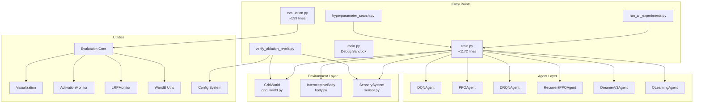

# 🧠 GridWorld Pain Project - Comprehensive System Documentation

> **Project Location**: `/media/nas01/projects/Interoceptive-AI/grid_world_pain`  
> **Last Updated**: 2026-01-28  
> **Purpose**: LLM Agent Context Document

---

## 📖 Executive Overview

**GridWorld Pain** is a sophisticated Reinforcement Learning research platform designed to study **Interoceptive AI** - agents that perceive and act based on internal body states (hunger, pain) rather than just external goals. The project implements a custom grid-based environment with homeostatic regulation and supports multiple state-of-the-art RL algorithms.

### Key Research Concepts
- **Interoception**: Internal body-state awareness (satiation, health)
- **Homeostatic RL**: Reward signals based on drive reduction (maintaining physiological setpoints)
- **Sensory Integration**: Gradient-based olfactory sensors, nociceptors, and collision detection

---

## 🏗️ System Architecture



---

## 📁 Project Structure

| Path | Lines | Description |
|------|-------|-------------|
| [train.py](file:///media/nas01/projects/Interoceptive-AI/grid_world_pain/train.py) | 1172 | Main training script with full RL loop |
| [evaluation.py](file:///media/nas01/projects/Interoceptive-AI/grid_world_pain/evaluation.py) | 599 | Evaluation and video generation entry point |
| [main.py](file:///media/nas01/projects/Interoceptive-AI/grid_world_pain/main.py) | 390 | Debug sandbox with random agent |
| [run_all_experiments.py](file:///media/nas01/projects/Interoceptive-AI/grid_world_pain/run_all_experiments.py) | 164 | Parallel training launcher |
| [hyperparameter_search.py](file:///media/nas01/projects/Interoceptive-AI/grid_world_pain/hyperparameter_search.py) | 300 | Grid search automation |
| [verify_ablation_levels.py](file:///media/nas01/projects/Interoceptive-AI/grid_world_pain/verify_ablation_levels.py) | 114 | Ablation configuration validator |

### Source Directory (`src/`)

```
src/
├── environment/
│   ├── grid_world.py      # GridWorld class (598 lines)
│   ├── body.py            # InteroceptiveBody class (166 lines)
│   └── sensor.py          # SensorySystem with 5 sensor types (462 lines)
│
├── models/
│   ├── dqn.py             # DQNAgent, DQN network (188 lines)
│   ├── drqn.py            # DRQNAgent with LSTM (321 lines)
│   ├── ppo.py             # PPOAgent, ActorCritic (265 lines)
│   ├── recurrent_ppo.py   # RecurrentPPOAgent with LSTM (346 lines)
│   ├── dreamer_v3.py      # DreamerV3Agent, RSSM world model (876 lines)
│   └── q_learning.py      # Tabular QLearningAgent (148 lines)
│
└── utils/
    ├── activation_monitor.py  # Hook-based activation capture (134 lines)
    ├── config.py              # Config class with strict validation (82 lines)
    ├── evaluation_core.py     # Core evaluation logic (429 lines)
    ├── lrp_monitor.py         # Layerwise Relevance Propagation (78 lines)
    ├── state_utils.py         # State preprocessing, frame stacking (103 lines)
    ├── visualization.py       # Video, Q-table, activation viz (634 lines)
    └── wandb_utils.py         # WandB login, video upload (168 lines)
```

---

## 🧪 Ablation Study Framework

The project includes a systematic ablation study framework with 9 pre-defined levels, allowing researchers to isolate the impact of different system components.

### Ablation Levels (`configs/ablation/`)

| Level | Config | Description | Key Features Enabled |
|-------|--------|-------------|----------------------|
| 01 | `01_goal_only.yaml` | Baseline pathfinding | Fixed food, No danger, No sensors |
| 02 | `02_danger_only.yaml` | Static Hazard | +Health system, Static danger zone |
| 03 | `03_dynamic_fixed.yaml` | Environmental Dynamics | +Food↔Danger probabilistic transitions |
| 04 | `04_nociception.yaml` | Pain Perception | +Nociceptor sensor (distance=0) |
| 05 | `05_olfactory.yaml` | Nutrient Gradient | +Olfactory sensor (gradient-based) |
| 06 | `0proprioception` | Motor Feedback | +Proprioceptive sensor (prev action) |
| 07 | `07_collision.yaml` | Spatial Obstacles | +Collision sensor (directional rays) |
| 08 | `08_homeostatic.yaml` | Internal Motivation | +Homeostatic reward (drive reduction) |
| 09 | `09_location.yaml` | Full Interoceptive Agent | +Location sensor (spatial coordinates) |

### Verification Script
`verify_ablation_levels.py` ensures that all ablation configurations correctly set the environment and sensor flags as intended for that research level.

---

## 🌍 Environment Module - Detailed

### GridWorld ([src/environment/grid_world.py](file:///media/nas01/projects/Interoceptive-AI/grid_world_pain/src/environment/grid_world.py))

The core navigation environment implementing a 2D grid with dynamic food/danger resources.

#### Constructor Parameters
```python
GridWorld(
    height, width,                    # Grid dimensions
    start,                            # Agent start position (row, col)
    resource_pos,                     # Initial resource position
    with_satiation,                   # Enable interoceptive mode
    max_steps,                        # Episode step limit
    prob_switch_to_danger,            # P(Food→Danger) per step
    min_danger_duration,              # Minimum steps before Danger can switch
    prob_switch_to_food,              # P(Danger→Food) per step  
    min_food_duration,                # Minimum steps before Food can switch
    damage_amount,                    # Health damage in danger zone
    relocate_resource,                # Enable periodic relocation
    relocation_steps,                 # Steps between relocations
    vector_size,                      # Property vector dimension
    food_property,                    # Food chemical signature [N-dim]
    danger_property,                  # Danger chemical signature [N-dim]
    eat_action_enabled=True,          # Require explicit Eat action 
    rest_action_enabled=True          # Require explicit Rest action 
)
```

#### Action Space (Dynamic)
| Configuration | Actions | Indices |
|---------------|---------|----------|
| Both enabled | 6 | 0-3: Move, 4: Rest, 5: Eat |
| Eat only | 5 | 0-3: Move, 4: Eat |
| Rest only | 5 | 0-3: Move, 4: Rest |
| Neither | 4 | 0-3: Move only |

---

## 🤖 Agent Implementations - Detailed

### DQNAgent ([src/models/dqn.py](file:///media/nas01/projects/Interoceptive-AI/grid_world_pain/src/models/dqn.py))
Standard Deep Q-Network with experience replay and target networks.

### DRQNAgent ([src/models/drqn.py](file:///media/nas01/projects/Interoceptive-AI/grid_world_pain/src/models/drqn.py))
Deep Recurrent Q-Network (LSTM) for handling partial observability in complex sensor environments.

### PPOAgent ([src/models/ppo.py](file:///media/nas01/projects/Interoceptive-AI/grid_world_pain/src/models/ppo.py))
Proximal Policy Optimization with separate actor-critic MLP networks.

### RecurrentPPOAgent ([src/models/recurrent_ppo.py](file:///media/nas01/projects/Interoceptive-AI/grid_world_pain/src/models/recurrent_ppo.py))
PPO with an LSTM backbone, effective for high-temporal dependency scenarios.

### DreamerV3Agent ([src/models/dreamer_v3.py](file:///media/nas01/projects/Interoceptive-AI/grid_world_pain/src/models/dreamer_v3.py))
State-of-the-art Model-Based RL using the RSSM (Recurrent State Space Model).

---

## 📦 Dependencies

| Package | Version | Purpose |
|---------|---------|---------|
| `torch` | ≥2.5.1 | Deep learning framework |
| `numpy` | ≥2.1.2 | Numerical computing |
| `matplotlib` | ≥3.9.2 | Visualization |
| `wandb` | ≥0.18.5 | Experiment tracking |
| `pyyaml` | ≥6.0.2 | Config parsing |

---

## 🚀 Usage Examples

### Running an Ablation Experiment
```bash
/home/vncuser/miniconda3/envs/grid_world_pain/bin/python train.py \
    --agent_config configs/models/dqn.yaml \
    --config configs/ablation/05_olfactory.yaml \
    --episodes 5000 \
    --tag ablation_run_5
```

### Parallel Batch Execution
```bash
/home/vncuser/miniconda3/envs/grid_world_pain/bin/python run_all_experiments.py \
    --tag final_baseline \
    --config configs/ablation/09_location.yaml \
    --episodes 10000
```
