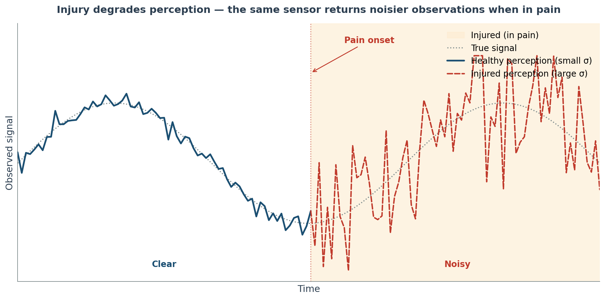

# 10 — Perceptual Noise

> **Source**: `src/environment/sensor.py` (`apply_perceptual_noise`, `sensor.py:223`), `src/environment/config_loader.py` (`_parse_noise_config`, `config_loader.py:957`) | **Back to hub**: [ENVIRONMENT_SUMMARY](ENVIRONMENT_SUMMARY.md)

---

## What this document is about

Biological sensing is imprecise — and pain makes it worse. This document describes how the GridWorld Pain environment simulates that imprecision through **perceptual noise**: small random perturbations added to each sensor reading every step.

Each sensor (called a **modality** — e.g. olfaction, collision, proprioception) gets its own noise setting. The noise is **state-dependent**: when the agent is injured, the random perturbations grow larger, so its readings become less reliable. At full health the agent perceives the world fairly clearly; at maximum injury every sensor (except those configured as clean references) is smeared by Gaussian noise.

Concretely, noise is Gaussian with mean zero and a standard deviation (σ) that scales with normalised injury: `σ_eff = σ_base × (1 + α × injury_norm)`. At zero injury, `σ_eff = σ_base`. At maximum injury, `σ_eff = σ_base × (1 + α)`. With typical values `σ_base = 0.1` and `α = 1.5`, the effective noise standard deviation grows from 0.1 (healthy) to 0.25 (maximum injury).

The whole system is toggled by `params.perceptual_noise_enabled` (set from `perceptual_noise.enabled` in YAML). When disabled, `apply_perceptual_noise` is a pass-through and the observation is returned unchanged.



---

## Noise Modes

Three modes per modality, set in YAML as a string and stored as an integer in `EnvParams`:

| Mode string | Integer value | σ_effective | Description |
|-------------|---------------|-------------|-------------|
| `none` | 0 | 0.0 | No noise applied; modality is a clean reference |
| `constant` | 1 | `σ_base` | Fixed Gaussian noise; not affected by injury level |
| `state_dependent` | 2 | `σ_base × (1 + α × injury_norm)` | Noise grows with normalised injury |

**State-dependent formula** (`sensor.py:250–260`):
```
norm_injury = state.injury_level / max(params.max_injury, 1e-6)

σ_eff[i] = σ_base[i] * (1.0 + α[i] * norm_injury)   # mode 2
          = σ_base[i]                                   # mode 1
          = 0.0                                         # mode 0
```

The `jnp.where` dispatch at `sensor.py:256–260` implements this as a fully vectorised expression over the full observation length — no Python branching at inference time.

- At `norm_injury = 0.0` (healthy): `σ_eff = σ_base`.
- At `norm_injury = 1.0` (maximum injury): `σ_eff = σ_base × (1 + α)`.
- With typical defaults `σ_base = 0.1`, `α = 1.5`: max σ = `0.1 × 2.5 = 0.25`.
- Setting `σ_base = 0.0` silences noise entirely regardless of mode — `σ_eff = 0` for all injury levels.

**Motivation**: pain degrades both interoceptive and exteroceptive perception. A highly injured agent has less reliable sensory information about its own body state and its environment, requiring it to act under greater uncertainty — a computational analogue of pain-induced perceptual distortion.

---

## Configuration

YAML structure under `perceptual_noise.modalities` (`configs/environment/default.yaml`):

```yaml
perceptual_noise:
  enabled: true                         # master on/off switch
  modalities:
    <modality_key>:
      mode: "none" | "constant" | "state_dependent"
      sigma: <float>                    # σ_base
      injury_noise_scale: <float>       # α (used in mode 2 only; ignored in modes 0/1)
      clip_min: <float>                 # post-noise lower bound (default: -100.0 if omitted)
      clip_max: <float>                 # post-noise upper bound (default:  100.0 if omitted)
```

**YAML key order is the single source of truth for noise array indices.** `config_loader.py:963–967` builds `noise_modality_order` by iterating `modalities_cfg` in YAML declaration order. Any reordering of YAML keys changes the array indices stored in `EnvParams` — see the Critical Invariant section below.

**All 10 modalities** (values from `configs/environment/default.yaml`):

| YAML key | Sensor name in code | Array index (default YAML order) | Mode | σ_base | α | clip |
|----------|--------------------|---------------------------------|------|--------|---|------|
| `injury` | `Injury` | 0 | `state_dependent` | 0.0 | 1.5 | [0, 1] |
| `nutrition` | `Nutrition` | 1 | `state_dependent` | 0.0 | 1.5 | [0, 1] |
| `satiation` | `Satiation` | 2 | `state_dependent` | 0.1 | 1.5 | [0, 1] |
| `interoceptive_nociception` | `Interoceptive Nociception` | 3 | `state_dependent` | 0.1 | 1.5 | [0, 1] |
| `extero_nociception` | `Extero Nociception` | 4 | `state_dependent` | 0.1 | 1.5 | [0, 100] |
| `olfaction` | `Olfaction` | 5 | `state_dependent` | 0.2 | 1.5 | [0, 100] |
| `collision` | `Collision` | 6 | `constant` | 0.01 | 0.0 | [0, 1] |
| `proprioception` | `Proprioception` | 7 | `constant` | 0.05 | 0.0 | [0, 1] |
| `visual` | `Visual` | 8 | `state_dependent` | 0.2 | 1.5 | [0, 100] |
| `location` | `Location` | 9 | `constant` | 0.01 | 0.0 | [-1, 1] |

**Notes on the default values:**
- `injury` and `nutrition` have `σ_base = 0.0` — noise is declared but silenced. Mode is `state_dependent` so it activates immediately if `sigma` is raised in a derived config without changing `mode`.
- `collision` and `proprioception` use `constant` mode — their noise is fixed regardless of injury level.
- `visual` has `clip_max = 100.0` even though one-hot channels are nominally in [0, 1]; the permissive bound allows noisy one-hots to exceed 1.0 without hard-clipping.
- `location` has `clip_min = -1.0` to match its `[-1, 1]` normalised coordinate range.

---

## `_parse_noise_config` (config_loader)

`_parse_noise_config(config) → dict` (`config_loader.py:957`)

**Step-by-step**:
1. Read `perceptual_noise.modalities` dict (`config_loader.py:958`). Python ≥ 3.7 and PyYAML ≥ 5.1 both preserve insertion order, so YAML declaration order is maintained.
2. Emit `noise_modality_order` tuple (`config_loader.py:963–967`) by iterating YAML keys in declaration order and mapping through `_YAML_KEY_TO_SENSOR_NAME` (`config_loader.py:944–955`). Only keys present in that mapping are included; unknown YAML keys are silently dropped.
3. Build five parallel arrays by iterating the same filtered key order:
   - `noise_modes [K]` int32: `0/1/2` from mode string via `_parse_mode` (`config_loader.py:960–961`)
   - `noise_sigmas [K]` float32: `sigma` field (default `0.0` if absent)
   - `noise_injury_scales [K]` float32: `injury_noise_scale` field (default `0.0` if absent)
   - `noise_clip_min [K]` float32: `clip_min` field (default `-100.0` if absent)
   - `noise_clip_max [K]` float32: `clip_max` field (default `100.0` if absent)
4. Zero-pad all five arrays to length 13 using `jnp.pad(..., (0, pad))` (`config_loader.py:968`).

The returned dict is unpacked into `EnvParams` with `**_parse_noise_config(config)` (`config_loader.py:941`).

**`_YAML_KEY_TO_SENSOR_NAME` mapping** (`config_loader.py:944–955`):
```python
{
    "injury":                    "Injury",
    "nutrition":                 "Nutrition",
    "satiation":                 "Satiation",
    "extero_nociception":        "Extero Nociception",
    "interoceptive_nociception": "Interoceptive Nociception",
    "olfaction":                 "Olfaction",
    "collision":                 "Collision",
    "proprioception":            "Proprioception",
    "visual":                    "Visual",
    "location":                  "Location",
}
```

Note: the definition order in `_YAML_KEY_TO_SENSOR_NAME` does **not** determine array indices — YAML declaration order in the config file does. This dict is a lookup table only.

---

## `apply_perceptual_noise` (sensor)

`apply_perceptual_noise(obs, state, params, key)` (`sensor.py:223`)

Decorated with `@jax.jit` (bare, no `static_argnames`). `params.perceptual_noise_enabled` is a static bool field in `EnvParams`, so the `if not params.perceptual_noise_enabled: return obs` guard at `sensor.py:225` is resolved at trace time — the disabled path compiles to a pass-through with zero runtime overhead.

**Step-by-step**:
1. Call `get_observation_breakdown(params)` (`sensor.py:228`) to get the ordered `{sensor_name: dim}` mapping for the current params configuration. This is the same function that controls observation assembly in `get_observation` — the two are always in sync.
2. Build `modality_map = {name: i for i, name in enumerate(params.noise_modality_order)}` (`sensor.py:232`) — maps each sensor name to its noise array index.
3. For each `(sensor_name, dim)` in breakdown (`sensor.py:239–243`), look up the array index and broadcast the noise params to a vector of length `dim` using `jnp.full`. **No guard**: if `sensor_name` is absent from `modality_map` this raises a `KeyError` at JIT trace time (see Critical Invariant).
4. Concatenate all broadcasted vectors (`sensor.py:245–247`) into full-obs-length arrays: `sigma_base [obs_dim]`, `alpha [obs_dim]`, `mode [obs_dim]`.
5. Compute `norm_injury = state.injury_level / max(params.max_injury, 1e-6)` (`sensor.py:250`). This is a scalar derived from the agent's current internal injury state.
6. Compute effective sigma per element using a vectorised `jnp.where` (`sensor.py:256–260`):
   ```
   σ_eff[i] = σ_base[i] * (1 + α[i] * norm_injury)   if mode[i] == 2
            = σ_base[i]                                  if mode[i] == 1
            = 0.0                                        if mode[i] == 0
   ```
7. Build `clip_min [obs_dim]` and `clip_max [obs_dim]` by the same broadcast-and-concatenate pattern (`sensor.py:263–264`). **Asymmetry**: the clip list comprehensions use `if name in modality_map` whereas the sigma/alpha/mode loop uses a bare dict lookup with no guard — see Suspected Bugs.
8. Draw noise: `noise = jax.random.normal(key, obs.shape) * sigma_eff` (`sensor.py:266`). One independent N(0,1) draw per observation element, scaled elementwise by `σ_eff`. Draws are independent across all dimensions and modalities.
9. Return `jnp.clip(obs + noise, clip_min, clip_max)` (`sensor.py:267`).

**PRNG key** (`sensor.py:273` in `get_observation`):
```python
obs_key = jax.random.fold_in(state.key, 999)
```
`state.key` is refreshed every step via the split-and-store pattern in `core.py`. `fold_in(key, 999)` creates a deterministic, per-step noise key without consuming a split from the main key. The constant `999` is an arbitrary salt whose only role is to make the observation noise branch independent from other uses of `state.key` in the same step.

---

## Array Layout

**Why 13, not 10**: the pad-to-13 (`config_loader.py:968`) keeps array shapes static across configs with fewer modalities. Adding or removing modalities from the YAML changes `noise_modality_order` length (a static tuple field — triggers recompilation) but keeps the five noise arrays at shape `[13]`, avoiding GPU memory reallocations. The 3 extra slots are zero-padded and never accessed at runtime.

**Index assignment**: indices 0–9 correspond to YAML keys in their declaration order in the config file. With the default config (`configs/environment/default.yaml`):

| Array index | YAML key | Sensor name |
|-------------|----------|-------------|
| 0 | `injury` | Injury |
| 1 | `nutrition` | Nutrition |
| 2 | `satiation` | Satiation |
| 3 | `interoceptive_nociception` | Interoceptive Nociception |
| 4 | `extero_nociception` | Extero Nociception |
| 5 | `olfaction` | Olfaction |
| 6 | `collision` | Collision |
| 7 | `proprioception` | Proprioception |
| 8 | `visual` | Visual |
| 9 | `location` | Location |
| 10–12 | — | Zero padding |

---

## Critical Invariant: Noise Order Must Match Observation Breakdown

**This is a known desync hazard in this project.**

`apply_perceptual_noise` iterates `get_observation_breakdown(params)` (the sensor assembly order, which is also the order of slices in the observation vector) and looks up each sensor's noise parameters by name via `modality_map`. The lookup is name-based, so the noise array index order (YAML declaration order) does **not** need to match the observation vector order. However, two desync conditions will crash or silently corrupt:

### Desync 1 — Sensor enabled but noise entry missing (KeyError)

If `get_observation_breakdown` lists a sensor (because it is enabled in `params`) that has **no entry** in `noise_modality_order` (because it was omitted from the YAML `modalities` block), `apply_perceptual_noise` raises a `KeyError` at `sensor.py:240` during JIT trace. The crash is immediate and loud.

**Safe fix**: always include every enabled sensor under `perceptual_noise.modalities`, even if you want no noise — set `mode: none`.

### Desync 2 — Noise entry present but sensor disabled (silent, safe)

If YAML declares noise for a sensor that is disabled in `params`, that entry never appears in `get_observation_breakdown`, so its noise arrays are allocated but never used. No crash; the pad slots absorb the waste. This direction is safe.

### Desync 3 — `clip_min/max` skip mismatch (latent asymmetry)

The clip list comprehension at `sensor.py:263–264` uses `if name in modality_map`, whereas the sigma/alpha/mode loop at `sensor.py:239–243` uses a bare `modality_map[sensor_name]` with no guard. In practice both paths iterate the same `breakdown` dict, so the `if name in modality_map` guard is always true and lengths always match. But if a future refactor changes the iteration sets, the clip arrays could become shorter than `sigma_eff`, causing a `jnp.clip` shape mismatch or silent broadcasting — see Suspected Bugs.

---

## Full Per-Modality Noise Table

For each modality: observation dimensions, enabling condition, noise formula, and the state variable that drives state-dependent noise.

| Sensor name | Obs dims | Gating condition | Mode (default) | σ_base (default) | α (default) | clip (default) | State driver |
|-------------|----------|-----------------|----------------|-----------------|-------------|----------------|-------------|
| Injury | 1 | `params.injury_observable` | state_dependent | 0.0 | 1.5 | [0, 1] | `state.injury_level` |
| Nutrition | 1 | `params.nutrition_observable` | state_dependent | 0.0 | 1.5 | [0, 1] | `state.injury_level` |
| Satiation | 1 | always present | state_dependent | 0.1 | 1.5 | [0, 1] | `state.injury_level` |
| Interoceptive Nociception | 1 | `params.interoceptive_nociception_enabled` | state_dependent | 0.1 | 1.5 | [0, 1] | `state.injury_level` |
| Extero Nociception | 1 | `params.nociception_enabled` | state_dependent | 0.1 | 1.5 | [0, 100] | `state.injury_level` |
| Olfaction | `res_property.shape[-1]` | `params.olfactory_enabled` | state_dependent | 0.2 | 1.5 | [0, 100] | `state.injury_level` |
| Collision | `2·sr²+2·sr+1` | always present | constant | 0.01 | 0.0 | [0, 1] | — |
| Proprioception | `params.action_dim` | `params.proprioception_enabled` | constant | 0.05 | 0.0 | [0, 1] | — |
| Visual | `(2·vr²+2·vr+1)·8` | `params.visual_sensor_enabled` | state_dependent | 0.2 | 1.5 | [0, 100] | `state.injury_level` |
| Location | 2 | `params.location_sensor_enabled` | constant | 0.01 | 0.0 | [-1, 1] | — |

`sr` = `params.sensor_range` (collision diamond radius); `vr` = `params.visual_sensor_range`.

All state-dependent modalities share the same injury driver: `norm_injury = state.injury_level / max(params.max_injury, 1e-6)`. There is no separate per-modality state variable — injury is the single axis of perceptual degradation.

---

## Clarifications / FAQ

**Q: What's the lookup failure mode — KeyError or silent skip?**
A: **KeyError** at JIT trace time (`sensor.py:240`) when an enabled sensor is missing from `noise_modality_order`. Crash is immediate and loud. The reverse (noise configured for a disabled sensor) is safe — the entry is never accessed.

**Q: Does noise apply when the sensor has no signal (e.g. no predator in sight)?**
A: Yes. Noise is added unconditionally per dimension. An "all zeros" olfaction vector becomes "all small Gaussians" after noise. The clip bounds keep the value in range. Agents must learn to distinguish "weak signal" from "weak signal + noise".

**Q: Is noise correlated across dimensions within one modality?**
A: No. One PRNG key, one vector draw of full-obs-length (`sensor.py:266`), one independent N(0,1) sample per element. Two dimensions of the same modality (e.g. olfaction channels) have uncorrelated draws, though they share the same `σ_eff` value.

**Q: Is noise correlated across modalities in one step?**
A: No, same reason. Different modalities have different `σ_eff` but all underlying N(0,1) draws are independent.

**Q: Is noise correlated across steps?**
A: No. `obs_key = jax.random.fold_in(state.key, 999)` and `state.key` changes every step. Sequential observations see uncorrelated noise.

**Q: What happens at `injury_norm > 1.0`?**
A: Not possible in practice — injury is clipped to `[0, max_injury]` in `update_body`. If it somehow exceeded `max_injury`, `σ_eff` would grow beyond `σ_base × (1 + α)` without bound. No guard exists in `apply_perceptual_noise`.

**Q: What does `clip_min/clip_max` do beyond the natural sensor range?**
A: Defines the valid range of the *noisy* observation. For sensors with natural range `[0, 1]`, the clip typically matches. For olfaction and extero nociception with `clip_max: 100`, the wide bound accommodates large values when the agent is on top of an entity. The clip is applied only after noise — **the pre-noise obs is never clipped** by this step.

**Q: Why are `clip_min/clip_max` defaults `-100/100` in `_parse_noise_config`?**
A: Permissive bounds so that missing clip config does not mangle the signal. Set `clip_min`/`clip_max` explicitly per modality in YAML to enforce a narrower range.

**Q: If I set `mode: state_dependent` and `injury_noise_scale: 0`, does it behave like `constant`?**
A: Yes. `σ_eff = σ_base × (1 + 0 × norm_injury) = σ_base`. Functionally identical to `constant` mode.

**Q: Can I set `sigma: 0` in `state_dependent` mode?**
A: Yes — `σ_eff = 0 × (...) = 0`. No noise. Equivalent to `mode: none`. The default config uses this for `injury` and `nutrition` to silence their noise while keeping the `state_dependent` mode declaration ready to activate by raising `sigma`.

**Q: How does noise affect the Visual sensor's binary channels?**
A: Small Gaussians centred on 0 or 1, then clipped to `[0, 100]`. A channel that reads 1 might become 0.87; a channel that reads 0 might become 0.08. The agent sees a continuous smear, not binary values. Consider whether your policy network expects binary visual inputs.

**Q: Is perceptual noise applied during training but not eval?**
A: Controlled by the `apply_noise` argument to `get_observation` (`sensor.py:270`, static arg). Training wrappers pass `True`; eval rollouts typically pass `False` for a deterministic observation. When `apply_noise=False`, `apply_perceptual_noise` is never called regardless of `perceptual_noise_enabled`.

**Q: What's the CPU/GPU cost of `apply_perceptual_noise`?**
A: One vector draw from N(0,1) sized to the observation (`sensor.py:266`), one elementwise multiply-add, one clip. Negligible compared to the rest of the step. The `breakdown` loop is Python-side but runs only at trace time — it is fully unrolled by `@jax.jit` and does not execute at inference time.

**Q: Why the 999 fold-in constant?**
A: A readable salt constant to create an independent noise PRNG branch without consuming a key split. Any integer constant would work; 999 was chosen for readability. Documented in doc 09.

**Q: Can I add an eleventh modality?**
A: Yes, if it corresponds to a real sensor. Steps: (1) add the YAML key to `_YAML_KEY_TO_SENSOR_NAME` (`config_loader.py:944`); (2) add the sensor name to `get_observation_breakdown` (`sensor.py:328`); (3) add the YAML entry to all relevant configs; (4) if active modalities will exceed 13, increase the pad constant in `config_loader.py:968`.

**Q: Do `noise_modality_order` and `get_observation_breakdown` have to declare modalities in the same order?**
A: No. Lookup is by name (`modality_map[sensor_name]`). YAML order determines array *indices*; names determine runtime *lookup*. Order inconsistency is safe but confusing — convention is to keep YAML declaration order aligned with observation assembly order for readability.

**Q: What if `perceptual_noise.modalities` is empty or absent?**
A: `_parse_noise_config` defaults `modalities_cfg = {}` (`config_loader.py:958`), producing an empty `noise_modality_order` and five all-zero arrays of length 13. `apply_perceptual_noise` would then KeyError on the first sensor in `breakdown`. In practice, set `perceptual_noise.enabled: false` whenever `modalities` is empty — the pass-through guard at `sensor.py:225` prevents the crash.
