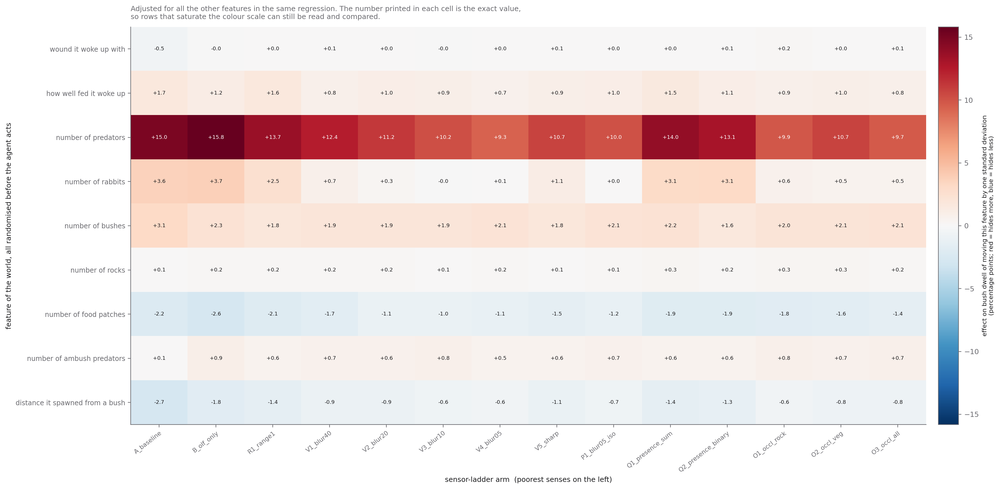
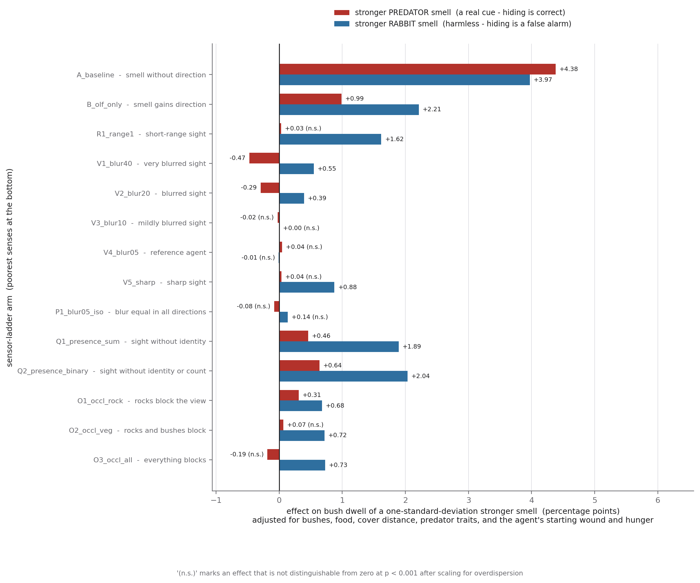
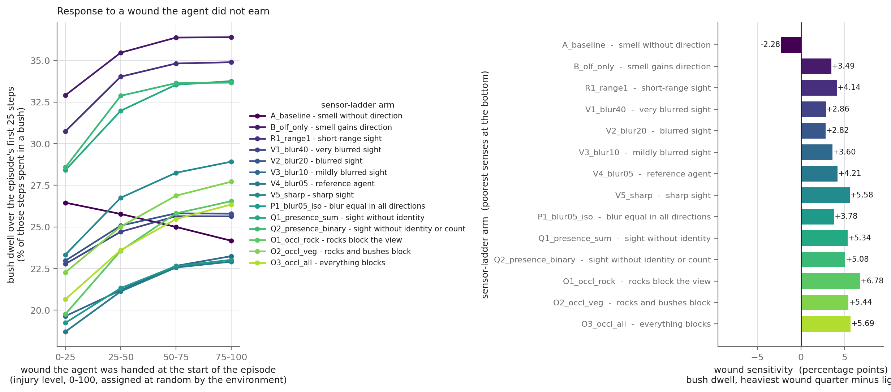
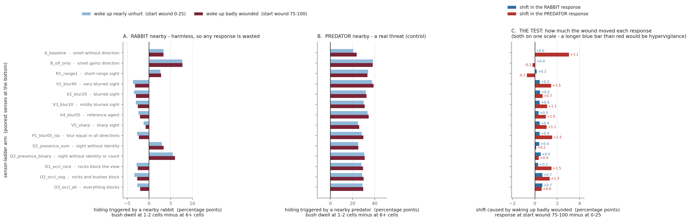
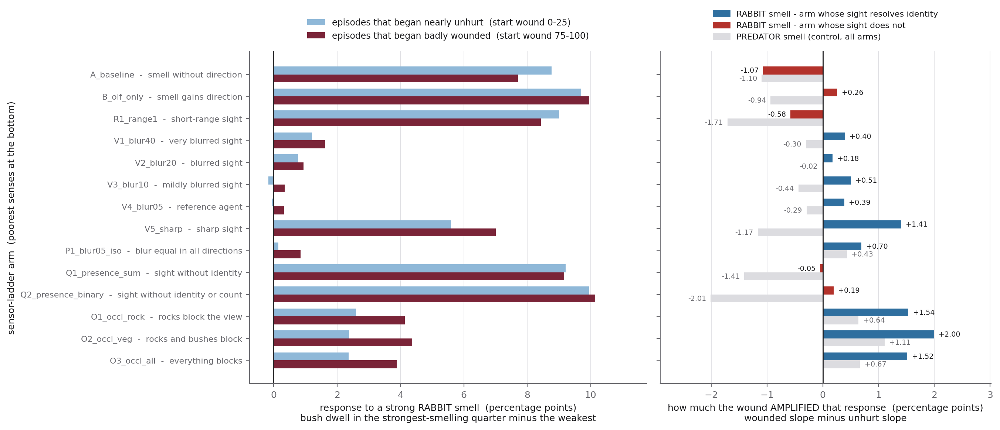
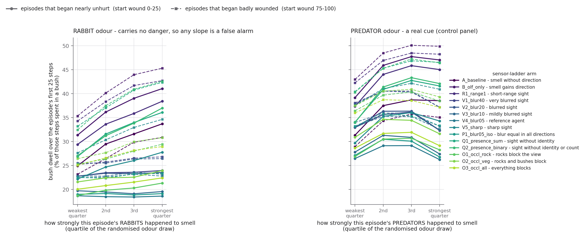
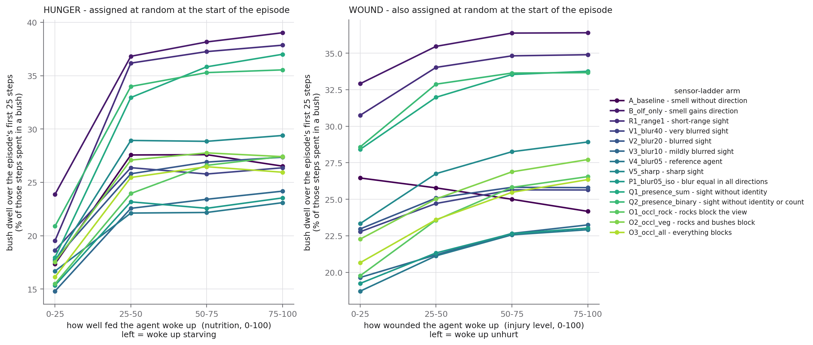
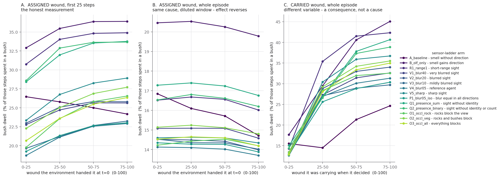
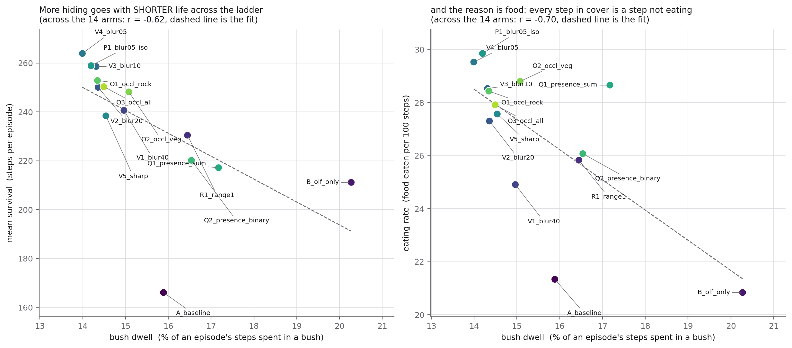

# What each sense buys

## Question

We trained fourteen agents on **one** environment with **one** random seed. They differ in exactly
one thing: what they are allowed to sense. One can only smell, and cannot even tell which direction
the smell is coming from. One sees a sharp picture of the four squares around it. One sees a blurred
picture but can tell a predator from a rabbit at a glance. One sees perfectly except that rocks and
bushes get in the way.

Then every one of them replayed the **same 300,000 evaluation episodes**. Same worlds, same
predators, same food, same starting injuries. So when two of these agents behave differently, the
difference is the sensory change and nothing else.

We asked two things of that data.

**First, what does each sense actually buy?** Not in the abstract - in survival steps, and in
*bush dwell*, the share of an episode's steps the agent spends standing inside a bush where a
predator cannot see it. Hiding is the behaviour this project is trying to explain, and a bush has
no food in it, so every step spent hiding is a step not spent eating.

**Second, what does an injury do to behaviour, and does the answer depend on what the agent can
sense?** This environment lets us ask that cleanly. At the start of every episode the agent is
handed an injury level drawn at random from 0 to 100 that it did nothing to earn, and it has no
sensor that reads that number directly - the only route from a wound to behaviour is an internal
*nociceptor*, a channel that reports a smoothed running trace of how injured the body is. So any
behaviour that tracks the assigned wound is caused by it.

### What we found

1. **The single most valuable thing we gave the agent was not sharper sight - it was a *direction*
   for its sense of smell.** Going from one omnidirectional whiff to a five-cell smell field is
   worth **+45 survival steps**, the largest single-variable gain anywhere in the ladder.

2. **What matters about sight is *identity*, not sharpness.** Taking an agent's eight appearance
   channels down to one - so it can see *that* something is there but not *what* - costs **−47
   steps**, the largest single loss in the ladder. Blurring the picture eightfold costs only half
   as much.

3. **Sharp sight is worse than slightly blurred sight (−26 steps).** This is not a paradox once you
   read the sensor code: with blur switched off, the agent sees an object only if it stands
   *exactly* on one of the thirteen sampled cells. The blur is a point-spread function that lets
   nearby objects register at all. Blur trades positional precision for reach, and in this ladder
   reach is worth more.

4. **An agent that can tell a rabbit from a predator stops hiding from rabbits.** A rabbit cannot
   hurt the agent. The five arms whose sight cannot resolve identity all hide *more* when a rabbit
   is near; all nine that can resolve it hide *less*. Four independent measures agree on that split.

5. **Waking up wounded causes more hiding** - between +2.8 and +6.8 percentage points of bush dwell
   in thirteen of the fourteen arms, measured causally off the randomised starting wound.

6. **Hypervigilance shows up on the ambiguous channel, and only there.** A wound does *not* make the
   agent treat a nearby rabbit more like a nearby predator - on that channel it becomes more
   responsive to the *real* threat. But it *does* amplify the agent's response to a harmless
   animal's **smell** more than to a predator's smell, in all fourteen arms; and the response to
   harmless smell only *grows* in absolute terms in the nine arms that have reliable sight to fall
   back on. The effect is largest in the three arms where scenery intermittently blocks the view.

7. **Hunger outweighs the wound by roughly two to three times**, and hiding is a cost rather than a
   good: across the fourteen arms, more bush dwell goes with *shorter* life (r = −0.62) and less
   eating (r = −0.70).

### The one caveat that colours everything below

**There is one training run per arm.** All fourteen share seed 42. The 300,000 replayed episodes
make each agent's *behaviour* very precisely measured, but each *agent* is a single draw from the
training distribution. So a difference between two individual arms - "sharp sight costs 26 steps" -
cannot be separated from ordinary run-to-run variation, and should be read as suggestive.

What survives that caveat is any finding that rests on a **pattern across many arms**. Fourteen
independently trained agents splitting cleanly into two groups by a sensory property (finding 4),
or fourteen out of fourteen moving the same direction (finding 6), is evidence in a way that a
single pairwise contrast is not. Each finding below says which kind it is.

---

## The fourteen arms

Read the zeros in this table carefully, because `range: 0` does **not** mean the sense is switched
off.

- **`olfactory_grid_range: 0`** still gives one olfactory sample, taken at the agent's own cell.
  That sample is a distance-decayed sum over every animal within the sensor radius of 20 cells -
  the whole 10×10 grid - so the agent smells everything. It just cannot tell where the smell is
  coming from. Range 1 adds a five-cell diamond around the agent, and comparing those five readings
  is what turns a whiff into a direction.
- **`visual_sensor_range: 0`** means the agent sees a one-cell field: the square it is standing on
  and nothing else. Range 1 is five cells, range 2 is thirteen.

(Both are in `src/environment/sensor.py` - `sense_olfaction_cells` takes a static single-point
branch at range 0, and `sense_visual` uses `get_visual_offsets`, which returns a single offset at
range 0.)


| arm | what it can sense | smell grid | sight range | blur scale | blur anisotropy | appearance channels | value mode | sight blocked by |
|---|---|---|---|---|---|---|---|---|
| `A_baseline` | smell without direction | 0 | 0 | off | - | 8 | sum | nothing |
| `B_olf_only` | smell gains direction | 1 | 0 | off | - | 8 | sum | nothing |
| `R1_range1` | short-range sight | 1 | 1 | off | - | 8 | sum | nothing |
| `V1_blur40` | very blurred sight | 1 | 2 | 4.0 | 3.0 | 8 | sum | nothing |
| `V2_blur20` | blurred sight | 1 | 2 | 2.0 | 3.0 | 8 | sum | nothing |
| `V3_blur10` | mildly blurred sight | 1 | 2 | 1.0 | 3.0 | 8 | sum | nothing |
| `V4_blur05` | reference agent | 1 | 2 | 0.5 | 3.0 | 8 | sum | nothing |
| `V5_sharp` | sharp sight | 1 | 2 | off | - | 8 | sum | nothing |
| `P1_blur05_iso` | blur equal in all directions | 1 | 2 | 0.5 | 1.0 | 8 | sum | nothing |
| `Q1_presence_sum` | sight without identity | 1 | 2 | 0.5 | 3.0 | 1 | sum | nothing |
| `Q2_presence_binary` | sight without identity or count | 1 | 2 | 0.5 | 3.0 | 1 | clamp | nothing |
| `O1_occl_rock` | rocks block the view | 1 | 2 | 0.5 | 3.0 | 8 | sum | rock |
| `O2_occl_veg` | rocks and bushes block | 1 | 2 | 0.5 | 3.0 | 8 | sum | bush, rock |
| `O3_occl_all` | everything blocks | 1 | 2 | 0.5 | 3.0 | 8 | sum | bush, rock, predator, neutral, hiding_predator |

`P1_blur05_iso` changes only the blur's *anisotropy*. At the default of 3.0 the point-spread is
stretched along the line from the agent to the object and kept narrow across it, so distance
becomes vague while direction stays sharp. At 1.0 the spread is equal in every direction and
direction blurs too.

### What is causal here, and what is not

Three quantities in this environment are drawn **before the agent acts**, so splitting on them
supports a causal claim:

| quantity | why it is causal |
|---|---|
| the starting injury (`random_start_injury`, uniform 0-100) | assigned at reset; the agent did nothing to earn it |
| the starting nutrition (`random_start_nutrition`, uniform 0-100) | same |
| each animal's odour (redrawn every episode) | the agent cannot choose what a rabbit smells like |

Everything else is not. In particular, **distance to a predator is not randomised** - the agent
chose where to walk - so the distance curves in Figures 4, 5 and 7 are descriptive. They describe a
real regularity in behaviour; they do not by themselves establish that proximity *caused* it.

---

## 1. What each sense buys


**Figure 1.** Left: mean survival. Right: bush dwell. Both over the arm's 300,000 episodes.

**Motivation.** The most basic question about a sense is whether having it helps. If it does, the
agents that have it should live longer.

**Method.** Survival is the mean episode length. Bush dwell is (bush steps) ÷ (steps), pooled over
every episode of the arm. The `t=0` row is the world as handed to the agent, not a step it took, so
it is excluded from both the numerator and the denominator.

**Reading.** Survival spans 166 to 264 steps - a 59% range produced entirely by sensory settings.
Bush dwell moves far less, 14.0% to 20.3%. The two are *anti*-correlated: the agents that hide most
are the ones that die soonest. That is the first hint that hiding is not the thing the senses buy.


| arm | mean survival (steps) | bush dwell (%) | killed (%) | starved (%) | reached the limit (%) | food per 100 steps |
|---|---|---|---|---|---|---|
| `A_baseline` | 166.1 | 15.9 | 46.0 | 30.4 | 23.6 | 21.34 |
| `B_olf_only` | 211.2 | 20.3 | 47.5 | 24.3 | 28.2 | 20.84 |
| `R1_range1` | 230.5 | 16.4 | 39.9 | 27.8 | 32.3 | 25.83 |
| `V1_blur40` | 240.7 | 15.0 | 29.6 | 36.1 | 34.4 | 24.91 |
| `V2_blur20` | 250.1 | 14.4 | 29.8 | 34.2 | 36.0 | 27.31 |
| `V3_blur10` | 258.6 | 14.3 | 27.5 | 35.9 | 36.6 | 28.54 |
| `V4_blur05` | 264.0 | 14.0 | 25.6 | 36.9 | 37.5 | 29.53 |
| `V5_sharp` | 238.4 | 14.5 | 33.1 | 32.8 | 34.2 | 27.57 |
| `P1_blur05_iso` | 259.0 | 14.2 | 27.1 | 36.6 | 36.3 | 29.86 |
| `Q1_presence_sum` | 217.2 | 17.2 | 45.3 | 26.5 | 28.2 | 28.66 |
| `Q2_presence_binary` | 220.2 | 16.5 | 40.9 | 30.1 | 29.0 | 26.08 |
| `O1_occl_rock` | 252.9 | 14.3 | 27.4 | 36.9 | 35.7 | 28.44 |
| `O2_occl_veg` | 248.2 | 15.1 | 30.6 | 34.4 | 35.0 | 28.80 |
| `O3_occl_all` | 250.4 | 14.5 | 29.7 | 34.5 | 35.8 | 27.92 |

### Isolating one knob at a time


**Figure 2.** Each row is one arm minus its reference arm - a change of exactly one setting.

**Motivation.** Figure 1's ranking confounds everything: the sharp-sighted agent differs from the
near-blind one in several settings at once. The ladder was built so that most arms sit one setting
away from a named reference, and those pairs are what Figure 2 shows.

**Method.** The difference of the two arms' pooled values from Figure 1. The pairing lives in
`ARM_REFERENCE` in `scripts/analysis/ladder/_ladder.py` and is checked against the saved configs.
Because both members of a pair replayed the same 300,000 worlds, they met identical predators,
identical food and identical starting wounds.

**Reading.** Three results stand out.

- **Direction beats acuity.** Giving smell a direction (`A_baseline` → `B_olf_only`) is worth
  **+45.1 steps** - the biggest single win in the table - even though the agent still has no useful
  sight at all.
- **Identity beats sharpness.** Collapsing the eight appearance channels to one (`V4_blur05` →
  `Q1_presence_sum`) costs **−46.8 steps**. Blurring the picture eightfold (`V4_blur05` →
  `V1_blur40`) costs **−23.3**. Seeing *that* something is there but not *what* is worse than
  seeing *what* very blurrily.
- **Sharp is worse than slightly blurred.** Disabling blur costs **−25.5 steps**. Section 3 explains
  why.

Note that these are single pairwise contrasts and therefore the findings most exposed to the
one-seed caveat. Findings 4 and 6 below do not have that weakness.


| change | arm | compared with | survival (steps) | bush dwell (pp) |
|---|---|---|---|---|
| olfactory grid range 1 - a 5-cell smell diamond | `B_olf_only` | `A_baseline` | +45.1 | +4.4 |
| visual range 1 (5 cells) instead of 2 (13 cells) | `R1_range1` | `V4_blur05` | -33.5 | +2.5 |
| visual blur radial scale 4.0 | `V1_blur40` | `V4_blur05` | -23.3 | +1.0 |
| visual blur radial scale 2.0 | `V2_blur20` | `V4_blur05` | -13.9 | +0.4 |
| visual blur radial scale 1.0 | `V3_blur10` | `V4_blur05` | -5.3 | +0.3 |
| visual blur disabled | `V5_sharp` | `V4_blur05` | -25.5 | +0.6 |
| visual blur anisotropy 1.0 instead of 3.0 | `P1_blur05_iso` | `V4_blur05` | -5.0 | +0.2 |
| visual vector size 1 - sees THAT, not WHAT | `Q1_presence_sum` | `V4_blur05` | -46.8 | +3.2 |
| visual value mode clamp instead of sum | `Q2_presence_binary` | `Q1_presence_sum` | +3.0 | -0.6 |
| visual occlusion on, rocks only | `O1_occl_rock` | `V4_blur05` | -11.1 | +0.4 |
| visual occlusion also by bushes | `O2_occl_veg` | `O1_occl_rock` | -4.7 | +0.7 |
| visual occlusion also by animals and ambush predators | `O3_occl_all` | `O2_occl_veg` | +2.1 | -0.6 |

## 2. What actually kills each agent


**Figure 3.** Every arm's 300,000 episodes split into the three ways an episode can end.

**Motivation.** Survival alone hides the trade-off. An agent that hides constantly does not get
eaten - it starves. An agent that forages constantly does not starve - it gets eaten. Which failure
a sensory setting buys down, and which it buys up, is more informative than the net.

**Method.** The `termination_reason` column of the episode table, counted per arm: 1 = reached the
step limit alive, 2 = starved, 4 = killed by a predator. The three shares sum to 100%.

**Reading.** Predation is where the senses pay. It runs from 46-47% in the two arms with no useful
sight down to 26% in the reference agent. Starvation moves the *other* way, from 24% up to 37% - the
better-sighted agents are trading some starvation risk for a much larger reduction in predation, and
coming out ahead. `Q1_presence_sum` and `Q2_presence_binary` are the tell: they have a full
thirteen-cell visual field and still die to predators at 45% and 41%, essentially the rate of an
agent that cannot see at all. A visual field that cannot say *what* it contains does not protect
against being eaten.

## 3. Why sharp sight is worse than blurred sight

This is the one result in the report that looks like an error and is not, so it is worth stating
the mechanism explicitly.

In `sense_visual` (`src/environment/sensor.py`), the weight matrix that maps objects onto the
agent's sampled cells is built one of two ways:

- **blur disabled** - `W` is an *exact cell match*. An object registers only if it is standing
  exactly on one of the thirteen cells of the Manhattan diamond of radius 2. A predator two cells
  away *diagonally* is at Manhattan distance 4 and is completely invisible.
- **blur enabled** - `W` is a Gaussian point-spread whose width grows with the object's distance,
  normalised by its own full analytic mass so that only the fraction landing inside the diamond is
  reported. Distant objects fade rather than vanish.

So the blur setting is not an image-quality dial running from "good" to "degraded". It is a
**reach-versus-precision** dial. Turning it off buys perfect localisation of the few objects that
happen to sit on a sampled cell, at the cost of not seeing anything else at all.

The behaviour matches. Figure 4 shows `V5_sharp` responding *less* strongly to a predator at one or
two cells (25.4 percentage points, against 34.1 for `V4_blur05`) while maintaining a *higher* level
of hiding out at six and seven cells. That is the signature of an agent that frequently cannot see
the predator that is right next to it, and compensates with a raised baseline. It also explains why
`V5_sharp` is the one identity-resolving arm that still responds strongly to rabbit *odour*
(Table 4): having unreliable sight, it falls back on smell.

And the ladder is non-monotonic in exactly the way a reach-versus-precision trade-off predicts:
survival runs 240.7 → 250.1 → 258.6 → **264.0** → 238.4 as the blur scale goes 4.0 → 2.0 → 1.0 →
0.5 → off. There is an optimum in the middle, at 0.5.


**Figure 4.** Bush dwell against how far the nearest predator (left) or rabbit (right) was when the
agent chose its move.

**Motivation.** Hiding is only defensive if the threat triggers it. A flat curve would mean the
agent hides on a schedule; a curve that rises as the animal approaches means it hides in response
to something it perceived.

**Method.** For every step, the distance to the nearest **active** predator is measured in chebyshev
steps - the number of moves a king would need, since the agent moves diagonally too. The action that
produced step `t` was chosen while the agent was looking at step `t−1`, so the distance is read off
the previous row and the bush occupancy off the current one. Distances of 8 or more are pooled.
Episodes that contain no predator at all are **excluded** from the predator panel - a third of all
episodes have none, and including them would silently make "there is no predator" the comparison
group. Bins with fewer than 1,000 steps are drawn as gaps.

**Reading.** Every arm's predator curve rises steeply as the predator closes. The rabbit curves
separate into two families, which is the subject of the next section.


## 4. The rabbit false alarm, and what abolishes it


**Figure 5.** Left: each arm's response to a nearby predator and to a nearby rabbit, joined by a
line whose length is that arm's discrimination. Right: the rabbit response alone, coloured by
whether the arm's sight can resolve identity.

**Motivation.** A rabbit cannot hurt the agent. Hiding when one comes near costs foraging time and
returns nothing. So the rabbit response is a clean measure of wasted defence - and asking which
sensory settings remove it tells us what discrimination actually requires.

**Method.** For each arm and each animal class, the *proximity effect* is

$$
\text{proximity effect} \;=\; P(\text{in bush} \mid \text{nearest animal 1-2 cells away}) \;-\; P(\text{in bush} \mid \text{nearest animal 6 or more cells away})
$$

in percentage points. Counts are pooled before the ratio is taken, so a distance bin holding more
steps carries more weight; averaging the per-bin rates instead would let a sparse bin dominate.
Predictors are read off the previous row. Episodes lacking the animal class in question are
excluded.

**Reading.** The fourteen arms split cleanly in two, and the split is **not** sight against no
sight:

- **Nine arms whose sight can resolve identity** - visual range 2 with eight appearance channels -
  have a *negative* rabbit response, between −1.0 and −3.5 percentage points. They hide slightly
  *less* when a rabbit is near.
- **Five arms whose sight cannot** - the two with no useful visual range, the one with range 1, and
  the two with a single appearance channel - all have a *positive* rabbit response, between +2.7
  and +7.6 percentage points.

`Q1_presence_sum` and `Q2_presence_binary` are the decisive cases. They have the full thirteen-cell
field at the reference blur; the only thing they lack is the ability to say what is in it. They fall
straight back into the false alarm. So the thing that abolishes it is not sight, and not acuity - it
is **identity**.

Four independent measures agree on this split, which is what makes it the most robust finding in
the report. Two are behavioural contrasts on separate cues (proximity and odour); two are regression
coefficients adjusted for the rest of the world. A single training run per arm could produce one of
these by chance. Producing all four, consistently, in nine arms against five, could not.


| arm | sight resolves identity | proximity to a rabbit (pp) | rabbit odour slope (pp) | rabbit odour, adjusted (pp) | one more rabbit in the world (pp) |
|---|---|---|---|---|---|
| `A_baseline` | no | +3.2 | +8.27 | +3.97 | +3.61 |
| `B_olf_only` | no | +7.6 | +9.71 | +2.21 | +3.72 |
| `R1_range1` | no | +2.7 | +8.83 | +1.62 | +2.53 |
| `V1_blur40` | yes | -3.5 | +1.27 | +0.55 | +0.75 |
| `V2_blur20` | yes | -3.3 | +0.88 | +0.39 | +0.29 |
| `V3_blur10` | yes | -2.9 | +0.09 | +0.00 | -0.03 |
| `V4_blur05` | yes | -2.3 | +0.08 | -0.01 | +0.07 |
| `V5_sharp` | yes | -1.0 | +6.59 | +0.88 | +1.12 |
| `P1_blur05_iso` | yes | -2.6 | +0.32 | +0.14 | +0.00 |
| `Q1_presence_sum` | no | +3.3 | +9.20 | +1.89 | +3.07 |
| `Q2_presence_binary` | no | +5.9 | +10.17 | +2.04 | +3.13 |
| `O1_occl_rock` | yes | -2.8 | +3.42 | +0.68 | +0.63 |
| `O2_occl_veg` | yes | -3.1 | +3.47 | +0.72 | +0.50 |
| `O3_occl_all` | yes | -2.4 | +3.30 | +0.73 | +0.52 |



**Figure 12** (shown here because it corroborates the same split). Every feature of the world that
is randomised before the agent acts, against every arm.

**Motivation.** Figures 1-5 each isolate one thing. This one steps back and asks which world
features move bush dwell at all, in every arm at once.

**Method.** A quasi-binomial regression per arm on the episode-level bush-dwell rate, with all nine
exogenous features entered together so each is adjusted for the others. Standard errors are scaled
by the Pearson overdispersion, which runs 13-27 here; without that scaling every p-value would be
meaningless. The number plotted is the effect of moving the feature by one standard deviation,
converted to percentage points of bush dwell. Only features drawn at reset are included -
consequences of the agent's own behaviour (how much it ate, how long it survived) belong to a
different question and would swamp this one.

**Reading.** The `number of rabbits` row reproduces the Figure 5 split exactly: +3.6, +3.7, +2.5 for
the arms without identity-resolving sight, +3.1 and +3.1 for the two presence-only arms, and
essentially zero (−0.0 to +1.1) for the nine that can resolve identity. Meanwhile `number of
predators` is the largest driver in every single arm, and it *shrinks* as the senses improve, from
+15.0 down to +9.3 - a better-sighted agent needs less blanket caution because it can afford to be
selective.



**Figure 13.** The effect of a predator's and a rabbit's odour strength on bush dwell, inside a
regression that holds the rest of the world fixed.

**Motivation.** Figure 5 uses proximity. This uses smell, which is the cue that is genuinely
ambiguous, and puts it inside a regression so the result cannot be explained by strong-smelling
worlds differing in some other way.

**Method.** Quasi-binomial regression on the episode-level bush-dwell rate, restricted to episodes
with exactly one predator and one rabbit so that "the predator's smell" and "the rabbit's smell" are
each a single well-defined number rather than an average over several animals (n ≈ 33,500 per arm).
Adjusted for the number of bushes, rocks, food patches and ambush predators, the distance the agent
spawned from cover, the predator's detection range, attack delay, attack range and stamina, the
predator's own smell, and the agent's starting wound and hunger. Bars are the effect of a
one-standard-deviation stronger smell, in percentage points.

**Reading.** The same nine-against-five split, on a completely different cue and with the world held
fixed. `A_baseline` hides +3.97 points harder for a strong-smelling rabbit; `V4_blur05` is at −0.01
and not distinguishable from zero.


---

## 5. What a wound does

### It causes more hiding



**Figure 6.** Bush dwell over each episode's first 25 steps, against the injury level the
environment handed the agent at `t=0`.

**Motivation.** Everywhere else, a wounded agent is a suspicious comparison: it got hurt by doing
something, so its later behaviour is contaminated by whatever it was doing. This environment removes
that problem. `body.random_start_injury` is true, so the agent begins every episode with a wound
drawn uniformly from 0 to 100 that it did nothing to earn. Behaviour that tracks *that* number is
caused by it.

This matters for the sensor ladder because the agent has **no sensor that reads its own injury** -
`injury_observable` is false. The only route from an injury level to behaviour is the interoceptive
nociceptor: a twelve-slot buffer of injury *levels* (not damage events), zeroed at reset, written
each step, and convolved with an alpha kernel. So this figure asks whether that internal channel
changes behaviour at all, and whether the answer depends on what the agent can sense of the outside
world.

**Method.** Episodes are split into four equal quarters of the starting wound. Bush dwell is pooled
over the **first 25 steps only** - the wound recovers as the episode runs, so a whole-episode
average would dilute the assigned dose with whatever the agent's own behaviour produced later.
Section 7 shows exactly how much damage that dilution does.

**Reading.** Thirteen of the fourteen arms hide more when handed a bigger wound, by between +2.8 and
+6.8 percentage points across the full range. The exception is `A_baseline` at −2.3, the one agent
with neither directional smell nor useful sight. Thirteen out of fourteen independently trained
agents moving the same way is a pattern, not a run-to-run fluctuation.

### But it is not hypervigilance - on this channel



**Figure 7.** Panels A and B: response to a nearby rabbit and to a nearby predator, at the lightest
and heaviest starting wound. Panel C: the two shifts on one scale.

**Motivation.** Figure 6 shows a wounded agent hides more. That, on its own, is ordinary caution.
The claim that would earn the word *hypervigilance* is stronger and more specific: that being
wounded changes **what the agent treats as evidence of danger**, so that an ambiguous, harmless cue
starts driving the same defence a real threat does. Testing that requires comparing the shift in the
harmless cue against the shift in the real one - which is what panel C does. If a wound raised both
by the same amount, the agent has simply become more defensive across the board: a gain change, not
a criterion change.

**Method.** Within each starting-wound quarter *separately*, the same proximity effect as Figure 5.
The shift is the heaviest quarter minus the lightest.

**Reading.** **No criterion shift on this channel.** The rabbit shift is between +0.0 and +0.7
percentage points in every arm. The predator shift is larger in most of them, up to +3.1. A wounded
agent becomes more responsive to the animal that can actually kill it - the opposite of what
hypervigilance predicts.

### It *is* hypervigilance - on the ambiguous channel



**Figure 8.** Left: how strongly each arm responds to a strong rabbit smell, when it began the
episode nearly unhurt and when it began badly wounded. Right: the difference, with the predator
smell as a control.

**Motivation.** Proximity is not the ambiguous cue. For an agent that can see, a nearby animal is a
*resolved* cue - it can look and tell what the animal is. Smell is the ambiguous one, and an
animal's odour is redrawn at random every episode, so a rabbit's smell carries no danger by
construction. If a wound shifts the agent's criterion, this is the channel where it should show.

**Method.** Within each arm, episodes are split into quartiles of the odour intensity drawn for
their rabbits. The *slope* is bush dwell in the strongest-smelling quarter minus the weakest, over
the first 25 steps. That slope is computed twice - once over episodes that began nearly unhurt
(start wound 0-25), once over those that began badly wounded (75-100) - and the bar is the
difference. Episodes containing no rabbit are excluded.

**Reading.** Two things, and the second is the finding.

- **In all fourteen arms, the wound amplifies the rabbit-smell response more than the
  predator-smell response.** The gap runs from +0.03 to +2.58 percentage points. Fourteen out of
  fourteen is not a fluctuation.
- **In absolute terms, the rabbit-smell response only *grows* in the nine arms that can resolve
  identity** (+0.18 to +2.00 points). In the five that cannot, it is flat or falls (−1.07 to +0.26)
  - those agents were already responding to rabbit odour at close to full strength whether wounded
  or not, so there is no headroom.

The reading this supports: a wound does not make the agent generically more afraid. It makes the
agent **lean harder on an ambiguous channel** - and that can only show up in an agent that has a
reliable channel to lean away from. Consistently, the effect is largest in the three occlusion arms
(+1.52 to +2.00), where sight is present but scenery intermittently blocks it, so the agent has the
most to gain from a fallback and the most reason to distrust its eyes.



**Figure 9.** The underlying curves: bush dwell against how strongly this episode's rabbits (left)
and predators (right) happened to smell, solid for episodes that began unhurt and dashed for those
that began wounded.

**Method.** As Figure 8. Intensity is the sum of the two olfactory channels that separate the two
classes, with the channels derived from each run's own config rather than assumed.

**Reading.** The predator panel dips at the loudest quartile, and that dip is real rather than an
artefact. Intensity is the **sum** of the two odour channels, while what marks an animal out as a
predator is their **difference** - so an episode whose predators smell very loudly has both channels
near their ceiling and the difference squeezed toward zero. Measured on the reference run, mean
predator-ness is 0.12 in the loudest quartile against 0.18-0.22 in the other three. The loudest
predators are the least distinguishable ones, and the agent responds to them less.


| arm | bush dwell, first 25 steps (pp per full wound range) | shift in rabbit proximity (pp) | shift in predator proximity (pp) | wound amplifies rabbit odour (pp) | wound amplifies predator odour (pp) |
|---|---|---|---|---|---|
| `A_baseline` | -2.28 | +0.00 | +3.05 | -1.07 | -1.10 |
| `B_olf_only` | +3.49 | +0.04 | -0.20 | +0.26 | -0.94 |
| `R1_range1` | +4.14 | +0.18 | -0.72 | -0.58 | -1.71 |
| `V1_blur40` | +2.86 | +0.45 | +1.46 | +0.40 | -0.30 |
| `V2_blur20` | +2.82 | +0.46 | +0.69 | +0.18 | -0.02 |
| `V3_blur10` | +3.60 | +0.43 | +1.09 | +0.51 | -0.44 |
| `V4_blur05` | +4.21 | +0.33 | +0.98 | +0.39 | -0.29 |
| `V5_sharp` | +5.58 | +0.43 | +1.06 | +1.41 | -1.17 |
| `P1_blur05_iso` | +3.78 | +0.43 | +1.55 | +0.70 | +0.43 |
| `Q1_presence_sum` | +5.34 | +0.40 | +0.12 | -0.05 | -1.41 |
| `Q2_presence_binary` | +5.08 | +0.53 | +0.36 | +0.19 | -2.01 |
| `O1_occl_rock` | +6.78 | +0.31 | +1.49 | +1.54 | +0.64 |
| `O2_occl_veg` | +5.44 | +0.67 | +1.33 | +2.00 | +1.11 |
| `O3_occl_all` | +5.69 | +0.67 | +0.60 | +1.52 | +0.67 |

---

## 6. The wound competes with hunger, and loses



**Figure 10.** Bush dwell over the first 25 steps against the two internal states the environment
assigns at random.

**Motivation.** The agent carries two internal states that pull in opposite directions. A wound
argues for staying in cover; an empty stomach argues for leaving it, because a bush contains no
food. Both are randomised at reset, so both can be tested causally and on the same footing. Which
one actually steers the behaviour?

**Method.** Episodes are split into four equal quarters of the assigned value. Both panels use the
first 25 steps, for the reason Section 7 gives. The two panels do **not** share a y-range - the
hunger effect is several times the size of the wound effect, and forcing one scale would flatten
the wound panel into a line. Compare the spans in the table, not the visual steepness.

**Reading.** Hunger moves bush dwell by +6.4 to +19.0 percentage points across its range; the wound
moves it by −2.3 to +6.8. Hunger is the dominant internal driver in every arm, by a factor of
roughly two to three. Any account of this agent's hiding that leaves out the competing metabolic
demand is describing a small part of the behaviour.


| arm | hunger: bush dwell span (pp) | wound: bush dwell span (pp) | ratio |
|---|---|---|---|
| `A_baseline` | +9.16 | -2.28 | wound effect is negative |
| `B_olf_only` | +15.14 | +3.49 | 4.3x |
| `R1_range1` | +18.32 | +4.14 | 4.4x |
| `V1_blur40` | +7.75 | +2.86 | 2.7x |
| `V2_blur20` | +9.59 | +2.82 | 3.4x |
| `V3_blur10` | +9.37 | +3.60 | 2.6x |
| `V4_blur05` | +6.42 | +4.21 | 1.5x |
| `V5_sharp` | +11.74 | +5.58 | 2.1x |
| `P1_blur05_iso` | +8.20 | +3.78 | 2.2x |
| `Q1_presence_sum` | +19.04 | +5.34 | 3.6x |
| `Q2_presence_binary` | +14.65 | +5.08 | 2.9x |
| `O1_occl_rock` | +11.94 | +6.78 | 1.8x |
| `O2_occl_veg` | +9.87 | +5.44 | 1.8x |
| `O3_occl_all` | +9.83 | +5.69 | 1.7x |

---

## 7. Two ways to get the injury result wrong



**Figure 11.** The same question answered three ways. A: the assigned wound over the first 25 steps.
B: the assigned wound over the whole episode. C: the carried wound over the whole episode.

**Motivation.** "Does injury make the agent hide?" has three plausible-looking answers in this data
and two of them are wrong. They are shown together because the two mistakes have *different* causes
that are easy to conflate, and because a reader who reproduced either one deserves to know why it
differs from what this report claims.

**Method.** All three use identical bins - four equal quarters of injury on 0-100 - and the
identical outcome, bush dwell with the `t=0` row excluded. They differ only in which injury number a
step is filed under, and over which steps the average is taken.

**Reading.**

- **Panel A** is the honest measurement: the randomised wound, measured while the assigned dose is
  still largely intact. Positive in thirteen of fourteen arms, +2.8 to +6.8 points.
- **Panel B** changes *one* thing - the same randomised wound, averaged over the whole episode - and
  the effect **reverses** to −0.0 to −0.7. Nothing about the cause changed, only the window. This is
  a weighting artefact: hiding is much commoner early in an episode than late, and a lightly wounded
  agent goes on to have a longer episode (270 steps against 255 in the reference arm), so its
  whole-episode average is diluted by more late, low-hiding steps. The reversal is a fact about
  episode length, not about what a wound does.
- **Panel C** changes the *variable* instead - the wound the agent was carrying mid-episode, which
  is the number that falls out of any trajectory log for free - and reports an enormous **+9 to +28
  points**. This is the most misleading of the three, because a mid-episode wound is a *consequence*
  of behaviour: the agent is carrying a big wound precisely because it was out in the open near a
  predator, which is also where the bushes are not. Panel C measures where the agent *was* and
  reports it as what the agent *decided*.

The spread between panel A and panel C - roughly +4 against +19 in the reference arm - is the size
of the mistake available to anyone who takes the convenient measurement.

---

## 8. What hiding costs



**Figure 14.** One point per arm, over that arm's 300,000 episodes.

**Motivation.** If hiding were simply good, the arms that hide most would be the ones that survive
longest. Testing that directly is the cleanest way to say what the senses are actually for.

**Method.** Bush dwell is bush steps over steps; eating rate is `ate_food` events per 100 steps;
survival is mean episode length. All three pool over the same episodes, and every arm saw the same
300,000 worlds. The dashed line is an ordinary least-squares fit across the fourteen arm-level
points; `r` is the correlation across arms, not across episodes.

**Reading.** More hiding goes with **shorter** life (r = −0.62) and **less** eating (r = −0.70).
The senses do not make the agent hide more - `A_baseline` and `B_olf_only` hide the most and die
soonest. They let it hide at the *right* moments and forage the rest of the time. That is the
through-line of the whole report: what improves with better senses is not the amount of defence but
its **selectivity**.

---

## Method summary

**Data.** Fourteen `lad_*` training runs, all finished at 10,000,005-10,000,081 environment steps
(a spread of 76 steps, so no arm had a meaningfully longer training budget). All share seed 42 and
one environment configuration; only the `sensory` block and the per-object `blocks_sight` flags
differ. Each arm's final checkpoint replayed 300,000 evaluation episodes with `--seed-base 1000000`,
producing 50-79 million step rows per arm, about 996 million rows in total.

**Pairing.** All fourteen arms replayed the *same* seed range, so any two arms met identical worlds:
identical predator traits, identical food placement, identical randomised starting wounds and
hungers, identical odour draws. Between-arm differences are therefore free of world variance. They
are **not** free of training variance - see the caveat below.

**Two conventions every script obeys.**

1. **The `t=0` row is not a step.** It is the world as handed to the agent. It appears in no
   numerator and no denominator. (Getting this wrong in an earlier analysis produced 5,568 episodes
   with more successes than trials.)
2. **Predictors come from the previous row.** The action that produced row `t` was chosen while the
   agent was looking at row `t−1`, so anything the agent conditioned on is read off `t−1`.

**Regressions.** Quasi-binomial on the episode-level bush-dwell rate, with standard errors scaled by
the Pearson overdispersion (13-27 across these runs). Effects are reported as the change in
percentage points of bush dwell produced by a one-standard-deviation change in the regressor.

**A trap this analysis fell into and corrected.** A third of all episodes contain no predator, and a
third contain no rabbit. In an early version of these scripts those episodes were not excluded from
the distance and odour analyses. Because `numpy.digitize` files every `NaN` into the *top* bin and
`numpy.clip` files every `inf` into the *farthest* distance bin, the no-predator episodes - which
hide far less, since nothing is hunting them - silently became the comparison group. That
manufactured a large spurious drop in the top odour quartile of Figure 9 and inflated every
proximity effect. The published numbers come from the corrected version, which excludes them
explicitly.

## Limitations

1. **One training run per arm.** All fourteen share seed 42, so any single pairwise contrast
   confounds the sensory change with ordinary training-run variation. Findings that rest on a
   pattern across many arms (Sections 4 and 5) are far more robust than the individual step sizes in
   Table 3. Replicating the ladder at two or three seeds would settle it and is the obvious next
   experiment.
2. **Proximity is not randomised.** The distance curves in Figures 4, 5 and 7 describe a real
   regularity but do not on their own establish causation. The causal claims in this report rest on
   the randomised starting wound, the randomised starting hunger, and the randomised odour draw.
3. **The early window is a judgement call.** Twenty-five steps is short enough that the assigned
   wound is largely intact and long enough for the rates to be stable, but it is not derived from
   anything. Figure 11 shows how much the answer depends on it.
4. **Hypervigilance is measured on two channels, not all of them.** Sections 5 tests proximity and
   odour. The agent also has collision, proprioceptive and visual channels that were not tested for
   a criterion shift.
5. **"Identity-resolving sight" is a two-condition proxy** - visual range ≥ 2 and more than one
   appearance channel. It groups the arms correctly here, but the ladder contains no arm that
   isolates range from channel count at range 1, so the two are not fully separated.

## Reproducing this

```bash
P=/home/vncuser/miniconda3/envs/grid_world_pain/bin/python
$P scripts/analysis/ladder/build_arm_data.py     # one sweep per arm, ~60-95 s each
$P scripts/analysis/ladder/run_all.py            # all fourteen figures, seconds
$P scripts/analysis/ladder/make_report_tables.py # every table in this document
```

Every figure has exactly one script, named for its figure number, and each script states its own
question, method and known limitations in its docstring. See
[`scripts/analysis/ladder/README.md`](../../../../scripts/analysis/ladder/README.md).

## Related

- [`a01_hiding_drivers`](../trajectory_factors/a01_hiding_drivers.md) - the same factor analysis on
  the ten `rppo_restprem` arms, which share one sensory setting and vary the agent instead.
- [`artifact_generation_guide`](../../../develop/active/meta/artifact_generation_guide.md) - the
  checklist these figures were built against.
