# What each sense buys

## Question

An agent lives in a 10&times;10 grid world. It walks one square at a time, in any of eight
directions. There is food it has to eat or it starves, predators that hunt and kill it, harmless
rabbits, rocks, and bushes it can stand in to hide. Its job is to stay alive as long as possible,
and that is how we score it: **survival steps**, never accumulated reward.

We trained **fourteen** of these agents with the same reinforcement-learning algorithm, on the same
world, from the same random starting point. They differ in exactly one thing: **what they are
allowed to sense**. One can only smell, and cannot even tell which direction the smell is coming
from. One sees a sharp picture of the four squares around it. One sees a blurred picture but can
tell a predator from a rabbit at a glance. One sees perfectly except that rocks and bushes get in
the way. Throughout this document each of the fourteen is called an **arm**, and the set of them a
**ladder**, because most of them sit one single setting away from another one.

Then every agent was turned loose in the **same 300,000 test worlds** &mdash; same food, same
predators, same starting injuries. Each agent then behaves differently and so lives out a different
episode, but the world it was handed was identical. So when two agents differ, the difference is the
sensory change and not the luck of the draw.

**Three things we found.** A *direction* for the sense of smell buys more than sharper eyesight
does. What matters about sight is whether it tells you *what* you are looking at, not how sharp it
is. And hiding turns out to be a cost the senses help the agent avoid paying, not a benefit they
help it collect &mdash; the agents that hide most are the ones that die soonest.

We also asked what an **injury** does to behaviour. This world lets us ask that cleanly: at the
start of every episode the agent is handed an injury level drawn at random from 0 to 100 that it did
nothing to earn, and it has no sensor that reads that number. The only route from a wound to
behaviour is an internal channel reporting a smoothed running trace of how injured the body is. So
any behaviour that tracks the assigned wound is *caused* by it.

### The seven findings

Each is tagged with how much weight it can bear, for the reason given in the caveat below.

1. **The most valuable single thing we gave the agent was a *direction* for its sense of smell**
   &mdash; not sharper sight. Going from one omnidirectional whiff to a five-cell smell field is
   worth **+45 survival steps**, the largest single-variable gain anywhere in the ladder.
   *(single contrast)*
2. **What matters about sight is *identity*, not sharpness.** Taking the agent's eight appearance
   channels down to one &mdash; so it sees *that* something is there but not *what* &mdash; costs
   **&minus;47 steps**, the largest single loss. Blurring the picture eightfold costs half as much.
   *(corroborated by finding 4)*
3. **Sharp sight is worse than slightly blurred sight (&minus;26 steps).** Not a paradox: with blur
   off, the agent sees an object only if it stands *exactly* on one of thirteen sampled cells.
   Section 3 gives the mechanism. *(single contrast)*
4. **An agent that can tell a rabbit from a predator stops hiding from rabbits.** All five arms
   whose sight cannot resolve identity hide *more* when a harmless rabbit is near; all nine that can
   resolve it hide *less*. Four independent measures separate the two groups with no overlap.
   *(pattern across all 14 arms)*
5. **Waking up wounded causes a burst of hiding that lasts about as long as the wound does, and is
   then paid back in food.** Extra hiding peaks at **+7.5 to +13.5 percentage points** around step
   14&ndash;16 in thirteen of the fourteen arms, fades as the wound heals (half healed by step 17,
   90% by step 28), and then goes *negative* &mdash; the agent forages to make up the 14&ndash;20
   nutrition points its early caution cost it. Section 5 shows all three stages.
   *(pattern across 13 of 14 arms; the effect is transient by construction, so any single number
   depends on the window it is measured over)*
6. **Hypervigilance shows up on the ambiguous channel, and only there.** A wound does *not* make the
   agent treat a nearby rabbit more like a nearby predator. It *does* amplify the response to a
   harmless animal's **smell** more than to a predator's smell, in all fourteen arms.
   *(pattern across all 14 arms, but see the two caveats in Section 5 &mdash; the comparison is not
   as clean as it looks, and it too depends on the window)*
7. **Hunger outweighs the wound &mdash; by 1.5&times; to 4.4&times; depending on the arm &mdash; and
   hiding is a cost, not a good.** Across the fourteen arms, more bush dwell goes with shorter life
   and less eating. *(pattern across arms; see the caveat in Section 8 about n = 14)*

### The one caveat that colours everything below

**There is one training run per arm.** All fourteen were trained from the same random seed &mdash;
the number that fixes the network's initial weights and every random choice during training. Two
runs of the same configuration with different seeds land in different places, so a single run tells
you about *one* agent, not about the configuration. The 300,000 test worlds make each agent's
*behaviour* very precisely measured; they do nothing about the fact that each *agent* is one draw.

So a difference between two individual arms &mdash; "sharp sight costs 26 steps" &mdash; cannot be
separated from ordinary run-to-run variation, and is marked *single contrast* above.

A finding resting on a **pattern across many arms** carries more weight &mdash; but less than a
count of arms makes it look. The fourteen are emphatically **not** fourteen independent trials:

- They all replayed **bit-identical worlds**. Verified: the starting injuries, starting nutritions,
  animal counts and odour draws are exactly equal across all fourteen stores. So a quirk of the test
  worlds hits every arm the same way.
- They share **one training seed**, and the nine arms grouped together in finding 4 also share an
  identical observation vector width &mdash; which under one seed plausibly means identical initial
  weights and identical data ordering. The nine-against-five split coincides exactly with
  same-versus-different input width. Those nine are therefore closer to near-replicates of each
  other than to nine independent draws.

So "nine arms agree" must not be read as nine independent confirmations, and no claim in this
document multiplies arms together as if they were coin flips. What the patterns do establish is that
the effects are **systematic rather than idiosyncratic** &mdash; they are not one arm's quirk. What
they cannot establish is the effect *size* for a configuration, or that a differently-seeded ladder
would reproduce them. **Replicating at two or three seeds is the only thing that would move this
study from exploratory to confirmatory**, and until then every confirmatory-sounding sentence here
should be read as exploratory. No hypotheses were pre-registered.

An independent adversarial review of this analysis, including findings not yet acted on, is at
[`docs/reviews/plan_sensor_ladder.md`](../../../reviews/plan_sensor_ladder.md).

---

## Words this document uses

| term | what it means here |
|---|---|
| **arm** | one of the fourteen trained agents, together with the sensory configuration it was trained under |
| **ladder** | the set of fourteen, arranged so that most sit one single setting away from another |
| **bush dwell** | the share of an episode's steps the agent spent standing inside a bush. A bush hides it from predators and contains no food |
| **percentage point** (pp) | the arithmetic difference between two percentages. Going from 14% to 18% is +4 pp, not +29% |
| **appearance channel** | one of the numbers in the vector describing how a thing looks. With eight channels, food, rock, predator and rabbit each occupy a different one, so the agent can tell them apart. With one channel, everything it sees adds to the same number, so it registers *that* something is there and not *what* |
| **value mode** `sum` / `clamp` | how several objects in one cell combine. `sum` adds them, so two rocks read 2.0; `clamp` saturates at 1.0, so the agent sees presence but not count |
| **occlusion** | whether objects block the line of sight to things behind them. Which objects block is set per object type by a `blocks_sight` flag |
| **chebyshev distance** | the number of moves needed when diagonal moves are allowed &mdash; so a square two cells away diagonally is at distance 2. Used for everything the agent does, since it moves diagonally |
| **Manhattan distance** | the number of moves when diagonals are *not* allowed &mdash; the same diagonal square is at distance 4. Used only to describe the shape of the visual field, which is a Manhattan diamond |
| **neutral** / **rabbit** | the harmless animal class. `neutral` is its name in the config; this document calls it a rabbit |
| **hiding predator** / **ambush predator** | a stationary hazard that sits in the world and damages the agent if it steps on it. Distinct from the roaming predators that hunt |
| **active** animal | one that was placed in this particular episode. The world does not contain every animal every time: a third of episodes have no predator at all, and a third no rabbit |
| **nociceptor** | the agent's internal injury channel. It holds the last twelve injury *levels* (not damage events), zeroed at reset, and reports a weighted blend of them that emphasises the recent past and fades the older entries &mdash; a smoothed running trace of how hurt the body is |
| **quasi-binomial regression** | a model for a proportion &mdash; here, what fraction of an episode's steps were spent in a bush &mdash; that does not assume every step is an independent coin flip. Steps within one episode are obviously not independent, and this model allows for that |
| **overdispersion** | how much more variable the data are than the independent-coin-flip model would predict. It runs 13&ndash;27 here, meaning the data are over a dozen times more variable than that idealised model allows. Standard errors are multiplied by its square root; without that correction every p-value in this document would be far too small |
| **effect per standard deviation** | how much bush dwell moves when a feature moves by one standard deviation of its own spread across episodes &mdash; *not* by one unit. It lets features measured in different units be compared on one scale |
| **seed** | the number fixing the random initial weights and every random choice during training. All fourteen arms share one |

**Arm names.** The letter is the family and the suffix is the setting. `A` baseline, `B` olfaction,
`R` visual range, `V` visual blur, `P` blur anisotropy (shape), `Q` presence-only vision, `O`
occlusion. In the `V` family the digits are the blur scale with the decimal point removed:
`V4_blur05` is blur scale **0.5**, `V1_blur40` is **4.0**.

**Table 1.** the fourteen arms


| arm | what it can sense | smell grid | sight range | blur scale | blur anisotropy | appearance channels | value mode | sight blocked by |
|---|---|---|---|---|---|---|---|---|
| `A_baseline` | smell without direction | 0 | 0 | off | - | 8 | sum | nothing |
| `B_olf_only` | smell gains direction | 1 | 0 | off | - | 8 | sum | nothing |
| `R1_range1` | short-range sight | 1 | 1 | off | - | 8 | sum | nothing |
| `V1_blur40` | very blurred sight | 1 | 2 | 4.0 | 3.0 | 8 | sum | nothing |
| `V2_blur20` | blurred sight | 1 | 2 | 2.0 | 3.0 | 8 | sum | nothing |
| `V3_blur10` | mildly blurred sight | 1 | 2 | 1.0 | 3.0 | 8 | sum | nothing |
| `V4_blur05` | reference agent | 1 | 2 | 0.5 | 3.0 | 8 | sum | nothing |
| `V5_sharp` | sharp sight | 1 | 2 | off | - | 8 | sum | nothing |
| `P1_blur05_iso` | blur equal in all directions | 1 | 2 | 0.5 | 1.0 | 8 | sum | nothing |
| `Q1_presence_sum` | sight without identity | 1 | 2 | 0.5 | 3.0 | 1 | sum | nothing |
| `Q2_presence_binary` | sight without identity or count | 1 | 2 | 0.5 | 3.0 | 1 | clamp | nothing |
| `O1_occl_rock` | rocks block the view | 1 | 2 | 0.5 | 3.0 | 8 | sum | rock |
| `O2_occl_veg` | rocks and bushes block | 1 | 2 | 0.5 | 3.0 | 8 | sum | bush, rock |
| `O3_occl_all` | everything blocks | 1 | 2 | 0.5 | 3.0 | 8 | sum | bush, rock, predator, neutral, hiding_predator |

`P1_blur05_iso` changes only the blur's *anisotropy*. At the default of 3.0 the point-spread is
stretched along the line from the agent to the object and kept narrow across it, so distance becomes
vague while direction stays sharp. At 1.0 the spread is equal in every direction and direction
blurs too.

### What is causal here, and what is not

Three quantities are drawn **before the agent acts**, so splitting on them supports a causal claim:
the starting injury (uniform 0&ndash;100), the starting nutrition (uniform 0&ndash;100), and each
animal's odour, redrawn every episode.

Everything else is not. In particular, **distance to a predator is not randomised** &mdash; the
agent chose where to walk &mdash; so the distance curves in Figures 4, 5 and 10 are descriptive.
They describe a real regularity in behaviour; they do not by themselves establish that proximity
*caused* it.

### How many episodes each analysis actually uses

Not every analysis uses all 300,000. Stating this once, so no figure has to carry a footnote:

| analysis | episodes | why |
|---|---|---|
| survival, bush dwell, how it ends (Figures 1&ndash;3, 15) | 300,000 | everything |
| nearest-predator distance (Figures 4, 5, 10) | ~200,000 | a third of episodes contain no predator |
| nearest-rabbit distance (Figures 4, 5, 10) | ~200,000 | a third contain no rabbit |
| rabbit odour (Figures 11, 12) | ~200,000 | needs a rabbit to have an odour |
| odour inside a regression (Figure 7) | ~33,500 (11%) | needs *exactly* one predator and one rabbit, so each smell is one number rather than an average |
| the wound (Figures 8, 9, 13, 14) | 300,000 | every episode has a starting wound |

---

## 1. What each sense buys

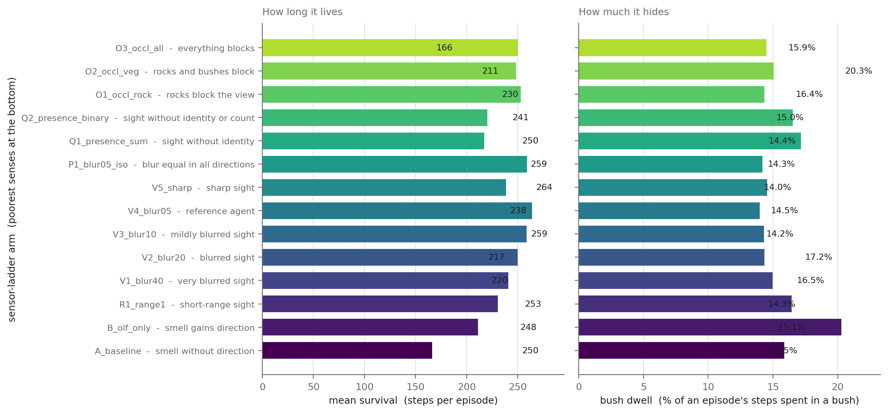

**Figure 1.** Left: mean survival. Right: bush dwell. Both pooled over each arm's 300,000 episodes.

**Motivation.** The most basic question about a sense is whether having it helps. If it does, the
agents that have it should live longer.

**Method.** Survival is the mean episode length. Bush dwell is (bush steps) &divide; (steps), pooled
over every episode of the arm. The `t=0` row is the world as handed to the agent, not a step it
took, so it is excluded from both the numerator and the denominator.

**Reading.** Survival runs from 166 steps to 264 &mdash; the best arm lives about 1.6 times as long
as the worst, produced entirely by sensory settings. Bush dwell moves far less, 14.0% to 20.3%. The
two are *anti*-correlated: the agents that hide most are the ones that die soonest. That is the
first hint that hiding is not the thing the senses buy.

**Table 2.** outcome per arm


| arm | mean survival (steps) | bush dwell (%) | killed (%) | starved (%) | reached the limit (%) | food per 100 steps |
|---|---|---|---|---|---|---|
| `A_baseline` | 166.1 | 15.9 | 46.0 | 30.4 | 23.6 | 21.34 |
| `B_olf_only` | 211.2 | 20.3 | 47.5 | 24.3 | 28.2 | 20.84 |
| `R1_range1` | 230.5 | 16.4 | 39.9 | 27.8 | 32.3 | 25.83 |
| `V1_blur40` | 240.7 | 15.0 | 29.6 | 36.1 | 34.4 | 24.91 |
| `V2_blur20` | 250.1 | 14.4 | 29.8 | 34.2 | 36.0 | 27.31 |
| `V3_blur10` | 258.6 | 14.3 | 27.5 | 35.9 | 36.6 | 28.54 |
| `V4_blur05` | 264.0 | 14.0 | 25.6 | 36.9 | 37.5 | 29.53 |
| `V5_sharp` | 238.4 | 14.5 | 33.1 | 32.8 | 34.2 | 27.57 |
| `P1_blur05_iso` | 259.0 | 14.2 | 27.1 | 36.6 | 36.3 | 29.86 |
| `Q1_presence_sum` | 217.2 | 17.2 | 45.3 | 26.5 | 28.2 | 28.66 |
| `Q2_presence_binary` | 220.2 | 16.5 | 40.9 | 30.1 | 29.0 | 26.08 |
| `O1_occl_rock` | 252.9 | 14.3 | 27.4 | 36.9 | 35.7 | 28.44 |
| `O2_occl_veg` | 248.2 | 15.1 | 30.6 | 34.4 | 35.0 | 28.80 |
| `O3_occl_all` | 250.4 | 14.5 | 29.7 | 34.5 | 35.8 | 27.92 |

### Isolating one knob at a time

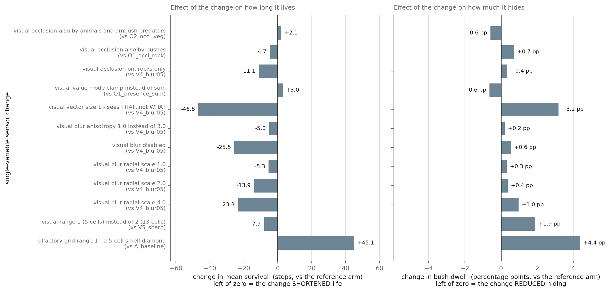

**Figure 2.** Each row is one arm minus its reference arm &mdash; a change of exactly one setting.

**Motivation.** Figure 1's ranking confounds everything: the sharp-sighted agent differs from the
near-blind one in several settings at once. The ladder was built so that most arms sit one setting
away from a named reference, and those pairs are what Figure 2 shows.

**Method.** The difference of the two arms' pooled values from Figure 1. Because both members of a
pair were handed the same 300,000 worlds, they met identical predators, identical food and identical
starting wounds. The claim that each pair differs in exactly one setting is **asserted in code**
(`check_single_variable_pairs`), not merely intended &mdash; see the correction note below for why
that guard exists.

**Reading.** Three results stand out.

- **Direction beats acuity.** Giving smell a direction (`A_baseline` &rarr; `B_olf_only`) is worth
  **+45.1 steps** &mdash; the biggest single win in the table &mdash; even though the agent still
  has no useful sight at all.
- **Identity beats sharpness.** Collapsing the eight appearance channels to one (`V4_blur05` &rarr;
  `Q1_presence_sum`) costs **&minus;46.8 steps**. Blurring the picture eightfold (`V4_blur05` &rarr;
  `V1_blur40`) costs **&minus;23.3**. Seeing *that* something is there but not *what* is worse than
  seeing *what* very blurrily.
- **Sharp is worse than slightly blurred.** Disabling blur costs **&minus;25.5 steps**. Section 3
  explains why.

Halving the visual range, by contrast, costs only **&minus;7.9 steps** &mdash; much less than any of
the above.

> **Correction.** An earlier version of this document reported the visual-range change as
> &minus;33.5 steps, a figure four times too large. `R1_range1` was being compared against
> `V4_blur05`, which differs from it in **two** settings: the visual range *and* whether blur is on.
> The correct single-variable comparison is against `V5_sharp`, which also has blur off. The number
> above is the corrected one. The analysis code now asserts that every pair differs in exactly one
> setting and refuses to draw the figure otherwise; an audit under that rule found two further
> pairings that were also being over-counted.

**Table 3.** single-variable sensor changes


| change | arm | compared with | survival (steps) | bush dwell (pp) |
|---|---|---|---|---|
| olfactory grid range 1 - a 5-cell smell diamond | `B_olf_only` | `A_baseline` | +45.1 | +4.4 |
| visual range 1 (5 cells) instead of 2 (13 cells) | `R1_range1` | `V5_sharp` | -7.9 | +1.9 |
| visual blur radial scale 4.0 | `V1_blur40` | `V4_blur05` | -23.3 | +1.0 |
| visual blur radial scale 2.0 | `V2_blur20` | `V4_blur05` | -13.9 | +0.4 |
| visual blur radial scale 1.0 | `V3_blur10` | `V4_blur05` | -5.3 | +0.3 |
| visual blur disabled | `V5_sharp` | `V4_blur05` | -25.5 | +0.6 |
| visual blur anisotropy 1.0 instead of 3.0 | `P1_blur05_iso` | `V4_blur05` | -5.0 | +0.2 |
| visual vector size 1 - sees THAT, not WHAT | `Q1_presence_sum` | `V4_blur05` | -46.8 | +3.2 |
| visual value mode clamp instead of sum | `Q2_presence_binary` | `Q1_presence_sum` | +3.0 | -0.6 |
| visual occlusion on, rocks only | `O1_occl_rock` | `V4_blur05` | -11.1 | +0.4 |
| visual occlusion also by bushes | `O2_occl_veg` | `O1_occl_rock` | -4.7 | +0.7 |
| visual occlusion also by animals and ambush predators | `O3_occl_all` | `O2_occl_veg` | +2.1 | -0.6 |

---

## 2. What actually kills each agent

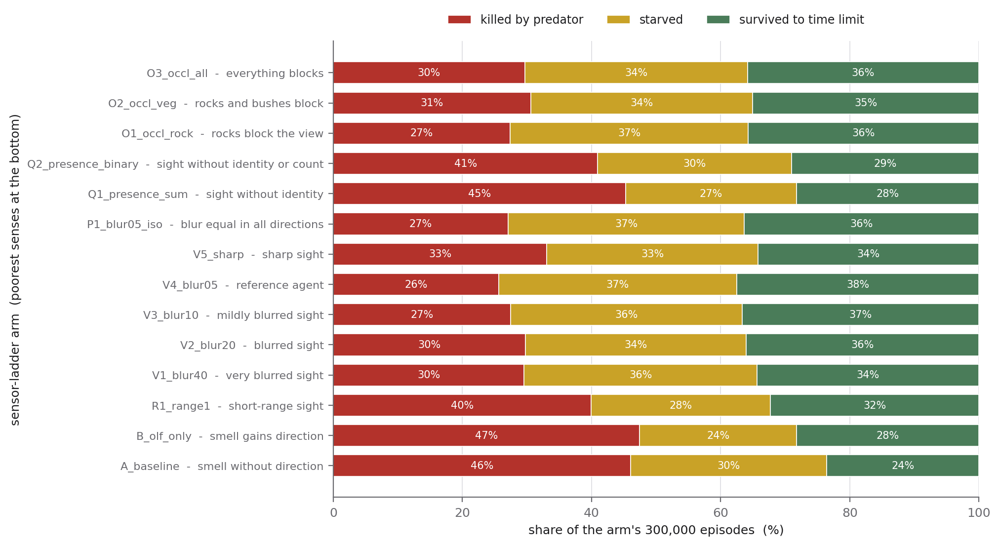

**Figure 3.** Every arm's 300,000 episodes split into the three ways an episode can end.

**Motivation.** Survival alone hides the trade-off. An agent that hides constantly does not get
eaten &mdash; it starves. An agent that forages constantly does not starve &mdash; it gets eaten.
Which failure a sensory setting buys down, and which it buys up, is more informative than the net.

**Method.** The `termination_reason` column of the episode table, counted per arm. Three outcomes
occur here: reached the step limit alive, starved, killed by a predator. They sum to 100%.

**Reading.** Predation is where the senses pay. It runs from 46&ndash;47% in the two arms with no
useful sight down to 26% in the reference agent. Starvation moves the *other* way, from 24% up to
37% &mdash; the better-sighted agents trade some starvation risk for a much larger reduction in
predation, and come out ahead. `Q1_presence_sum` and `Q2_presence_binary` are the tell: they have a
full thirteen-cell visual field and are still eaten at 45% and 41%, essentially the rate of an agent
that cannot see at all. A visual field that cannot say *what* it contains does not protect against
being eaten.

---

## 3. Why sharp sight is worse than blurred sight

This is the one result in the report that looks like an error and is not, so the mechanism is worth
stating explicitly. In `sense_visual` (`src/environment/sensor.py`), the weight matrix that maps
objects onto the agent's sampled cells is built one of two ways:

- **Blur disabled** &mdash; an *exact cell match*. An object registers only if it stands exactly on
  one of the thirteen cells of the visual field. Those thirteen cells form a Manhattan diamond of
  radius 2, so a predator two cells away *diagonally* &mdash; Manhattan distance 4 &mdash; is
  completely invisible.
- **Blur enabled** &mdash; a *point-spread function*: instead of registering only on its own cell,
  each object contributes a Gaussian smear of signal to nearby cells, wider the further away it is,
  normalised so that only the fraction landing inside the diamond is reported. Distant objects fade
  rather than vanish.

So the blur setting is not an image-quality dial running from "good" to "degraded". It is a
**reach-versus-precision** dial. Turning it off buys perfect localisation of the few objects that
happen to sit on a sampled cell, at the cost of not seeing anything else at all.

The behaviour matches. **Figure 5** shows `V5_sharp` responding *less* strongly to a predator at one
or two cells (25.4 percentage points, against 34.1 for the reference agent), and **Figure 4** shows
it maintaining a *higher* level of hiding out at six and seven cells (12.2% against 8.0%). That is
the signature of an agent that frequently cannot see the predator right next to it and compensates
with a raised baseline everywhere. It also explains why `V5_sharp` is the arm that comes closest to
the false-alarm group on every odour measure in Table 5: with unreliable sight, it falls back on
smell.

And the ladder is non-monotonic in exactly the way a reach-versus-precision trade-off predicts:
survival runs 240.7 &rarr; 250.1 &rarr; 258.6 &rarr; **264.0** &rarr; 238.4 as the blur scale goes
4.0 &rarr; 2.0 &rarr; 1.0 &rarr; 0.5 &rarr; off. There is an optimum in the middle, at 0.5.

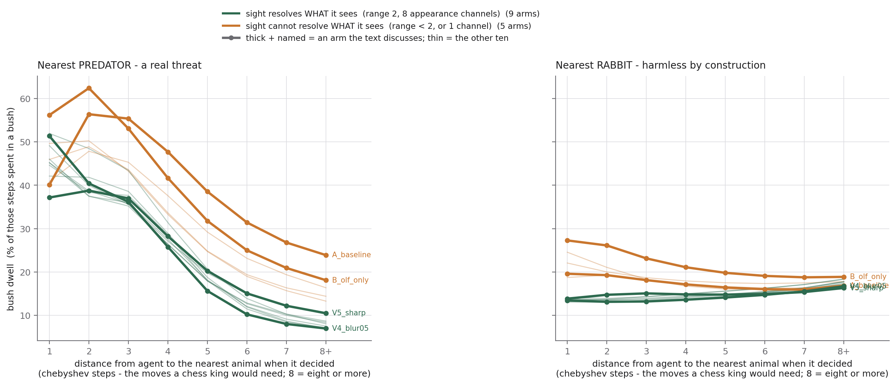

**Figure 4.** Bush dwell against how far the nearest predator (left) or rabbit (right) was when the
agent chose its move. Colour is the grouping of Section 4; the four arms the text discusses are
drawn thick and named.

**Motivation.** Hiding is only defensive if the threat triggers it. A flat curve would mean the
agent hides on a schedule; a curve that rises as the animal approaches means it hides in response to
something it perceived.

**Method.** Distance to the nearest *active* predator, in chebyshev steps. The action that produced
step `t` was chosen while the agent was looking at step `t&minus;1`, so distance is read off the
previous row and bush occupancy off the current one. Distances of 8 or more are pooled into the
last bin. Episodes containing no predator are excluded from the predator panel &mdash; a third of
all episodes have none, and including them would silently make "there is no predator" the comparison
group.

**Reading.** Every arm hides far more with a predator close than with one far away. The rise is not
perfectly monotone at the very closest bin: in `B_olf_only`, `A_baseline` and four others, bush dwell
is *higher* at distance 2 than at distance 1. That dip is expected rather than puzzling &mdash; at
distance 1 the agent is often already caught in the open with a predator adjacent, which is a
different situation from spotting one approaching. The rabbit curves separate into two families,
which is the subject of the next section.

---

## 4. The rabbit false alarm, and what abolishes it

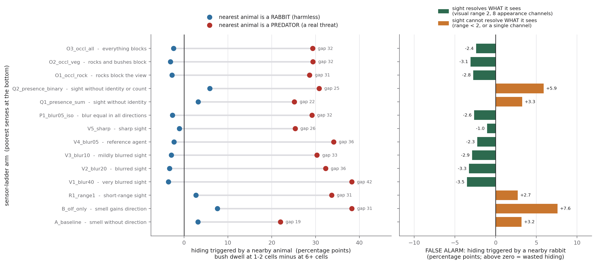

**Figure 5.** Left: each arm's response to a nearby predator and to a nearby rabbit, joined by a line
whose length is that arm's discrimination. Right: the rabbit response alone, coloured by whether the
arm's sight can resolve identity.

**Motivation.** A rabbit cannot hurt the agent. Hiding when one comes near costs foraging time and
returns nothing. So the rabbit response is a clean measure of wasted defence &mdash; and asking which
sensory settings remove it tells us what discrimination actually requires.

**Method.** For each arm and each animal class, the *proximity effect* is

$$
P(\text{in bush} \mid \text{nearest animal 1-2 cells away}) \;-\; P(\text{in bush} \mid \text{nearest animal 6 or more cells away})
$$

in percentage points, over all steps. Counts are pooled before the ratio is taken, so a distance bin
holding more steps carries more weight; averaging the per-bin rates instead would let a sparse bin
dominate.

**Reading.** The fourteen arms split cleanly in two, and the split is **not** sight against no sight:

- **Nine arms whose sight can resolve identity** &mdash; visual range 2 with eight appearance
  channels &mdash; have a *negative* rabbit response, between &minus;1.0 and &minus;3.5 percentage
  points. They hide slightly *less* when a rabbit is near.
- **Five arms whose sight cannot** &mdash; the two with no useful visual range, the one with range 1,
  and the two with a single appearance channel &mdash; all have a *positive* rabbit response, between
  +2.7 and +7.6 percentage points.

`Q1_presence_sum` and `Q2_presence_binary` are the interesting cases. They have the full
thirteen-cell field at the reference blur; the only thing they lack is the ability to say what is in
it. They fall straight back into the false alarm.

**Table 4.** the rabbit false alarm, four independent measures


| arm | sight resolves identity | proximity to a rabbit (pp) | rabbit odour slope (pp) | rabbit odour, adjusted (pp) | one SD more rabbits (pp) |
|---|---|---|---|---|---|
| `A_baseline` | no | +3.2 | +8.27 | +3.97 | +3.61 |
| `B_olf_only` | no | +7.6 | +9.71 | +2.21 | +3.72 |
| `R1_range1` | no | +2.7 | +8.83 | +1.62 | +2.53 |
| `V1_blur40` | yes | -3.5 | +1.27 | +0.55 | +0.75 |
| `V2_blur20` | yes | -3.3 | +0.88 | +0.39 | +0.29 |
| `V3_blur10` | yes | -2.9 | +0.09 | +0.00 | -0.03 |
| `V4_blur05` | yes | -2.3 | +0.08 | -0.01 | +0.07 |
| `V5_sharp` | yes | -1.0 | +6.59 | +0.88 | +1.12 |
| `P1_blur05_iso` | yes | -2.6 | +0.32 | +0.14 | +0.00 |
| `Q1_presence_sum` | no | +3.3 | +9.20 | +1.89 | +3.07 |
| `Q2_presence_binary` | no | +5.9 | +10.17 | +2.04 | +3.13 |
| `O1_occl_rock` | yes | -2.8 | +3.42 | +0.68 | +0.63 |
| `O2_occl_veg` | yes | -3.1 | +3.47 | +0.72 | +0.50 |
| `O3_occl_all` | yes | -2.4 | +3.30 | +0.73 | +0.52 |

Four measures of the same false alarm, on two different cues, separate the two groups with **no
overlap** &mdash; the largest value among the nine never reaches the smallest among the five:

**Table 5.** does the split actually separate the two groups, or do they overlap?


| measure | largest value among the nine that resolve identity | smallest among the five that do not | separation | closest of the nine |
|---|---|---|---|---|
| how much it hides when a rabbit is near | -1.05 | +2.72 | +3.77 | `V5_sharp` |
| response to a strong rabbit smell | +6.59 | +8.27 | +1.69 | `V5_sharp` |
| rabbit smell, adjusted for the world | +0.88 | +1.62 | +0.74 | `V5_sharp` |
| one SD more rabbits in the world | +1.12 | +2.53 | +1.41 | `V5_sharp` |

**But read that with three qualifications, because it is easy to overstate.**

1. **The grouping rule is post-hoc.** "Sight resolves identity" is defined as visual range &ge; 2
   *and* more than one appearance channel. That rule was written after seeing which arms separated,
   not before. It is a description of the split, not a prediction of it, and nothing here was
   pre-registered.
2. **The four measures are not four independent experiments.** They are four views of the same
   behaviour stream from the same fourteen agents. Two are behavioural contrasts and two are
   regression coefficients, on two different cues (proximity and smell), which is real
   corroboration &mdash; but it is corroboration, not replication, and `V5_sharp` is the closest of
   the nine to the boundary on *all four*, with the smallest margin only 0.74 points.
3. **Identity is confounded with capacity.** Collapsing eight appearance channels to one does not
   only remove identity information; it shrinks the visual part of the observation from 104 numbers
   to 13. `Q1` and `Q2` therefore have a smaller network input as well as a less informative one.
   The ladder contains no arm that separates those two things, so "identity" is the most natural
   reading of this split, not the only possible one. `R1_range1` cuts the other way and is worth
   noting: it carries all eight identity channels and still shows the false alarm, which says range
   matters too.

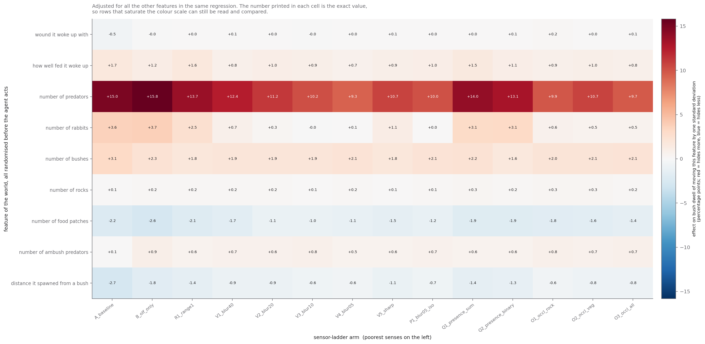

**Figure 6.** Every feature of the world that is randomised before the agent acts, against every arm.
Red means the agent hides more; blue, less.

**Motivation.** Figures 1&ndash;5 each isolate one thing. This one steps back and asks which world
features move bush dwell at all, in every arm at once.

**Method.** A quasi-binomial regression per arm on the episode-level bush-dwell rate, with all nine
exogenous features entered together so each is adjusted for the others. Standard errors are scaled
by the Pearson overdispersion. The number plotted is the effect of moving the feature by one
standard deviation of its own spread, in percentage points of bush dwell &mdash; **not** the effect
of one more predator or one more rabbit. (One standard deviation of the rabbit count is 0.82
rabbits, so a per-rabbit effect would be about 22% larger than the number shown.) Only features
drawn at reset are included; consequences of the agent's own behaviour belong to a different
question and would swamp this one.

**Reading.** The `number of rabbits` row reproduces the Figure 5 split: +3.6, +3.7 and +2.5 for the
three arms without identity-resolving sight, +3.1 and +3.1 for the two presence-only arms, against
&minus;0.0 to +1.1 for the nine that can resolve identity. `number of predators` is the largest
driver in every single arm. It is *lower* in the identity-resolving arms (+9.3 to +12.4) than in
those without (+13.1 to +15.8), but not monotonically down the ladder &mdash; `B_olf_only` at +15.8
is the highest of all, above `A_baseline`. The row tracks identity-resolution, not "senses improving
in general": an agent that can tell what it is looking at needs less blanket caution because it can
afford to be selective.

> **Two rows in this figure look like they contradict the rest of the report, and here is why they
> do not.** `wound it woke up with` reads &minus;0.5 to +0.2 &mdash; essentially nothing &mdash;
> while Section 5 reports the wound moving bush dwell by up to +13 points. `how well fed it woke up`
> reads +0.7 to +1.7, against Section 6's much larger numbers. Both regressions here are fitted on
> the **whole-episode** bush-dwell rate, and both of those internal states are *transient*: the wound
> is 90% healed by step 28. Averaging over an episode of 250 steps dilutes a 30-step effect almost to
> nothing. Section 5 shows the full time course, and Section 7 shows exactly how much the choice of
> window changes the answer.

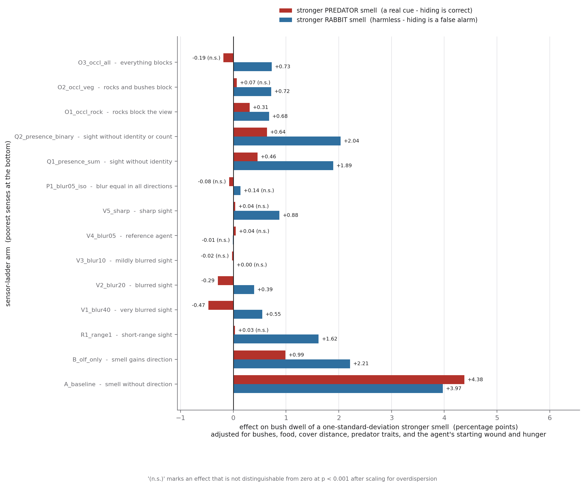

**Figure 7.** The effect of a predator's and a rabbit's odour strength on bush dwell, with the rest
of the world held fixed.

**Motivation.** Figure 5 uses proximity. This uses smell, which is the genuinely ambiguous cue, and
puts it inside a regression so the result cannot be explained by strong-smelling worlds differing in
some other way.

**Method.** Quasi-binomial regression on the episode-level bush-dwell rate, restricted to the
&asymp;33,500 episodes per arm with exactly one predator and one rabbit, so that "the predator's
smell" and "the rabbit's smell" are each a single well-defined number rather than an average over
several animals. Adjusted for the number of bushes, rocks, food patches and ambush predators, the
distance the agent spawned from cover, the predator's detection range, attack delay, attack range
and stamina, the predator's own smell, and the agent's starting wound and hunger.

**Reading.** The same split, on a different cue and with the world held fixed. `A_baseline` hides
+3.97 points harder for a strong-smelling rabbit; the reference agent is at &minus;0.01 and not
distinguishable from zero.


---

## 5. What a wound does

### It causes a burst of hiding, on a timetable

**Motivation.** Everywhere else, a wounded agent is a suspicious comparison: it got hurt by doing
something, so its later behaviour is contaminated by whatever it was doing. This environment removes
that problem. The agent begins every episode with a wound drawn uniformly from 0 to 100 that it did
nothing to earn, so behaviour that tracks *that* number is caused by it.

This matters for the sensor ladder because the agent has **no sensor that reads its own injury**.
The only route from an injury level to behaviour is the interoceptive nociceptor. So this asks
whether that internal channel changes behaviour at all, and whether the answer depends on what the
agent can sense of the outside world.

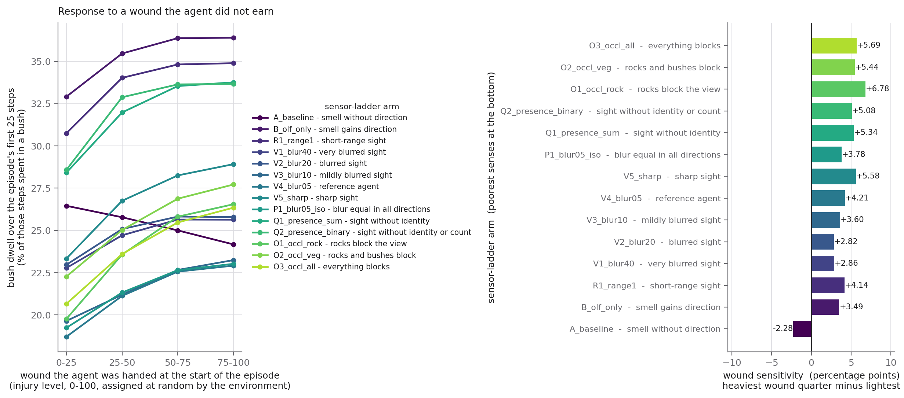

**Figure 8.** Bush dwell over each episode's first 25 steps, against the injury level the environment
handed the agent at `t=0`.

**Method.** Episodes are split into four equal quarters of the starting wound. Bush dwell is pooled
over the **first 25 steps only**. Figure 9 explains why 25, and Figure 14 shows what happens if you
choose otherwise.

**Reading.** Thirteen of the fourteen arms hide more when handed a bigger wound, by +2.8 to +6.8
percentage points across the full range. The exception is `A_baseline` at &minus;2.3, the one agent
with neither directional smell nor useful sight.

### How long it lasts, and what it costs

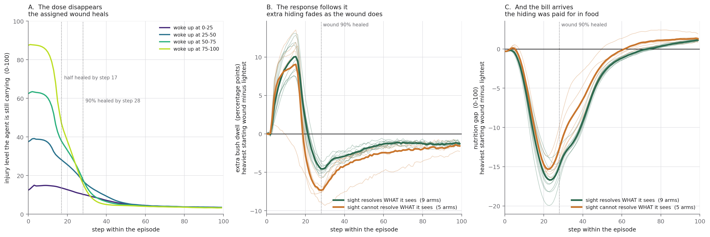

**Figure 9.** Left: the assigned wound healing. Middle: the extra hiding it causes. Right: the food
the agent did not eat while hiding. Faint lines are individual arms; bold lines are the two groups.

**Motivation.** Figure 8 measures over 25 steps. Why 25? Widen the window and the effect shrinks: in
the reference agent it runs +4.2 percentage points at 25 steps, +0.8 at 50, and slightly negative
over the whole episode. Taken at face value that looks like a result reported at a flattering
window, which is a fair thing for a reader to suspect. This figure is the answer.

**Method.** A separate step-by-step sweep records, for each arm and each quarter of the assigned
starting wound, the mean injury still carried, bush dwell, and nutrition at every step up to 120.
The middle and right panels plot the heaviest quarter minus the lightest.

**Reading.** Three stages, in order.

1. **The dose disappears.** The 75-point injury gap the environment assigns at reset is **half gone
   by step 17 and 90% gone by step 28.** The cause is essentially over before step 30.
2. **The response follows it.** Extra hiding climbs to a peak of **+7.5 to +13.5 percentage points
   around step 14&ndash;16** in thirteen of the fourteen arms &mdash; two to three times the size of
   the 25-step average in Figure 8 &mdash; and then falls away on roughly the wound's own schedule.
   An effect that tracks its cause through time is evidence *for* the causal reading, not against
   it, and it means 25 steps was not a lucky pick: it is approximately the lifetime of the dose.
3. **Then the bill arrives.** The hiding is paid for in food. An agent handed a heavy wound eats 4.4
   food items in its first 25 steps against 8.0 for one handed almost none, and runs 14&ndash;20
   nutrition points behind by around step 25. Once the wound has healed it hides **less** than the
   unhurt agent &mdash; &minus;0.7 to &minus;4.8 points at step 60 &mdash; while it makes up the
   shortfall, and the two converge by about step 100.

So the honest statement of finding 5 is not "a wound makes the agent hide more" but **"a wound causes
a transient burst of hiding that lasts about as long as the wound does, followed by a compensatory
decrease while the agent makes up the food it missed."** The whole-episode number is slightly
negative, and Figure 6's near-zero wound row is that same dilution.

**Table 10.** the wound's effect through time (Figure 9)


| arm | peak extra hiding (pp) | at step | extra hiding by step 60 (pp) | worst nutrition gap |
|---|---|---|---|---|
| `A_baseline` | +1.18 | 4 | -4.83 | -13.7 |
| `B_olf_only` | +10.79 | 14 | -2.48 | -15.7 |
| `R1_range1` | +11.45 | 16 | -1.85 | -16.4 |
| `V1_blur40` | +7.52 | 14 | -1.05 | -13.9 |
| `V2_blur20` | +7.61 | 14 | -1.08 | -17.2 |
| `V3_blur10` | +8.47 | 15 | -1.63 | -15.4 |
| `V4_blur05` | +9.65 | 15 | -1.36 | -18.2 |
| `V5_sharp` | +11.90 | 15 | -0.93 | -17.2 |
| `P1_blur05_iso` | +8.29 | 15 | -0.72 | -19.9 |
| `Q1_presence_sum` | +13.54 | 15 | -1.59 | -16.0 |
| `Q2_presence_binary` | +11.92 | 15 | -1.47 | -15.6 |
| `O1_occl_rock` | +13.09 | 14 | -1.51 | -14.7 |
| `O2_occl_veg` | +11.61 | 14 | -1.61 | -16.4 |
| `O3_occl_all` | +12.86 | 15 | -1.86 | -18.2 |

### But it is not hypervigilance &mdash; on this channel

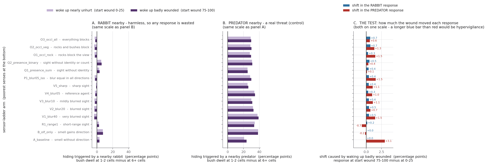

**Figure 10.** Panels A and B: response to a nearby rabbit and to a nearby predator, at the lightest
and heaviest starting wound, **on one shared scale**. Panel C: the two shifts.

**Motivation.** Figure 8 shows a wounded agent hides more. That, on its own, is ordinary caution. The
claim that would earn the word *hypervigilance* is stronger and more specific: that being wounded
changes **what the agent treats as evidence of danger**, so an ambiguous, harmless cue starts driving
the same defence a real threat does. Testing that means comparing the shift in the harmless cue
against the shift in the real one. If a wound raised both by the same amount, the agent has simply
become more defensive across the board &mdash; a gain change, not a criterion change.

**Method.** Within each starting-wound quarter separately, the same proximity effect as Figure 5.
The shift is the heaviest quarter minus the lightest.

**Reading.** **No criterion shift on this channel.** The rabbit shift is between +0.0 and +0.7
percentage points in every arm. The predator shift is larger in most of them, up to +3.1. A wounded
agent becomes more responsive to the animal that can actually kill it &mdash; the opposite of what
hypervigilance predicts. Panels A and B share a scale so the rabbit response can be seen for what it
is: small.

### It *is* hypervigilance &mdash; on the ambiguous channel

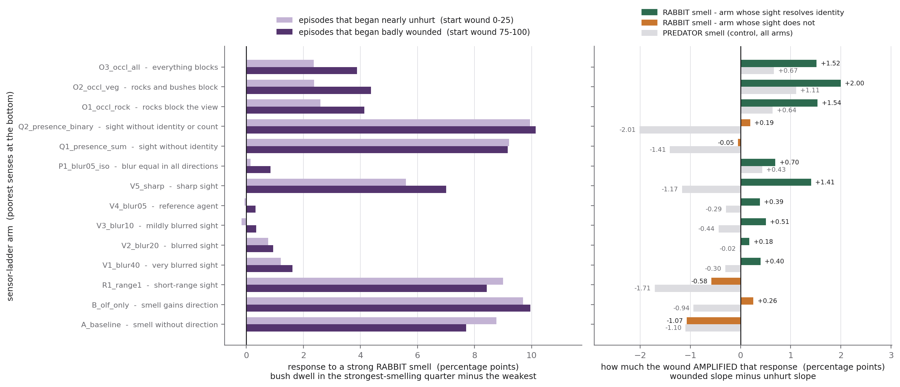

**Figure 11.** Left: how strongly each arm responds to a strong rabbit smell, having begun the
episode nearly unhurt or badly wounded. Right: the difference, with the predator smell as a control.

**Motivation.** Proximity is not the ambiguous cue. For an agent that can see, a nearby animal is a
*resolved* cue &mdash; it can look and tell what the animal is. Smell is the ambiguous one, and an
animal's odour is redrawn at random every episode. If a wound shifts the agent's criterion, this is
the channel where it should show.

**Method.** Episodes are split into quartiles of the odour intensity drawn for their rabbits. The
*slope* is bush dwell in the strongest-smelling quarter minus the weakest, over the first 25 steps,
computed once over episodes that began nearly unhurt and once over those that began badly wounded.
The bar is the difference. Episodes containing no rabbit are excluded.

**Reading.** In **all fourteen arms** the wound amplifies the rabbit-smell response more than the
predator-smell response; the gap runs +0.03 to +2.58 points. In absolute terms the rabbit-smell
response *grows* by +0.18 to +2.00 points in the nine arms that resolve identity, while in the five
that do not it is between &minus;1.07 and +0.26 &mdash; flat, or falling. Those five were already
responding to rabbit odour at close to full strength whether wounded or not, so there was no headroom.

**Two caveats that keep this from being as clean as it looks.**

- **The control channel is not neutral.** Figure 12 shows that the loudest-smelling predators are
  also the *least* distinguishable ones, because odour intensity is the sum of two channels while
  predator-ness is their difference. That mechanically flattens the predator slope &mdash; which is
  the quantity the rabbit slope is being compared against. Some of the rabbit-minus-predator gap is
  therefore an artefact of how intensity is defined, not a fact about the agent.
- **It is window-dependent, like everything else about the wound.** Measured over 50 steps instead of
  25, the gap goes negative in several arms. Given Figure 9, that is expected &mdash; the wound is
  gone by then &mdash; but it means the finding is a statement about the wounded phase, not about the
  episode.

Taken with those caveats, the reading this supports is that a wound does not make the agent
generically more afraid. It makes the agent **lean harder on an ambiguous channel** &mdash; which can
only show up in an agent that has a reliable channel to lean away from. The largest raw amplification
is in the three occlusion arms (+1.52 to +2.00), where sight is present but scenery intermittently
blocks it. On the rabbit-minus-predator gap, though, the leaders are `V5_sharp` (+2.58) and
`Q2_presence_binary` (+2.20), so "largest in the occlusion arms" holds for one of the two measures
and not the other.

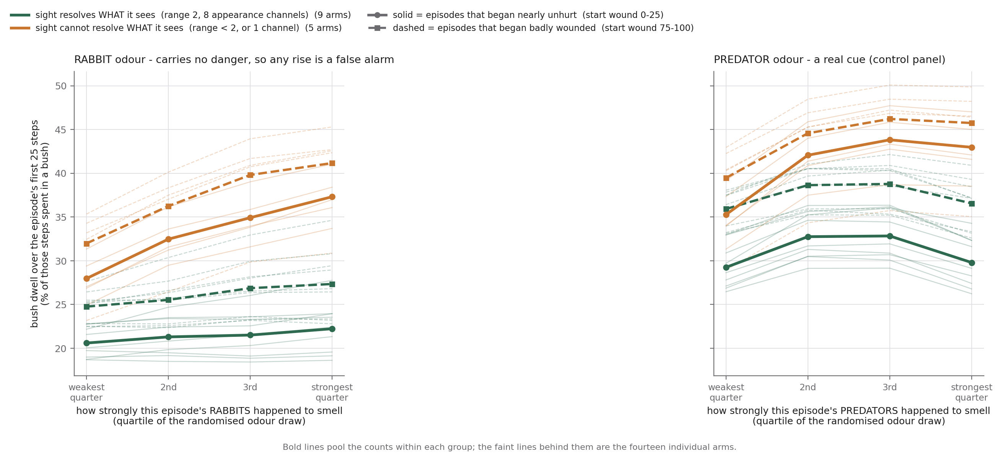

**Figure 12.** The underlying curves: bush dwell against how strongly this episode's rabbits (left)
and predators (right) happened to smell. Bold lines pool the counts within each group; faint lines
are the fourteen individual arms.

**Reading.** The rabbit panel rises for both groups and much more steeply for the five that cannot
resolve identity. The predator panel dips at the loudest quartile, and that dip is real rather than
an artefact: intensity is the **sum** of the two odour channels while what marks an animal out as a
predator is their **difference**, so an episode whose predators smell very loudly has both channels
near their ceiling and the difference squeezed toward zero. Measured on the reference run, mean
predator-ness is 0.12 in the loudest quartile against 0.18&ndash;0.22 in the other three. The loudest
predators are the least distinguishable ones, and the agent responds to them less &mdash; which also
means a loud rabbit is genuinely harder to rule out, so part of the "false" alarm is rational.

**Table 6.** what a randomised starting wound does


| arm | bush dwell, first 25 steps (pp per full wound range) | shift in rabbit proximity (pp) | shift in predator proximity (pp) | wound amplifies rabbit odour (pp) | wound amplifies predator odour (pp) |
|---|---|---|---|---|---|
| `A_baseline` | -2.28 | +0.00 | +3.05 | -1.07 | -1.10 |
| `B_olf_only` | +3.49 | +0.04 | -0.20 | +0.26 | -0.94 |
| `R1_range1` | +4.14 | +0.18 | -0.72 | -0.58 | -1.71 |
| `V1_blur40` | +2.86 | +0.45 | +1.46 | +0.40 | -0.30 |
| `V2_blur20` | +2.82 | +0.46 | +0.69 | +0.18 | -0.02 |
| `V3_blur10` | +3.60 | +0.43 | +1.09 | +0.51 | -0.44 |
| `V4_blur05` | +4.21 | +0.33 | +0.98 | +0.39 | -0.29 |
| `V5_sharp` | +5.58 | +0.43 | +1.06 | +1.41 | -1.17 |
| `P1_blur05_iso` | +3.78 | +0.43 | +1.55 | +0.70 | +0.43 |
| `Q1_presence_sum` | +5.34 | +0.40 | +0.12 | -0.05 | -1.41 |
| `Q2_presence_binary` | +5.08 | +0.53 | +0.36 | +0.19 | -2.01 |
| `O1_occl_rock` | +6.78 | +0.31 | +1.49 | +1.54 | +0.64 |
| `O2_occl_veg` | +5.44 | +0.67 | +1.33 | +2.00 | +1.11 |
| `O3_occl_all` | +5.69 | +0.67 | +0.60 | +1.52 | +0.67 |

---

## 6. The wound competes with hunger, and loses

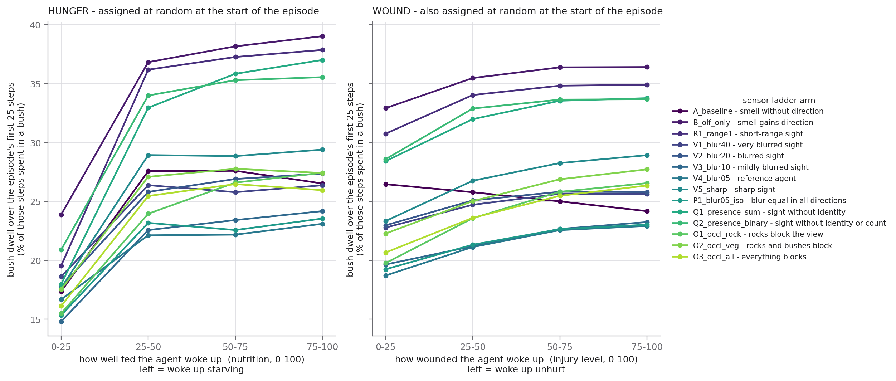

**Figure 13.** Bush dwell over the first 25 steps against the two internal states the environment
assigns at random, on a shared y-scale.

**Motivation.** The agent carries two internal states that pull in opposite directions. A wound
argues for staying in cover; an empty stomach argues for leaving it, because a bush contains no food.
Both are randomised at reset, so both can be tested causally and on the same footing.

**Method.** Episodes are split into four equal quarters of the assigned value. Both panels use the
first 25 steps, for the reason Section 5 gives. **Note the direction of the hunger axis**: it plots
*nutrition*, so the left end is an agent that woke up starving and the right end one that woke up
well fed. The slope is positive, meaning a **well-fed** agent hides more &mdash; equivalently, a
hungry one hides less, because it has to go and eat.

**Reading.** Nutrition moves bush dwell by +6.4 to +19.0 percentage points across its range; the
wound moves it by &minus;2.3 to +6.8. The ratio runs from 1.5&times; to 4.4&times; depending on the
arm. The metabolic drive is the larger of the two in every arm, and any account of this agent's
hiding that leaves it out is describing a small part of the behaviour.

**Table 9.** the two internal drives, first 25 steps


| arm | hunger: bush dwell span (pp) | wound: bush dwell span (pp) | ratio |
|---|---|---|---|
| `A_baseline` | +9.16 | -2.28 | wound effect is negative |
| `B_olf_only` | +15.14 | +3.49 | 4.3x |
| `R1_range1` | +18.32 | +4.14 | 4.4x |
| `V1_blur40` | +7.75 | +2.86 | 2.7x |
| `V2_blur20` | +9.59 | +2.82 | 3.4x |
| `V3_blur10` | +9.37 | +3.60 | 2.6x |
| `V4_blur05` | +6.42 | +4.21 | 1.5x |
| `V5_sharp` | +11.74 | +5.58 | 2.1x |
| `P1_blur05_iso` | +8.20 | +3.78 | 2.2x |
| `Q1_presence_sum` | +19.04 | +5.34 | 3.6x |
| `Q2_presence_binary` | +14.65 | +5.08 | 2.9x |
| `O1_occl_rock` | +11.94 | +6.78 | 1.8x |
| `O2_occl_veg` | +9.87 | +5.44 | 1.8x |
| `O3_occl_all` | +9.83 | +5.69 | 1.7x |

---

## 7. Two ways to get the injury result wrong

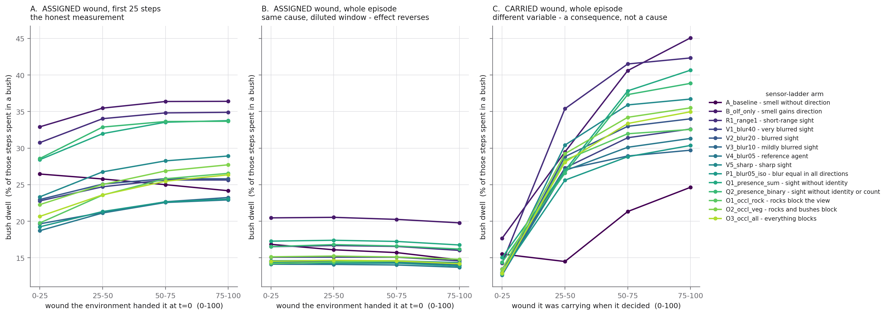

**Figure 14.** The same question answered three ways, on one shared y-scale. A: the assigned wound
over the first 25 steps. B: the assigned wound over the whole episode. C: the carried wound over the
whole episode.

**Motivation.** "Does injury make the agent hide?" has three plausible-looking answers in this data
and two of them are wrong. They are shown together because the two mistakes have *different* causes
that are easy to conflate, and because a reader who reproduced either one deserves to know why it
differs.

**Method.** All three use identical bins and the identical outcome, bush dwell with the `t=0` row
excluded. They differ only in which injury number a step is filed under, and over which steps the
average is taken. All three panels share one y-axis, so the sizes are directly comparable.

**Reading.**

- **Panel A** is the honest measurement: the randomised wound, measured while the assigned dose is
  still largely present. Positive in thirteen of fourteen arms.
- **Panel B** changes *one* thing &mdash; the same randomised wound, averaged over the whole episode
  &mdash; and the answer collapses to between &minus;0.0 and &minus;0.7. Section 5 explains why: the
  wound heals by step 28, so an average over 250 steps is mostly measuring an agent with no wound,
  plus the compensatory foraging that follows. The panel looks nearly flat on the shared scale, which
  is the correct impression.
- **Panel C** changes the *variable* instead &mdash; the wound the agent was carrying mid-episode,
  which is what falls out of any trajectory log for free &mdash; and reports **+9 to +28 points**.
  This is the most misleading of the three, because a mid-episode wound is a *consequence* of
  behaviour: the agent is carrying a big wound precisely because it was out in the open near a
  predator, which is also where the bushes are not. Panel C measures where the agent *was* and
  reports it as what the agent *decided*.

The spread between panel A and panel C &mdash; +4.2 against +18.7 in the reference arm &mdash; is the
size of the mistake available to anyone who takes the convenient measurement.

**Table 7.** the three readings of the injury question (Figure 14)


| arm | A: assigned wound, first 25 steps (pp) | B: assigned wound, whole episode (pp) | C: carried wound, whole episode (pp) |
|---|---|---|---|
| `A_baseline` | -2.28 | -2.13 | +9.12 |
| `B_olf_only` | +3.49 | -0.68 | +27.41 |
| `R1_range1` | +4.14 | -0.50 | +28.04 |
| `V1_blur40` | +2.86 | -0.50 | +19.18 |
| `V2_blur20` | +2.82 | -0.54 | +21.21 |
| `V3_blur10` | +3.60 | -0.51 | +16.73 |
| `V4_blur05` | +4.21 | -0.43 | +18.68 |
| `V5_sharp` | +5.58 | -0.26 | +23.89 |
| `P1_blur05_iso` | +3.78 | -0.47 | +17.36 |
| `Q1_presence_sum` | +5.34 | -0.52 | +25.62 |
| `Q2_presence_binary` | +5.08 | -0.33 | +24.46 |
| `O1_occl_rock` | +6.78 | -0.03 | +19.74 |
| `O2_occl_veg` | +5.44 | -0.34 | +22.10 |
| `O3_occl_all` | +5.69 | -0.34 | +22.08 |
**Table 8.** how long an episode lasts, by the wound the agent woke up with


| arm | started 0-25 | started 25-50 | started 50-75 | started 75-100 | difference |
|---|---|---|---|---|---|
| `A_baseline` | 177.2 | 172.7 | 163.5 | 151.1 | -26.1 |
| `B_olf_only` | 223.1 | 218.9 | 208.8 | 193.9 | -29.2 |
| `R1_range1` | 236.1 | 233.6 | 229.5 | 222.7 | -13.5 |
| `V1_blur40` | 247.8 | 244.5 | 239.7 | 230.6 | -17.2 |
| `V2_blur20` | 256.0 | 253.0 | 249.1 | 242.2 | -13.7 |
| `V3_blur10` | 264.6 | 261.7 | 257.5 | 250.7 | -13.9 |
| `V4_blur05` | 270.2 | 267.6 | 262.9 | 255.0 | -15.2 |
| `V5_sharp` | 244.0 | 241.2 | 237.3 | 231.1 | -12.9 |
| `P1_blur05_iso` | 265.6 | 262.3 | 257.6 | 250.4 | -15.1 |
| `Q1_presence_sum` | 223.4 | 220.4 | 215.6 | 209.3 | -14.2 |
| `Q2_presence_binary` | 227.3 | 223.3 | 218.2 | 212.0 | -15.3 |
| `O1_occl_rock` | 257.9 | 256.4 | 252.0 | 245.2 | -12.7 |
| `O2_occl_veg` | 253.6 | 251.1 | 247.1 | 241.0 | -12.6 |
| `O3_occl_all` | 255.8 | 253.7 | 249.4 | 242.5 | -13.2 |

---

## 8. What hiding costs

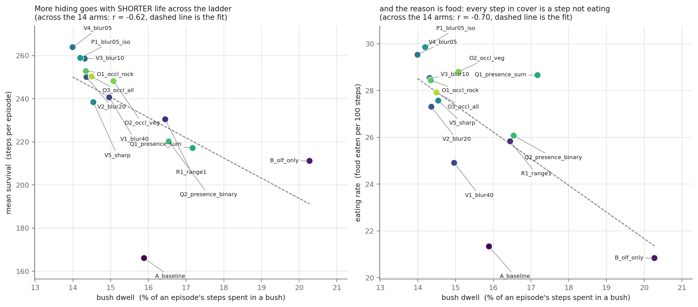

**Figure 15.** One point per arm, over that arm's 300,000 episodes.

**Motivation.** If hiding were simply good, the arms that hide most would be the ones that survive
longest. Testing that directly is the cleanest way to say what the senses are actually for.

**Method.** Bush dwell is bush steps over steps; eating rate is `ate_food` events per 100 steps;
survival is mean episode length. The dashed line is a least-squares fit across the fourteen
**arm-level** points, and `r` is the correlation across those fourteen points &mdash; not across
300,000 episodes.

**Reading.** More hiding goes with **shorter** life (r = &minus;0.62) and **less** eating
(r = &minus;0.70).

**How much weight that correlation can bear: not much on its own.** It is computed on n = 14 points
that are not independent (see the caveat in the Question section), no confidence interval is given,
and it is visibly driven by `A_baseline` and `B_olf_only`, which sit detached in the lower right of
both panels. Cover those two and the remaining twelve show a much weaker relationship. What the
figure establishes is the *direction* &mdash; and the direction is corroborated independently by
Figure 3, where predation and starvation move in opposite directions across the ladder, and by
Figure 9, where extra hiding is followed by a measured food debt in every arm. The claim rests on
those, with this figure as the summary picture rather than the evidence.

The through-line of the whole report is there: the senses do not make the agent hide more.
`A_baseline` and `B_olf_only` hide the most and die soonest. Better senses let the agent hide at the
*right* moments and forage the rest of the time. What improves is not the amount of defence but its
**selectivity**.

---

## Method summary

**Data.** Fourteen `lad_*` training runs, all finished at 10,000,005&ndash;10,000,081 environment
steps (a spread of 76, so no arm had a meaningfully longer training budget). All share seed 42 and
one environment configuration; only the `sensory` block and the per-object `blocks_sight` flags
differ. Each arm's final checkpoint was run on 300,000 evaluation worlds seeded from a common base,
producing 50&ndash;79 million step rows per arm and about 996 million in total.

**Pairing.** All fourteen arms were handed the *same* seed range, and this was verified rather than
assumed: the starting injuries, starting nutritions, animal counts and odour draws are exactly equal
across all fourteen stores. Between-arm differences are therefore free of world variance. They are
**not** free of training variance &mdash; see the limitations.

**Two conventions every script obeys.**

1. **The `t=0` row is not a step.** It is the world as handed to the agent. It appears in no numerator
   and no denominator. (Getting this wrong in an earlier analysis produced episodes in which the
   number of bush steps exceeded the number of steps &mdash; the count that was supposed to be a
   subset was larger than the set.)
2. **Predictors come from the previous row.** The action that produced row `t` was chosen while the
   agent was looking at row `t&minus;1`, so anything the agent conditioned on is read off `t&minus;1`.

**Regressions.** Quasi-binomial on the episode-level bush-dwell rate, with standard errors scaled by
the Pearson overdispersion. Effects are reported per standard deviation of the regressor.

**Three corrections made during this analysis**, recorded because each would have put a wrong number
into circulation:

1. **A third of episodes contain no predator, and a third no rabbit.** In an early version those were
   not excluded from the distance and odour analyses. Because `numpy.digitize` files every missing
   value into the *top* bin and `numpy.clip` files every infinite distance into the *farthest* bin,
   the no-predator episodes &mdash; which hide far less, since nothing is hunting them &mdash;
   silently became the comparison group. That manufactured a large spurious drop in the top odour
   quartile and inflated every proximity effect.
2. **One reference pairing was not single-variable.** `R1_range1` was compared against `V4_blur05`,
   which differs from it in two settings, inflating the reported cost of a shorter visual range from
   &minus;7.9 steps to &minus;33.5. The code now asserts single-variable pairing and refuses to draw
   the figure otherwise.
3. **The whole-episode injury result was explained by the wrong mechanism.** An earlier draft
   attributed it to episode-length weighting. The decomposition in Figure 9 shows the real cause: the
   wound heals, and the agent then repays a food debt. The earlier explanation predicted the wrong
   sign.

## Limitations

1. **One training run per arm, and the arms are not independent.** All fourteen share seed 42 and
   replayed bit-identical worlds; the nine arms grouped together in Section 4 additionally share an
   observation vector width, so under one seed they plausibly share initial weights and data
   ordering. Counts of agreeing arms must not be read as independent confirmations. **Replicating
   the ladder at two or three seeds is the single change that would move this study from exploratory
   to confirmatory.** Nothing here was pre-registered.
2. **Everything about the wound is window-dependent, because the wound is transient.** Figure 9 makes
   the time course explicit and shows that the 25-step window matches the dose's lifetime, but any
   single number quoted for the wound is a statement about a window, and the hypervigilance gap in
   Section 5 changes sign in several arms at 50 steps.
3. **Proximity is not randomised.** The distance curves in Figures 4, 5 and 10 describe a real
   regularity but do not on their own establish causation.
4. **"Identity-resolving sight" is a post-hoc, two-condition proxy** that also confounds identity
   with input capacity. See the three qualifications in Section 4.
5. **The predator-odour control is contaminated.** Intensity and discriminability are anticorrelated
   by construction, which flattens the control slope and inflates the rabbit-minus-predator gap in
   Section 5.
6. **Hypervigilance was tested on two channels, not all of them.** The agent also has collision,
   proprioceptive and visual channels that were not tested for a criterion shift.

## Reproducing this

```bash
P=/home/vncuser/miniconda3/envs/grid_world_pain/bin/python
$P scripts/analysis/ladder/build_arm_data.py       # one sweep per arm, ~60-95 s each
$P scripts/analysis/ladder/build_time_course.py    # the step-by-step sweep for Figure 9
$P scripts/analysis/ladder/run_all.py              # all fifteen figures, seconds
$P scripts/analysis/ladder/make_report_tables.py   # every table in this document
$P scripts/analysis/ladder/build_artifact.py       # the shareable HTML page
```

Every figure has exactly one script, named for its figure number, and each script states its own
question, method and known limitations in its docstring. Figures 6 and 7 additionally require
`scripts/analysis/hiding_drivers.py` to have been run per arm. See
[`scripts/analysis/ladder/README.md`](../../../../scripts/analysis/ladder/README.md).

## Related

- [`plan_sensor_ladder`](../../../reviews/plan_sensor_ladder.md) &mdash; the adversarial review of
  this analysis, including findings not yet acted on.
- [`a01_hiding_drivers`](../trajectory_factors/a01_hiding_drivers.md) &mdash; the same factor
  analysis on the ten `rppo_restprem` arms, which share one sensory setting and vary the agent
  instead.
- [`artifact_generation_guide`](../../../develop/active/meta/artifact_generation_guide.md) &mdash;
  the checklist these figures were built against.
